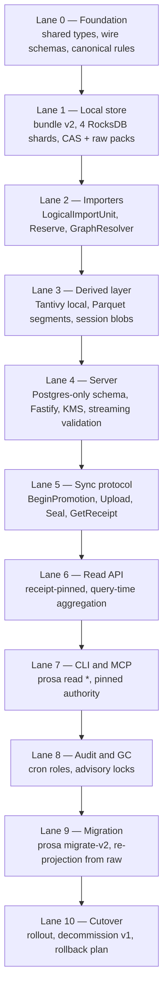

# Prosa v2 — lean execution plan

This directory is the **execution plan** for prosa v2, in the lean shape agreed after the architecture review thread in `docs/rearch/`. It is organized as eleven sequential lanes (Lane 0 through Lane 10). Each lane is one document. Each document is concrete enough that one engineer can pick it up and ship it without re-litigating design.

If you are reading this for the first time: start at `00-README.md`, read `01-lane-0-foundation.md`, then proceed in order. Do not skip ahead — later lanes depend on artifacts shipped by earlier lanes.

If you have already read the architecture review at `docs/rearch/`, the only architectural delta in this plan is the **lean simplification** documented in §"Lean architecture summary" below. Everything else (the five invariants, the 17 L-items pinned in `docs/rearch/16-proposal-3.md`) holds.

---

## Lean architecture summary

The v2.0.1 design closeout at `docs/rearch/16-proposal-3.md` was accepted as architecturally complete. This plan executes a **lean profile** of that design, with seven simplifications that preserve all five invariants and cut ~6–10 engineer-weeks plus ~$2–3 k/month in infra:

| Closeout decision | Lean profile |
|---|---|
| Postgres + ClickHouse + S3 | **Postgres + S3 only** — projection lives in Postgres with partitioning + GIN. Analytics via DuckDB-over-Parquet (already shipped). |
| Tantivy fleet remote + local | **Postgres FTS remote, Tantivy local only** — same `SearchDoc` contract, different engines. No remote Tantivy fleet. |
| 3 fleets (API / audit / GC) | **One API fleet with audit + GC as cron roles** — advisory locks on Postgres prevent overlap. Split physically later when scale demands. |
| `tenant_session_current` materialized view | **Query-time aggregation with 30 s cache** — eventual consistency tolerated on the listing view. |
| Six Merkle sub-roots in receipt | **Two roots: `bundleRoot` + `rawSourceRoot`** — the latter is the audit-load-bearing one; the other four become internal metadata. |
| Two grant modes (`all_entries` / `filtered_entries`) | **One grant mode (`all_entries`)** — packs are tenant-scoped, no slicing needed. |
| `SessionFixupV2` with 7 fields | **Fixups only for `parent_session_id` + `parent_resolution`** — extend when observed in production. |
| Device keys mandatory v2.1 | **Device keys deferred to v2.x** — server signing via AWS KMS is the v2.0 audit anchor. |
| 16 RocksDB shards | **4 RocksDB shards** — enough parallelism for laptop core counts; extend if benchmarks demand. |

The five invariants survive each simplification:
1. Raw byte preservation (raw_source packs immutable, retained as long as their epoch is referenced).
2. Idempotent re-imports (natural keys routed to deterministic shard actors via `PutIfAbsent`).
3. Canonical cross-provider graph unification (`SessionV2`/`MessageV2`/etc. mirror today's grain).
4. Content-addressed deduplication (BLAKE3 of uncompressed bytes, global on local, tenant-scoped on remote catalog).
5. Signed promotion receipts (server Ed25519 via AWS KMS, verifiable offline against published JWKS).

---

## Lane sequence



Each lane has a gate. **A lane is "complete" when its gate passes.** The next lane does not start until the gate is green.

---

## Per-lane summary

| Lane | Title | Doc | Estimated work | Primary deliverable |
|---|---|---|---|---|
| 0 | Foundation | `01-lane-0-foundation.md` | 1–2 weeks, 2–3 PRs | New packages: `prosa-types-v2`, `prosa-wire-v2`. All canonical schemas + wire formats compile-clean. |
| 1 | Local store | `02-lane-1-local-store.md` | 3–4 weeks, 5–7 PRs | `prosa-bundle-v2` package. Bundle v2 can be initialized, written to, sealed via epoch swap, and opened read-only. |
| 2 | Importers | `03-lane-2-importers.md` | 4–6 weeks, 6–8 PRs | `prosa-importers-v2`. All five providers import into bundle v2 with `Reserve` + `GraphResolver`. Idempotent re-import verified. |
| 3 | Derived layer | `04-lane-3-derived-layer.md` | 2–3 weeks, 3–4 PRs | `prosa-derived-v2`. Tantivy local index, Parquet segment writer, session blob writer, DuckDB analytics views all populated from bundle v2. |
| 4 | Server | `05-lane-4-server.md` | 3–4 weeks, 5–6 PRs | Postgres v2 schema applied. Fastify API workers boot. AWS KMS server signing operational. Streaming pack validation pipeline tested. |
| 5 | Sync protocol | `06-lane-5-sync-protocol.md` | 4–5 weeks, 4–5 PRs | End-to-end promotion: local bundle → server. No-op fast path < 2 s. Fresh sync bandwidth-bound. Resume after interrupt works. |
| 6 | Read API | `07-lane-6-read-api.md` | 3–4 weeks, 4–5 PRs | Receipt-pinned reads for sessions / transcript / search / tool_calls / artifacts / analytics. Postgres FTS operational. |
| 7 | CLI and MCP | `08-lane-7-cli-and-mcp.md` | 2–3 weeks, 3–4 PRs | New CLI surface (`prosa read *` + `prosa tui` top-level). MCP pinned-authority modes. Web data layer rewritten. |
| 8 | Audit and GC | `09-lane-8-audit-and-gc.md` | 1–2 weeks, 2–3 PRs | Audit and GC cron roles in API workers. Advisory-lock serialization. Pack quarantine + receipt degrade response. |
| 9 | Migration | `10-lane-9-migration.md` | 1–2 weeks, 1–2 PRs | `prosa migrate-v2` tool. Re-projects 1.4 GB v1 bundle to v2 in 45–120 s. Count validation passes. |
| 10 | Cutover | `11-lane-10-cutover.md` | 1 week, 1 PR + ops | Feature flag promotes v2 globally. v1 code paths removed. Decommission runbook executed. |

**Total estimated calendar time: 6–9 months** for one team of 2–3 engineers, assuming the lanes are strictly sequential. Two-week buffer between lanes for review and stabilization.

---

## Gate criteria summary

Each lane has a specific gate documented in its own file. The high-level pattern:

- **Lane 0**: `pnpm typecheck && pnpm test` clean on the new packages; CI green; canonical types referenced by no production code yet.
- **Lane 1**: A bundle v2 can be initialized, written to with synthetic data via shard-actor commands, sealed, and re-opened. All 5 invariant tests pass.
- **Lane 2**: Each of the 5 providers imports a fixture corpus. Re-running compile produces zero new rows. `Reserve` flow verified under concurrent worker test.
- **Lane 3**: Tantivy index built; Parquet segments emit; session blob written; analytics views return expected row counts.
- **Lane 4**: Server boots in production-mode config; KMS sign/verify roundtrip works; streaming pack validation rejects malformed packs.
- **Lane 5**: End-to-end E2E suite (Docker harness) promotes a fresh bundle and re-promotes a no-op bundle in <2 s. Receipt verifies against JWKS.
- **Lane 6**: All read endpoints return verified-projection-gated data. p95 latency targets met against fixture.
- **Lane 7**: New CLI commands pass smoke test against E2E harness. MCP authority modes behave as specified.
- **Lane 8**: Audit cron detects an injected drift; GC cron deletes an unreferenced pack; both serialize via advisory lock.
- **Lane 9**: `prosa migrate-v2` converts a fixture v1 bundle to v2; counts match; reads succeed against the new bundle.
- **Lane 10**: Production traffic on v2; v1 code paths return 410 Gone; old data archived per runbook.

---

## Five invariants — tracked across every lane

| # | Invariant | Tested in lane(s) | Owner test file |
|---|---|---|---|
| I1 | Raw byte preservation | 1, 2, 9 | `packages/prosa-bundle-v2/test/raw-preservation.test.ts` |
| I2 | Idempotent re-imports | 2 | `packages/prosa-importers-v2/test/idempotency.test.ts` |
| I3 | Canonical cross-provider graph | 2 | `packages/prosa-importers-v2/test/canonical-graph.test.ts` |
| I4 | Content-addressed dedup | 1, 5 | `packages/prosa-bundle-v2/test/cas-dedup.test.ts` |
| I5 | Signed promotion receipts | 4, 5 | `apps/api/test/receipt-signing.test.ts` |

Each test must pass before the owning lane's gate is green. A failure on any invariant test in any lane blocks the whole sequence.

---

## Cross-lane risk register

These are the load-bearing properties of the implementation phase, from `docs/rearch/17-review-of-proposal-3.md`. The plan tracks them as global risks, not per-lane risks:

1. **Two implementers producing the same Merkle leaf for the same logical row** — pinned in Lane 0 via `prosa-types-v2/src/canonical.ts` + cross-implementation conformance tests.
2. **Pack writer must reject zstd `window_size > 8 MiB`; CLI catches and re-encodes** — pinned in Lane 1 (writer) and Lane 5 (CLI retry path).
3. **Seal transaction is the only path that updates the authority and current views** — pinned in Lane 5; lint rule + integration test enforces no other code path writes to authority tables.
4. **Cold rebuild never writes to live `index/`** — pinned in Lane 1; integration test injects `SIGKILL` mid-rebuild and verifies `index/` is untouched.

A regression on any of these four is treated as a release blocker.

---

## Rollback strategy

The plan is designed for **one-shot cutover** at Lane 10. There is no dual-write phase, no compat shim, no parallel-write period. However, until Lane 10, every lane is independently revertable:

- **Lanes 0–9** ship new packages and code paths alongside v1. v1 code remains the only thing serving real users. A lane's PR can be reverted by `git revert` without affecting production.
- **Lane 10** is the cutover. The rollback for Lane 10 is to revert the feature flag flip — both v1 and v2 code paths exist in the same binary at cutover time, gated on `PROSA_V2_ENABLED`.
- **Post-cutover**: v1 code is removed in a follow-up release. Rollback past that point requires reverting the deletion PR and redeploying.

See `11-lane-10-cutover.md` for the detailed rollback runbook.

---

## What is intentionally not in this plan

- **A v2.1 plan.** Device-key client signing, cross-tenant CAS dedup, multi-region replication, ClickHouse migration if Postgres becomes the bottleneck — all of these are tracked as v2.x candidates in the post-cutover backlog. They are not blocking for v2.0.
- **A compat shim.** v1 and v2 do not interoperate. The migration tool (Lane 9) converts forward only. Old promotion receipts are archived but cannot authorize v2 reads.
- **A migration of historical analytics data.** Analytics view names and column shapes are preserved (Lane 6), but the underlying Parquet exports are regenerated post-migration. Historical Parquet files from v1 are archived but not consumed by v2.
- **A spec freeze ceremony.** The specs are already frozen in `docs/rearch/16-proposal-3.md` and `docs/rearch/17-review-of-proposal-3.md`. This plan executes against them. Spec changes during execution require a written ADR and a Lane re-evaluation.

---

## How to read each lane document

Every lane file follows the same structure:

```
# Lane N — <title>

## Goal              # one paragraph: what this lane delivers and why
## Depends on        # which previous lanes must be complete
## Deliverables      # bullet list of concrete artifacts
## Tasks             # numbered, ordered, sized as ~1 PR each
## Concrete types    # TypeScript / SQL with full signatures
## Tests             # specific test files and what they assert
## Gate              # criteria to call the lane complete
## Risks             # what can go wrong, mitigations
## Unblocks          # which next lane(s) depend on this
```

Estimates in each lane assume one focused engineer working full-time. Two engineers can parallelize some sub-tasks within a lane but cannot skip ahead across lanes.

---

Now read `01-lane-0-foundation.md`.
