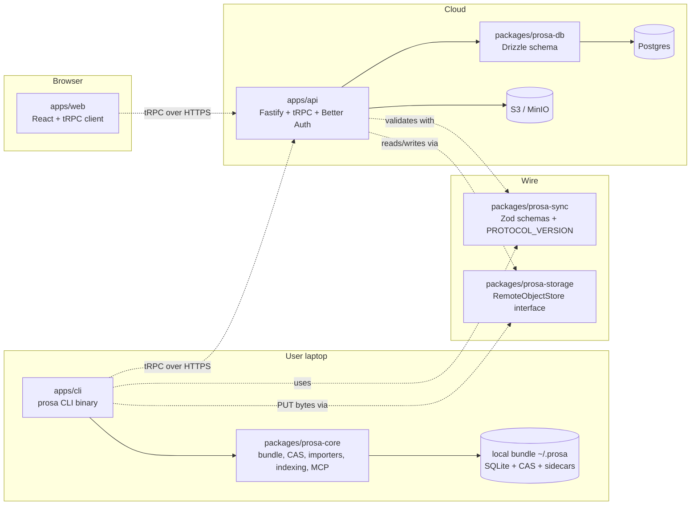
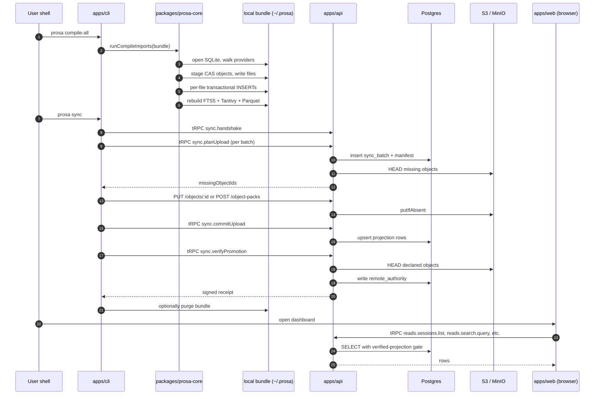

# 02 — Repository layout

Prosa is a pnpm + Turbo monorepo. The top-level shape:

```
prosa/
├── apps/
│   ├── api/                       # Fastify + tRPC server (cloud component)
│   ├── cli/                       # `prosa` CLI binary (Node.js)
│   └── web/                       # Vite + React console (talks to apps/api)
├── packages/
│   ├── prosa-core/                # Bundle, CAS, schema, importers, indexing, MCP
│   ├── prosa-db/                  # Drizzle schema for the server's Postgres
│   ├── prosa-storage/             # RemoteObjectStore adapter interface (memory/fs/s3)
│   └── prosa-sync/                # Wire schemas + PROTOCOL_VERSION shared by CLI and API
├── bench/                         # Standalone bench scripts (Parquet, BLAKE3, importer, etc.)
├── docs/                          # Architecture docs, source-format references, recipes
├── .codex/skills/                 # Per-subsystem agent skill notes (internal)
├── .claude/agents/                # Claude Code agent subagent definitions (internal)
├── docker-compose.yml             # Local dev: api + postgres + minio
├── pnpm-workspace.yaml
├── turbo.json
└── package.json
```

The architecture splits cleanly along three boundaries: **what lives in the bundle** (packages/prosa-core), **what lives on the server** (apps/api + packages/prosa-db + packages/prosa-storage), and **what is shared on the wire** (packages/prosa-sync). The CLI and the web app are both consumers of one or both halves.



## Per-directory responsibilities

### `apps/api/` — the remote server

Fastify HTTP host. Mounts:

- `/api/auth/*` — Better Auth catch-all (sign-up, sign-in, organization management, OAuth device flow, JWKS). Better Auth's models live in `packages/prosa-db/src/schema/auth.ts`.
- `/objects/:objectId` and `/object-packs` — direct HTTP object I/O (PUT one object; POST many packed objects in a single binary payload).
- `/trpc/*` — the tRPC router exposing `auth`, `tenant`, `sync.*`, and `reads.*` procedures.

Important subdirectories:

- `src/auth.ts` — Better Auth config (plugins: `organization`, `deviceAuthorization`, `bearer`).
- `src/trpc/init.ts` — tRPC bootstrap, `publicProcedure`, `requireUser`, `tenantProcedure`, `adminTenantProcedure`, `rateLimitedProcedure`.
- `src/trpc/context.ts` — per-request context build: resolves session + user via Better Auth, resolves tenant via `x-prosa-tenant-id` header or session's `activeOrganizationId`, verifies membership via the `member` table.
- `src/trpc/routers/sync.ts` plus `src/trpc/routers/sync/{plan-upload,commit-upload,verify-promotion,ack-cleanup,manifest,projection-upserts}.ts` — the promotion protocol implementation.
- `src/trpc/routers/reads.ts` plus `src/trpc/routers/reads/{sessions,search,tool-calls,transcript,artifacts,analytics,shared}.ts` — the verified-only read API.
- `src/http/objects.ts` — the PUT and POST handlers for object bytes (verify caller owns batch, decompress, verify BLAKE3 of decompressed bytes, write via `RemoteObjectStore.putIfAbsent`).
- `src/objects/locations.ts` — `findMaterializedObjectIds` and `findMissingObjectIds`, the hot path of `planUpload`.
- `test/` — Vitest suites including the E2E `sync.test.ts` and `verified-provenance.test.ts`.

### `apps/cli/` — the `prosa` CLI

The user-facing binary, written in TypeScript and run through Node. Built with `tsup` for release; run through SWC during dev (`pnpm dev`).

Important command files under `src/cli/commands/`:

- `compile.ts` — `prosa compile <provider>` and `prosa compile-all`. Walks one or all five providers' history trees and imports them.
- `auth.ts` — `prosa auth {signup, login, device-login, logout, status, tenants, use}`.
- `sync.ts` — `prosa sync` and `prosa sync status`. The single largest CLI file: roughly 1700 lines covering single-batch and chunked promotion, dry-run, resume from checkpoint, adaptive concurrency, cleanup.
- `sessions.ts`, `session.ts` — list and show. Switches between local SQLite reads and remote tRPC reads via `resolveReadAuthorityOrFailClosed`.
- `search.ts` — full-text search via FTS5 or Tantivy locally; tRPC remote `search.query` when promoted.
- `query.ts` — `prosa query duckdb '<sql>'` for ad-hoc analytics over the Parquet snapshot.
- `analytics.ts` — `prosa analytics {sessions,tools,errors,models,projects}` fixed reports.
- `export.ts` — Markdown / Parquet exports.
- `mcp.ts` — `prosa mcp serve` (HTTP) and `prosa mcp stdio` (stdio transport for embedding in agents).
- `tui.ts` — interactive Ink-based explorer.
- `doctor.ts` — bundle health check (orphan files, drift between `search_docs` and FTS5, batch reaping).
- `index.ts` — `prosa index {fts5,tantivy,status}` for manual sidecar rebuilds.

Subdirectories:

- `src/cli/auth/` — config file loading (`~/.config/prosa/config.json`, mode 0600), `ProsaApiClient` (Fetch wrapper with retries and idempotency keys), routing (`resolveReadAuthorityOrFailClosed`).
- `src/cli/sync/` — promotion helpers: `promotion.ts` (`promoteUpload`, `promoteChunk`, `AdaptiveUploadConcurrencyController`, `splitMissingObjectUploads`, `uploadMissingCasObjects`), `pipeline.ts` (the producer-consumer for object reads → uploads), `limits.ts` (batch estimation), `checkpoint.ts` (resume state).
- `test/` — Vitest tests for every CLI command.

### `apps/web/` — the console

Vite + React + TanStack Router + tRPC client + React Query + Tailwind. All read pages call `api.<router>.<procedure>.query()`; the active tenant is injected by the auth context (the user's active organization in Better Auth).

Main routes:

- `/console/dashboard` — calls `analytics.summary`.
- `/console/sessions` — calls `sessions.list` and `sessions.count` with paginated filters.
- `/console/session/:id` — calls `sessions.transcript` with cursor pagination over turns/messages.
- `/console/search` — calls `search.query`.
- `/console/tool-calls` — calls `toolCalls.list`.
- `/console/analytics` — calls `analytics.report` for the five fixed reports.

Lazy CAS body fetch via `artifacts.getText` happens on demand for content blocks larger than the 8 KiB inline budget.

### `packages/prosa-core/` — the local heart

Everything that defines what a bundle is and how it gets populated. The CLI consumes it; the MCP server consumes it; the local read paths consume it.

Subdirectories:

- `src/core/bundle.ts` — `initBundle`, `openBundle`, `openOrInitBundle`, path derivation, manifest read/write.
- `src/core/db.ts` — `openDb` (the PRAGMA block), `prepare` cache, `transactional` helper.
- `src/core/schema/sql/00{1..5}_*.ts` — every CREATE TABLE / INDEX / TRIGGER / ALTER, in numbered migration files.
- `src/core/schema/migrate.ts` — `runMigrations` loader.
- `src/core/cas/{hash,compress,index}.ts` — BLAKE3, zstd, the three-phase staging API (`createPendingObjects`, `stageBytes`, `stageJson`, `stageText`, `flushPendingObjects`), the read API (`getBytes`, `getText`, `getJson`).
- `src/core/ingest/{idempotency,batch}.ts` — `registerSourceFile`, `preserveRawSourceBytes`, `startBatch`, `finishBatch`, `recordError`.
- `src/core/version.ts` — `PROSA_SCHEMA_VERSION = 5`, `PROSA_PARSER_VERSION`.
- `src/core/ids/` — deterministic ID helpers (e.g. `makeSessionId`, `sourceFileId`).
- `src/importers/{codex,claude,gemini,cursor,hermes}/` — one importer per provider. Each follows the same three-phase per-file shape: discover → parse + CAS-stage → FK-ordered domain insert. Codex is the largest at ~1700 lines.
- `src/services/compile.ts` — `runCompileImports`: the orchestrator that sweeps stale batches, disables FTS5 triggers, runs all providers sequentially, rebuilds FTS5 and Tantivy if `importedAny`, and triggers Parquet export after `closeBundle`.
- `src/services/indexing.ts` — `disableFts5Triggers`, `enableFts5Triggers`, `rebuildFts5Index`, `rebuildTantivyIndex` (incremental + schema fingerprint check), `markIndexesAfterImport`.
- `src/services/search/` — FTS5 and Tantivy query implementations.
- `src/services/transcript.ts` — `loadTranscript(bundle, sessionId)` shared between CLI, TUI, MCP.
- `src/services/export/parquet.ts` — `exportBundleParquet`, `queryDuckDbParquet`, `createAnalyticsViews`. The DuckDB-side equivalents of the five SQLite analytics views.
- `src/services/analytics.ts` — `buildAnalyticsSql` (one set of parameterized templates that works for both SQLite and DuckDB dialects), `runAnalyticsReport`, `runAnalyticsReportFromBundle`.
- `src/services/sessions.ts`, `src/services/search.ts` — local read helpers used by the CLI and MCP.
- `src/mcp/{server,tools,guidance}.ts` — MCP server, the six tools (`search`, `sessions`, `tool_calls`, `analytics`, `artifact`, `compile`), per-tool guidance text. Two transports: HTTP Streamable (`prosa mcp serve`) and stdio (`prosa mcp stdio`).

### `packages/prosa-db/` — the server's Postgres schema

Drizzle ORM schema definitions. Applied on API startup via `applySchema(raw)` (idempotent `CREATE ... IF NOT EXISTS`) plus a post-check that the required tables exist (`user`, `session`, `organization`, `member`, `device`, `sync_batch`, `remote_object`, `tenant_object`, `projection_session`, `search_doc`).

Subdirectories:

- `src/schema/auth.ts` — Better Auth tables: `user`, `session`, `account`, `verification`, `organization`, `member`, `invitation`, `device_code`, `jwks`.
- `src/schema/sync.ts` — `device`, `sync_batch`, `sync_batch_object_manifest`, `sync_batch_projection_manifest`, `sync_source`, `remote_authority`.
- `src/schema/objects.ts` — `remote_object`, `tenant_object`, `remote_object_location`, `remote_blob`.
- `src/schema/projection.ts` — `source_file`, `import_batch`, `raw_record`, `project`, `projection_session`, `projection_turn`, `projection_event`, `projection_message`, `projection_content_block`, `projection_tool_call`, `projection_tool_result`, `projection_artifact`, `projection_edge`, `search_doc`. All keyed `(tenant_id, id)`.

### `packages/prosa-storage/` — object-store abstraction

Defines `RemoteObjectStore` with `head` / `putIfAbsent` / `get` / `delete` plus path helpers. Three adapters:

- `MemoryObjectStore` — in-process map. Test only; production refuses to boot with it.
- `FsObjectStore` — local filesystem under `PROSA_OBJECT_STORE_ROOT`. Used by `docker-compose.yml` for the simplest setups.
- `S3ObjectStore` — AWS SDK v3 with HTTP keep-alive. CAS objects are stored at `<prefix>/objects/blake3/<aa>/<bb>/<hash>.zst`, mirroring the local bundle's fanout.

### `packages/prosa-sync/` — wire schemas

Zod schemas (and inferred TypeScript types) for every sync mutation: `HandshakeInput/Output`, `PlanUploadInput/Output`, `CommitUploadInput/Output`, `VerifyPromotionInput/Output`, `AckCleanupInput/Output`, plus all the projection row types. Both the CLI client and the API server import these schemas — the contract is single-source.

Exports `PROTOCOL_VERSION = 1`. A future-incompatible change should bump this.

### `docs/`

Architectural reference. The relevant subdirectories the redesign team's content has been mined from:

- `docs/architecture/{bundle-format,import-pipeline,search-engines,analytics,server-sync}.md` — authoritative narrative of how each subsystem works today.
- `docs/sources/{codex,claude-code,cursor,gemini,hermes}.md` — per-provider format references (what fields the importer reads, why).
- `docs/sync-performance/*.md` — open proposals (#03 parallel batches, #05 mixed-type batches, #07 bulk objects:bulk endpoint, #10 per-phase metrics, #12 remote CAS pack blobs). Numbers #01, #02, #04, #06, #08, #09 in this series were already merged as PRs #37–#47.
- `docs/recipes/` — copy-pasteable DuckDB recipes for ad-hoc analytics.

### `bench/`

Standalone Node scripts that measure specific hot paths (Parquet export tuning, BLAKE3 hashing, importer steady-state throughput, sync phase probe). The note in §03 PRAGMA tuning was produced here.

## How the parts talk



The redesign is free to change every arrow in this diagram, including the choice of HTTP, the choice of tRPC, the choice of Postgres, the choice of SQLite, and the choice of fronting the object store with a JSON-RPC verifier. Only the five invariants survive.
