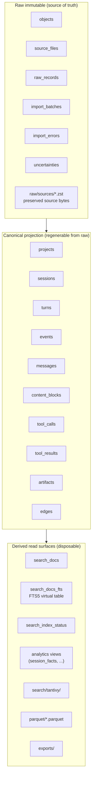

# 03 — Store architecture

This document is the authoritative reference for the local bundle: the on-disk layout, every SQLite table, every index, every PRAGMA, the CAS, the raw byte preservation policy, and the three-layer model. Everything cited here lives in `packages/prosa-core/`.

The current schema version is **5**. The current parser version comes from the package version of `packages/prosa-core` (today `0.8.1`).

## On-disk layout

```text
<bundle>/                        # default ~/.prosa; PROSA_STORE / --store override
├── manifest.json                # bundle metadata (versions, hash alg, default compression)
├── prosa.sqlite                 # canonical catalog (every SQLite table below)
├── prosa.sqlite-wal             # WAL file (write-ahead log)
├── prosa.sqlite-shm             # shared-memory file for WAL
├── prosa.lock                   # advisory lock taken by mutating commands
├── objects/
│   └── blake3/
│       └── ab/cd/<hash>.zst    # CAS objects, fanned out by first 4 hex chars
├── raw/
│   └── sources/
│       └── <blake3>.zst         # zstd-compressed copies of original source files
├── search/
│   └── tantivy/                 # optional sidecar full-text index
│       ├── meta.json
│       ├── *.idx, *.term, *.fast, *.fieldnorm, *.pos, ...
│       └── prosa-index.json     # metadata: mode, source/indexed counts, fingerprint
├── parquet/                     # derived analytics snapshots (one .parquet per canonical table)
│   ├── manifest.json
│   ├── sessions.parquet
│   ├── messages.parquet
│   └── ...
└── exports/                     # ad-hoc exports (Markdown, etc.)
```

`manifest.json` shape:

```json
{
  "version": 1,
  "parser_version": "0.8.1",
  "schema_version": 5,
  "created_at": "2026-05-12T16:32:11.084Z",
  "hash_alg": "blake3",
  "default_compression": "zstd"
}
```

## Three-layer model



Rule: the projection layer can always be rebuilt from raw. The derived layer can always be rebuilt from the projection. Importer fixes ship as re-projection, not re-import. Every byte the projection needs to be reconstructed must live in `raw_records` and the CAS objects they reference.

## SQLite open path and PRAGMAs

The bundle's SQLite database is opened through one function, called for every read or write of the bundle:

```ts
// packages/prosa-core/src/core/db.ts
export function openDb(path: string): Db {
  const db = new Database(path)

  // page_size must be set before any table is created. On an existing DB it
  // is a no-op (changing requires VACUUM). 16 KiB pages cut B-tree depth
  // and pack more rows per page — measurable wins on insert-heavy workloads.
  db.pragma('page_size = 16384')

  db.pragma('journal_mode = WAL')
  db.pragma('foreign_keys = ON')
  db.pragma('synchronous = NORMAL')

  // Reduce contention on long imports.
  db.pragma('busy_timeout = 5000')

  // 256 MiB page cache (default is 2 MiB) — keeps the working set of long
  // imports in memory and avoids re-reading hot index pages from disk.
  db.pragma('cache_size = -262144')

  // 256 MiB mmap window for read-side; cheap on macOS/Linux and lets SQLite
  // skip pread() syscalls when pages are already paged in.
  db.pragma('mmap_size = 268435456')

  // Keep temp btrees (used by FTS5 merges, large IN lists) in RAM.
  db.pragma('temp_store = MEMORY')

  // Default 1000 pages (~4 MiB) causes a WAL checkpoint every few hundred
  // INSERTs during compile; bump to ~80 MiB so checkpoints don't interrupt
  // the steady-state write loop.
  db.pragma('wal_autocheckpoint = 20000')

  return db
}
```

The compile pipeline depends on this exact combination. From a bench run on a 1.4 GB workload (1340 Codex files + 938 Claude files), the PRAGMA tuning by itself moved `compile-all` from 519.75 s to 367.47 s (-29 %); adding `page_size = 16384` brought it to 329 s (-37 % cumulative). The same bench tried wrapping 32 files in one outer transaction with savepoints per file — it regressed to 878 s (2.7× worse than baseline). Smaller savepoint batches were worse still (1859 s for 8-file groups, 5.6× worse). The root cause is that long write transactions accumulate WAL frames and every `INSERT OR IGNORE` / `INSERT OR REPLACE` walks those frames to see consistent state. Per-file commits keep the WAL short. This is the single most important constraint on the current design.

`busy_timeout = 5000` is the only retry margin the WAL writer lock gives a concurrent writer. There are no other writers in the local design — only one CLI process compiles at a time.

## Migrations

Migrations live in `packages/prosa-core/src/core/schema/sql/NNN_*.ts`, applied in numeric order by `runMigrations()` in `packages/prosa-core/src/core/schema/migrate.ts`. The bookkeeping table:

```sql
CREATE TABLE IF NOT EXISTS _prosa_migrations (
  version    INTEGER PRIMARY KEY,
  name       TEXT NOT NULL,
  applied_at TEXT NOT NULL
);
```

The five current migrations:

| # | File | What it adds |
|---|---|---|
| 1 | `001_init.ts` | All raw, canonical, and search_docs tables; FTS5 virtual table + triggers |
| 2 | `002_search_index_status.ts` | Per-engine FTS5 / Tantivy lifecycle table |
| 3 | `003_analytics_views.ts` | Five analytics views (`session_facts`, etc.) |
| 4 | `004_tantivy_checkpoint.ts` | `last_indexed_rowid`, `schema_fingerprint` columns on `search_index_status` |
| 5 | `005_object_transport_hash.ts` | `transport_hash` column on `objects` (cached BLAKE3 of stored compressed bytes) |

`openBundle` refuses to open a bundle whose schema is ahead of the running code.

## Raw layer DDL

### `objects` — content-addressed catalog

```sql
CREATE TABLE IF NOT EXISTS objects (
  object_id              TEXT PRIMARY KEY,           -- "blake3:<hex>"
  hash_alg               TEXT NOT NULL,              -- always "blake3"
  hash                   TEXT NOT NULL,              -- 64-char hex
  size_bytes             INTEGER NOT NULL,           -- uncompressed size
  compressed_size_bytes  INTEGER,                    -- present when compression='zstd'
  compression            TEXT NOT NULL DEFAULT 'zstd',
  mime_type              TEXT,
  encoding               TEXT,
  storage_path           TEXT NOT NULL,              -- relative to bundle root
  created_at             TEXT NOT NULL
  -- migration 005 adds:
  -- transport_hash      TEXT                        -- BLAKE3 of stored (possibly compressed) bytes
);
CREATE INDEX IF NOT EXISTS objects_hash_idx ON objects(hash_alg, hash);
```

### `source_files` — per-file registration, idempotent

```sql
CREATE TABLE IF NOT EXISTS source_files (
  source_file_id   TEXT PRIMARY KEY,                 -- deterministic from tool + path + content_hash
  source_tool      TEXT NOT NULL,                    -- 'codex' | 'claude' | 'gemini' | 'cursor' | 'hermes'
  path             TEXT NOT NULL,                    -- absolute path on the user's machine
  file_kind        TEXT NOT NULL,                    -- 'jsonl' | 'json' | 'sqlite' | 'tool_result' | 'memory' | 'blob' | ...
  size_bytes       INTEGER NOT NULL,
  mtime            TEXT,                             -- ISO 8601
  content_hash     TEXT NOT NULL,                    -- SHA-256 (natural key, predates BLAKE3)
  object_id        TEXT REFERENCES objects(object_id), -- BLAKE3-keyed copy
  discovered_at    TEXT NOT NULL,
  workspace_hint   TEXT,
  UNIQUE(source_tool, path, size_bytes, mtime, content_hash)
);
CREATE INDEX IF NOT EXISTS source_files_tool_idx ON source_files(source_tool);
CREATE INDEX IF NOT EXISTS source_files_hash_idx ON source_files(content_hash);
```

The dual hash (SHA-256 on `content_hash` plus BLAKE3 on `object_id`) is historical: SHA-256 was the natural-key choice when the importer-side staging API didn't exist yet. New code paths use BLAKE3 throughout. Source bytes are physically preserved under `raw/sources/<blake3-hash>.zst`.

### `raw_records` — the reprocessing foundation

```sql
CREATE TABLE IF NOT EXISTS raw_records (
  raw_record_id            TEXT PRIMARY KEY,         -- deterministic from source_file + locator + content
  source_file_id           TEXT NOT NULL REFERENCES source_files(source_file_id),
  source_tool              TEXT NOT NULL,
  record_kind              TEXT NOT NULL,            -- 'jsonl_line' | 'json_pointer' | 'sqlite_meta' | 'sqlite_blob' | 'external_file'
  ordinal                  INTEGER,
  line_no                  INTEGER,
  json_pointer             TEXT,
  native_id                TEXT,                     -- tool's native ID when available
  raw_object_id            TEXT NOT NULL REFERENCES objects(object_id),  -- always set
  decoded_json_object_id   TEXT REFERENCES objects(object_id),           -- optional; distinct canonical JSON
  parser_status            TEXT NOT NULL,            -- 'ok' | 'partial' | 'failed'
  confidence               TEXT NOT NULL DEFAULT 'high',
  import_batch_id          TEXT NOT NULL REFERENCES import_batches(batch_id),
  UNIQUE(source_file_id, ordinal, raw_object_id)
);
CREATE INDEX IF NOT EXISTS raw_records_file_idx ON raw_records(source_file_id);
CREATE INDEX IF NOT EXISTS raw_records_native_idx ON raw_records(source_tool, native_id);
```

Every projected row carries a `raw_record_id` back to one of these. The UNIQUE on `(source_file_id, ordinal, raw_object_id)` means re-imports are no-ops at the record level.

### `import_batches` — one per `prosa compile <provider>` invocation

```sql
CREATE TABLE IF NOT EXISTS import_batches (
  batch_id        TEXT PRIMARY KEY,
  parser_version  TEXT NOT NULL,
  source_tool     TEXT,
  paths           TEXT,                              -- JSON array of paths
  started_at      TEXT NOT NULL,
  finished_at     TEXT,
  status          TEXT NOT NULL DEFAULT 'running',   -- 'running' | 'completed' | 'failed'
  counts_json     TEXT                               -- ImportCounts on finish
);
```

### `import_errors` and `uncertainties`

```sql
CREATE TABLE IF NOT EXISTS import_errors (
  error_id          INTEGER PRIMARY KEY AUTOINCREMENT,
  batch_id          TEXT NOT NULL REFERENCES import_batches(batch_id),
  source_file_id    TEXT,
  raw_record_id     TEXT,
  kind              TEXT NOT NULL,                   -- e.g. 'codex_file_failed'
  message           TEXT NOT NULL,
  payload_object_id TEXT REFERENCES objects(object_id),
  occurred_at       TEXT NOT NULL
);

CREATE TABLE IF NOT EXISTS uncertainties (
  uncertainty_id     INTEGER PRIMARY KEY AUTOINCREMENT,
  entity_type        TEXT NOT NULL,
  entity_id          TEXT NOT NULL,
  reason             TEXT NOT NULL,
  metadata_object_id TEXT REFERENCES objects(object_id)
);
```

A single bad file does not abort the batch; it gets a row in `import_errors` and processing continues.

## Canonical projection DDL

### `projects` — logical project identity

```sql
CREATE TABLE IF NOT EXISTS projects (
  project_id          TEXT PRIMARY KEY,
  canonical_path      TEXT,                          -- real filesystem path when resolvable
  path_hash           TEXT,
  source_tool         TEXT,
  source_project_id   TEXT,
  display_name        TEXT,
  created_at          TEXT NOT NULL,
  UNIQUE(source_tool, source_project_id)
);
```

### `sessions` — the root of the per-provider event graph

```sql
CREATE TABLE IF NOT EXISTS sessions (
  session_id           TEXT PRIMARY KEY,
  source_tool          TEXT NOT NULL,
  source_session_id    TEXT NOT NULL,
  project_id           TEXT REFERENCES projects(project_id),
  parent_session_id    TEXT REFERENCES sessions(session_id),
  is_subagent          INTEGER NOT NULL DEFAULT 0,
  agent_role           TEXT,
  agent_nickname       TEXT,
  title                TEXT,
  summary              TEXT,
  start_ts             TEXT,
  end_ts               TEXT,
  cwd_initial          TEXT,
  git_branch_initial   TEXT,
  model_first          TEXT,
  model_last           TEXT,
  status               TEXT,
  timeline_confidence  TEXT NOT NULL DEFAULT 'high'
                       CHECK (timeline_confidence IN ('high','medium','low')),
  raw_record_id        TEXT REFERENCES raw_records(raw_record_id),
  UNIQUE(source_tool, source_session_id)
);
CREATE INDEX IF NOT EXISTS sessions_source_idx  ON sessions(source_tool);
CREATE INDEX IF NOT EXISTS sessions_start_idx   ON sessions(start_ts);
CREATE INDEX IF NOT EXISTS sessions_project_idx ON sessions(project_id);
CREATE INDEX IF NOT EXISTS sessions_parent_idx  ON sessions(parent_session_id);
```

### `turns` — per-turn execution context (mostly Codex)

```sql
CREATE TABLE IF NOT EXISTS turns (
  turn_id           TEXT PRIMARY KEY,
  session_id        TEXT NOT NULL REFERENCES sessions(session_id),
  source_turn_id    TEXT,
  ordinal           INTEGER NOT NULL,
  start_ts          TEXT,
  end_ts            TEXT,
  model             TEXT,
  cwd               TEXT,
  git_branch        TEXT,
  approval_policy   TEXT,
  sandbox_policy    TEXT,
  effort            TEXT,
  raw_record_id     TEXT REFERENCES raw_records(raw_record_id)
);
CREATE INDEX IF NOT EXISTS turns_session_idx ON turns(session_id, ordinal);
```

### `events` — the unified event log

```sql
CREATE TABLE IF NOT EXISTS events (
  event_id           TEXT PRIMARY KEY,
  session_id         TEXT NOT NULL REFERENCES sessions(session_id),
  turn_id            TEXT REFERENCES turns(turn_id),
  source_event_id    TEXT,
  event_type         TEXT NOT NULL,                  -- 'message' | 'tool_call' | 'tool_result' | 'progress' |
                                                     -- 'system_operational' | 'attachment' | 'compaction' |
                                                     -- 'patch' | 'exec' | ...
  source_type        TEXT,                           -- tool's native record name
  subtype            TEXT,
  timestamp          TEXT,
  ordinal            INTEGER NOT NULL,
  actor              TEXT,                           -- 'user' | 'assistant' | 'tool' | 'system' | 'cli'
  payload_object_id  TEXT REFERENCES objects(object_id),
  raw_record_id      TEXT NOT NULL REFERENCES raw_records(raw_record_id),
  confidence         TEXT NOT NULL DEFAULT 'high',
  is_derived         INTEGER NOT NULL DEFAULT 0      -- 1 when prosa inferred the event
);
CREATE INDEX IF NOT EXISTS events_session_idx ON events(session_id, ordinal);
CREATE INDEX IF NOT EXISTS events_type_idx    ON events(event_type, subtype);
```

### `messages` — chat messages

```sql
CREATE TABLE IF NOT EXISTS messages (
  message_id          TEXT PRIMARY KEY,
  session_id          TEXT NOT NULL REFERENCES sessions(session_id),
  turn_id             TEXT REFERENCES turns(turn_id),
  event_id            TEXT REFERENCES events(event_id),
  source_message_id   TEXT,
  role                TEXT NOT NULL CHECK (role IN (
                        'system_prompt','developer','user','assistant','tool','operational'
                      )),
  author_name         TEXT,
  model               TEXT,
  timestamp           TEXT,
  ordinal             INTEGER NOT NULL,
  parent_message_id   TEXT REFERENCES messages(message_id),
  request_id          TEXT,
  status              TEXT,
  raw_record_id       TEXT NOT NULL REFERENCES raw_records(raw_record_id)
);
CREATE INDEX IF NOT EXISTS messages_session_idx ON messages(session_id, ordinal);
CREATE INDEX IF NOT EXISTS messages_role_idx    ON messages(role);
```

Note `role` is a closed set. `'operational'` is reserved for Claude-style `type: "system"` events (operational hints), distinct from actual system prompts.

### `content_blocks` — per-message fragments

```sql
CREATE TABLE IF NOT EXISTS content_blocks (
  block_id        TEXT PRIMARY KEY,
  message_id      TEXT REFERENCES messages(message_id),
  event_id        TEXT REFERENCES events(event_id),
  session_id      TEXT NOT NULL REFERENCES sessions(session_id),
  ordinal         INTEGER NOT NULL,
  block_type      TEXT NOT NULL,                    -- 'text' | 'input_text' | 'output_text' | 'tool_use' |
                                                    -- 'tool_result' | 'thinking' | 'image' | 'attachment' |
                                                    -- 'diff' | 'summary' | ...
  text_object_id  TEXT REFERENCES objects(object_id),  -- for large content
  text_inline     TEXT,                             -- for small content (mutually exclusive with text_object_id)
  mime_type       TEXT,
  token_count     INTEGER,
  is_error        INTEGER NOT NULL DEFAULT 0,
  is_redacted     INTEGER NOT NULL DEFAULT 0,
  visibility      TEXT NOT NULL DEFAULT 'default'
                  CHECK (visibility IN ('default','hidden_by_default','audit_only')),
  raw_record_id   TEXT NOT NULL REFERENCES raw_records(raw_record_id)
);
CREATE INDEX IF NOT EXISTS blocks_session_idx ON content_blocks(session_id, ordinal);
CREATE INDEX IF NOT EXISTS blocks_message_idx ON content_blocks(message_id);
```

### `tool_calls` and `tool_results`

```sql
CREATE TABLE IF NOT EXISTS tool_calls (
  tool_call_id          TEXT PRIMARY KEY,
  session_id            TEXT NOT NULL REFERENCES sessions(session_id),
  turn_id               TEXT REFERENCES turns(turn_id),
  message_id            TEXT REFERENCES messages(message_id),
  event_id              TEXT REFERENCES events(event_id),
  source_call_id        TEXT,                        -- e.g. Claude tool_use.id, Codex call_id
  tool_name             TEXT NOT NULL,
  canonical_tool_type   TEXT,                        -- 'shell' | 'read_file' | 'edit_file' | ...
  args_object_id        TEXT REFERENCES objects(object_id),
  command               TEXT,
  cwd                   TEXT,
  path                  TEXT,
  query                 TEXT,
  timestamp_start       TEXT,
  timestamp_end         TEXT,
  status                TEXT,
  raw_record_id         TEXT NOT NULL REFERENCES raw_records(raw_record_id)
);
CREATE INDEX IF NOT EXISTS tool_calls_session_idx     ON tool_calls(session_id, timestamp_start);
CREATE INDEX IF NOT EXISTS tool_calls_name_idx        ON tool_calls(tool_name);
CREATE INDEX IF NOT EXISTS tool_calls_canon_idx       ON tool_calls(canonical_tool_type);
CREATE INDEX IF NOT EXISTS tool_calls_source_call_idx ON tool_calls(session_id, source_call_id);

CREATE TABLE IF NOT EXISTS tool_results (
  tool_result_id        TEXT PRIMARY KEY,
  tool_call_id          TEXT REFERENCES tool_calls(tool_call_id),
  session_id            TEXT NOT NULL REFERENCES sessions(session_id),
  message_id            TEXT REFERENCES messages(message_id),
  event_id              TEXT REFERENCES events(event_id),
  source_call_id        TEXT,                        -- when prosa couldn't pre-match the call
  status                TEXT,
  is_error              INTEGER NOT NULL DEFAULT 0,
  exit_code             INTEGER,
  duration_ms           INTEGER,
  stdout_object_id      TEXT REFERENCES objects(object_id),
  stderr_object_id      TEXT REFERENCES objects(object_id),
  output_object_id      TEXT REFERENCES objects(object_id),
  preview               TEXT,                        -- short inline preview
  raw_record_id         TEXT NOT NULL REFERENCES raw_records(raw_record_id)
);
CREATE INDEX IF NOT EXISTS tool_results_session_idx     ON tool_results(session_id);
CREATE INDEX IF NOT EXISTS tool_results_call_idx        ON tool_results(tool_call_id);
CREATE INDEX IF NOT EXISTS tool_results_source_call_idx ON tool_results(session_id, source_call_id);
CREATE INDEX IF NOT EXISTS tool_results_error_idx       ON tool_results(is_error);
```

`canonical_tool_type` collapses provider-specific names. Bash / Shell / `run_shell_command` → `shell`. Read / `read_file` → `read_file`. Edit / `replace` → `edit_file`. This lets cross-provider analytics group on a single canonical column.

### `artifacts` — out-of-band content

```sql
CREATE TABLE IF NOT EXISTS artifacts (
  artifact_id     TEXT PRIMARY KEY,
  session_id      TEXT REFERENCES sessions(session_id),
  project_id      TEXT REFERENCES projects(project_id),
  source_tool     TEXT NOT NULL,
  kind            TEXT NOT NULL,
  path            TEXT,
  logical_path    TEXT,
  object_id       TEXT REFERENCES objects(object_id),       -- binary bytes
  text_object_id  TEXT REFERENCES objects(object_id),       -- extracted text when available
  mime_type       TEXT,
  size_bytes      INTEGER NOT NULL,
  created_ts      TEXT,
  raw_record_id   TEXT NOT NULL REFERENCES raw_records(raw_record_id)
);
CREATE INDEX IF NOT EXISTS artifacts_session_idx ON artifacts(session_id);
CREATE INDEX IF NOT EXISTS artifacts_path_idx    ON artifacts(path);
```

### `edges` — the cross-entity graph

```sql
CREATE TABLE IF NOT EXISTS edges (
  edge_id              INTEGER PRIMARY KEY AUTOINCREMENT,
  src_type             TEXT NOT NULL,
  src_id               TEXT NOT NULL,
  dst_type             TEXT NOT NULL,
  dst_id               TEXT NOT NULL,
  edge_type            TEXT NOT NULL,                -- 'parent_of' | 'calls' | 'returns' | 'spawned' |
                                                     -- 'contains' | 'produced' | 'consumed' | 'derived_from' |
                                                     -- 'summarizes' | 'compacts' | 'same_as' | 'refers_to'
  confidence           TEXT NOT NULL DEFAULT 'high',
  source               TEXT NOT NULL DEFAULT 'explicit', -- 'explicit' | 'path_inferred' | 'timestamp_inferred' | 'content_inferred'
  raw_record_id        TEXT REFERENCES raw_records(raw_record_id),
  metadata_object_id   TEXT REFERENCES objects(object_id),
  UNIQUE(src_type, src_id, dst_type, dst_id, edge_type)
);
CREATE INDEX IF NOT EXISTS edges_src_idx  ON edges(src_type, src_id);
CREATE INDEX IF NOT EXISTS edges_dst_idx  ON edges(dst_type, dst_id);
CREATE INDEX IF NOT EXISTS edges_type_idx ON edges(edge_type);
```

`edges` is what links subagent sessions to their parents (`spawned`), what relates compaction summaries to original turns (`compacts`, `summarizes`), and what records produced/consumed file relationships.

## Derived read surfaces

### `search_docs` — indexable corpus

```sql
CREATE TABLE IF NOT EXISTS search_docs (
  doc_id                TEXT PRIMARY KEY,
  entity_type           TEXT NOT NULL,               -- 'message' | 'tool_call' | 'tool_result' | 'artifact' | ...
  entity_id             TEXT NOT NULL,
  session_id            TEXT,
  project_id            TEXT,
  timestamp             TEXT,
  role                  TEXT,
  tool_name             TEXT,
  canonical_tool_type   TEXT,
  field_kind            TEXT NOT NULL,               -- partition by purpose; see list below
  text                  TEXT NOT NULL
);
CREATE INDEX IF NOT EXISTS search_docs_session_idx ON search_docs(session_id);
CREATE INDEX IF NOT EXISTS search_docs_entity_idx  ON search_docs(entity_type, entity_id);
CREATE INDEX IF NOT EXISTS search_docs_field_idx   ON search_docs(field_kind);
```

`field_kind` takes one of:

```
message_text, user_prompt, assistant_text, system_prompt,
command, command_output_preview, error, file_path, diff,
summary, artifact_text, tool_args, tool_result
```

### `search_docs_fts` — FTS5 virtual table + triggers

```sql
CREATE VIRTUAL TABLE IF NOT EXISTS search_docs_fts USING fts5(
  text,
  role            UNINDEXED,
  tool_name       UNINDEXED,
  field_kind      UNINDEXED,
  content='search_docs',
  content_rowid='rowid',
  tokenize='unicode61 remove_diacritics 2'
);

CREATE TRIGGER IF NOT EXISTS search_docs_ai AFTER INSERT ON search_docs BEGIN
  INSERT INTO search_docs_fts(rowid, text, role, tool_name, field_kind)
  VALUES (new.rowid, new.text, new.role, new.tool_name, new.field_kind);
END;

CREATE TRIGGER IF NOT EXISTS search_docs_ad AFTER DELETE ON search_docs BEGIN
  INSERT INTO search_docs_fts(search_docs_fts, rowid, text, role, tool_name, field_kind)
  VALUES('delete', old.rowid, old.text, old.role, old.tool_name, old.field_kind);
END;

CREATE TRIGGER IF NOT EXISTS search_docs_au AFTER UPDATE ON search_docs BEGIN
  INSERT INTO search_docs_fts(search_docs_fts, rowid, text, role, tool_name, field_kind)
  VALUES('delete', old.rowid, old.text, old.role, old.tool_name, old.field_kind);
  INSERT INTO search_docs_fts(rowid, text, role, tool_name, field_kind)
  VALUES (new.rowid, new.text, new.role, new.tool_name, new.field_kind);
END;
```

These triggers keep FTS5 in sync with `search_docs` *outside* of compile. During compile, the triggers are **dropped** (see §04 for the call site) so per-row trigger tokenization doesn't pay the steady-state insert cost. At end-of-compile, `INSERT INTO search_docs_fts(search_docs_fts) VALUES('rebuild')` rebuilds the index in bulk and the triggers are re-installed.

### `search_index_status` — engine lifecycle

```sql
CREATE TABLE IF NOT EXISTS search_index_status (
  engine                 TEXT PRIMARY KEY,           -- 'fts5' | 'tantivy'
  status                 TEXT NOT NULL CHECK (status IN ('missing','ready','stale','building','failed')),
  source_doc_count       INTEGER NOT NULL DEFAULT 0,
  indexed_doc_count      INTEGER NOT NULL DEFAULT 0,
  updated_at             TEXT NOT NULL,
  error_message          TEXT
  -- migration 004 adds:
  -- last_indexed_rowid  INTEGER,
  -- schema_fingerprint  TEXT
);
```

### Analytics views (migration 003)

The five views are pure SELECTs over the canonical tables. They are never rebuilt; querying them always sees the latest state.

```sql
-- session_facts: one row per session, with rollups across turns, messages, tool calls/results.
-- Key columns: session_id, source_tool, project_id, project_name, source_session_id,
-- start_ts, end_ts, duration_seconds, model_first, model_last,
-- message_count, user_message_count, assistant_message_count,
-- turn_count, tool_call_count, tool_result_count, tool_error_count, tool_duration_ms,
-- timeline_confidence, source_file_path, title.

-- tool_usage_facts: one row per tool call, joined with rollup of its results.
-- Key columns: tool_call_id, session_id, tool_name, canonical_tool_type, command, path, query,
-- timestamp_start, timestamp_end, call_duration_seconds, call_status,
-- result_status, is_error, exit_code, result_duration_ms, tool_result_count, preview.

-- error_facts: one row per error (tool_result error | import_error | uncertainty).
-- Key columns: error_id, error_category, source_tool, session_id, timestamp,
-- tool_name, status, exit_code, message, preview, entity_type, entity_id.

-- model_usage: rollup per (source_tool, project, model).
-- Key columns: model, session_count, turn_count, observation_count, message_count,
-- first_seen_ts, last_seen_ts.

-- project_activity: rollup per (source_tool, project).
-- Key columns: project_name, project_path, first_session_ts, latest_session_ts,
-- session_count, low_confidence_session_count, turn_count, message_count,
-- tool_call_count, tool_result_count, tool_error_count, search_doc_count.
```

DuckDB equivalents are created at query time by `createAnalyticsViews` in `packages/prosa-core/src/services/export/parquet.ts`. The view names and projected columns are the stable contract for external dashboards.

## Content-addressed storage

Every byte string with potential reuse — raw lines, decoded JSON, tool stdout / stderr, file contents, source-file copies, artifact bytes — is stored once in the CAS.

### Hashing and ID format

```ts
// packages/prosa-core/src/core/cas/hash.ts

// Synchronous BLAKE3 using @noble/hashes. Used inside the per-record staging
// API; keeping it sync lets stageBytes return an ObjectId immediately so
// callers can attach domain rows.
export function blake3Hex(bytes: Uint8Array): string {
  return bytesToHex(nobleBlake3(bytes))
}

// Async WASM BLAKE3 (hash-wasm). Used for transport_hash computation in
// parallel before the SQLite insert phase.
export async function blake3HexAsync(bytes: Uint8Array): Promise<string> {
  return wasmBlake3(bytes)
}

// SHA-256 used only for source_files.content_hash (natural key).
export function sha256Hex(bytes: Uint8Array | string): string {
  return createHash('sha256').update(bytes).digest('hex')
}

export function objectIdFromHash(hashHex: string): string {
  return `blake3:${hashHex}`
}

export function objectStoragePath(hashHex: string, compression: 'zstd' | 'none'): string {
  const ext = compression === 'zstd' ? '.zst' : '.bin'
  const a = hashHex.slice(0, 2)
  const b = hashHex.slice(2, 4)
  return `objects/blake3/${a}/${b}/${hashHex}${ext}`
}
```

- Primary hash: **BLAKE3** over the uncompressed bytes.
- `object_id` format: `blake3:<64-character-hex-digest>`.
- Fanout: first 4 hex chars split into two levels, so the directory tree is at most 65,536 leaves deep. Each level is `mkdir`-cached per process (see `ensureDir` below).
- After migration 005, `objects.transport_hash` stores the BLAKE3 of the on-disk bytes (the possibly-compressed bytes), computed once at ingest. This lets sync send `transportHash` as a separate field without re-hashing.

### Compression policy

```ts
// packages/prosa-core/src/core/cas/compress.ts

// Minimum payload size for zstd compression.
// Below this threshold the zstd frame overhead and CPU cost are not worth
// the small storage savings.
const COMPRESS_THRESHOLD_BYTES = 256

// Conservative zstd level used for importer throughput.
const ZSTD_LEVEL = 3

export function compressBytes(input: Uint8Array): CompressionResult {
  if (input.byteLength < COMPRESS_THRESHOLD_BYTES) {
    return { bytes: Buffer.from(input), compression: 'none' }
  }
  const out = zstdCompress(Buffer.from(input), { compressionLevel: ZSTD_LEVEL })
  return { bytes: out, compression: 'zstd' }
}
```

### Staging API

The CAS exposes two APIs. The per-record auto-commit one (`putBytes`, `putText`, `putJson`) is used outside the importer hot path. The staging API is used during compile to amortize the cost over the per-file flush:

```ts
// packages/prosa-core/src/core/cas/index.ts

// 1. Create an empty staging accumulator (synchronous, per-batch).
export function createPendingObjects(): PendingObjects {
  return { byId: new Map() }
}

// 2. Stage bytes (synchronous; deduped within pending by object_id).
//    Returns the object_id immediately for use by domain rows.
export function stageBytes(
  pending: PendingObjects,
  bytes: Uint8Array,
  options: PutOptions = {},
): ObjectId
export function stageText(
  pending: PendingObjects,
  text: string,
  options: { mimeType?: string } = {},
): ObjectId
export function stageJson(pending: PendingObjects, value: unknown): ObjectId

// 3. Flush all pending objects (async, once per file).
//    - Bulk SELECT to find which object_ids already exist
//    - Parallel writeFile (concurrency 16) for missing ones
//    - INSERT OR IGNORE in a single transaction
//    - Transport hashes computed in parallel via WASM before the insert phase
export async function flushPendingObjects(
  bundle: Bundle,
  pending: PendingObjects,
): Promise<void>

// Read path (decompresses on the fly).
export async function getBytes(bundle: Bundle, objectId: ObjectId): Promise<Buffer>
export async function getText(bundle: Bundle, objectId: ObjectId): Promise<string>
export async function getJson<T = unknown>(bundle: Bundle, objectId: ObjectId): Promise<T>
export function getObjectMeta(bundle: Bundle, objectId: ObjectId): ObjectMeta | null
```

The two-phase shape (synchronous stage / asynchronous flush) is dictated by two facts: `better-sqlite3` transactions are synchronous, so filesystem writes inside them would serialize; and per-record auto-commits are catastrophically slow during bulk import.

### Directory creation cache

```ts
const ensuredDirs = new Set<string>()  // per-process; not persisted

export async function ensureDir(absoluteDir: string): Promise<void> {
  if (ensuredDirs.has(absoluteDir)) return
  await mkdir(absoluteDir, { recursive: true })
  ensuredDirs.add(absoluteDir)
}
```

The CAS fanout creates up to 65,536 leaf directories. Calling `mkdir({ recursive: true })` for every staged object measurably hurts cold imports; this cache eliminates that.

### Object metadata returned by `getObjectMeta`

```ts
export interface ObjectMeta {
  object_id: ObjectId                       // 'blake3:<hex>'
  hash_alg: 'blake3'
  hash: string                              // 64-char hex
  size_bytes: number                        // uncompressed
  compressed_size_bytes: number | null
  compression: 'zstd' | 'none'
  mime_type: string | null
  encoding: string | null
  storage_path: string                      // relative to bundle root
  transport_hash: string | null             // BLAKE3 of bytes-on-disk
  created_at: string
}
```

## Idempotency keys

These are the natural keys that make re-runs of `prosa compile-all` produce zero new rows:

| Layer | Key | Where | Behavior |
|---|---|---|---|
| File | `(source_tool, path, size_bytes, mtime, content_hash)` | `source_files` UNIQUE | Cheap path (size+mtime) short-circuits; slow path (SHA-256) confirms |
| Record | `(source_file_id, ordinal, raw_object_id)` | `raw_records` UNIQUE | Same record at same offset from same file deduped |
| Object | `object_id` (BLAKE3) | `objects` PK | `INSERT OR IGNORE`; identical bytes are a no-op |
| Session | `(source_tool, source_session_id)` | `sessions` UNIQUE | Re-import upserts metadata |
| Project | `(source_tool, source_project_id)` | `projects` UNIQUE | Same |
| Edge | `(src_type, src_id, dst_type, dst_id, edge_type)` | `edges` UNIQUE | Inferred edges deduped |

A modified source file produces a new `source_file_id` (different `content_hash`) but reuses every CAS object whose bytes happen to match. Provenance is preserved separately in `raw_records`, which always point at the actual bytes via `raw_object_id`.

## The `decoded_json_object_id` rule

For each `raw_records` row prosa can store two CAS objects: the raw bytes (`raw_object_id`, always set) and a canonical JSON projection (`decoded_json_object_id`, optional). The matrix:

| Importer | `decoded_json_object_id` for parsed records | Why |
|---|---|---|
| Codex | `NULL` | Each JSONL line **is** the JSON; no consumer reads it back |
| Claude | `NULL` | Same |
| Gemini | populated | Source is one big JSON file; per-message payloads are genuinely distinct objects worth caching |
| Cursor | populated | The importer reads the decoded JSON back during the same pass |
| Hermes | populated | SQLite rows and JSON snapshot pointers are distinct from preserved file bytes |

Skipping the decoded object for Codex and Claude halves CAS writes for the two heaviest importers.

## A note on the WAL writer lock

SQLite WAL allows concurrent readers but serializes writers. The current design relies on this serialization: one CLI process compiles at a time, and per-file transactions are short enough that the WAL never bloats. Two facts from internal benchmarks pin down what this constraint costs:

- **`worker_threads` parallelism over the same SQLite store: ~15 % gain only** (350 s → 298 s on the 1.4 GB workload). With 16 workers, ~14 of them sit in the `busy_timeout` queue at any moment. `synchronous = OFF` only shaved another 4 % off, proving the bottleneck is lock acquisition + WAL append, not fsync.
- **A single outer transaction wrapping 32 files with savepoints**: 878 s, 2.7× worse than baseline. With 8-file groups: 1859 s, 5.6× worse. The WAL grew large enough that every `INSERT OR IGNORE` walked it on the index-check path.

The redesign should treat the single SQLite writer as the load-bearing constraint of the current store. Any answer that keeps a single SQLite database as the local store will inherit it. Answers worth considering include: multiple SQLites with a merge step, replacing SQLite (TursoDB / libSQL `BEGIN CONCURRENT` was evaluated and rejected — see §09), splitting raw and projection across two stores with independent writer locks, or moving the writer out of the import critical path entirely.
