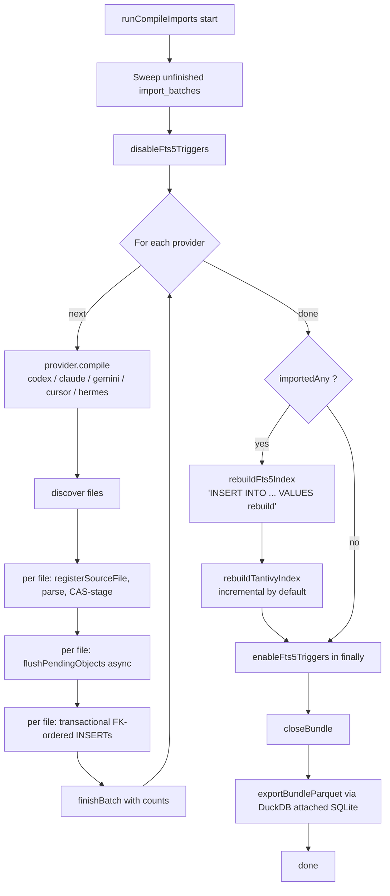
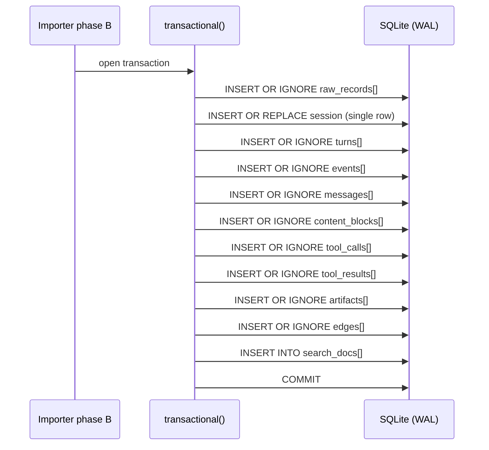

# 04 — Compile pipeline and importers

`prosa compile <provider>` and `prosa compile-all` walk a provider's local session tree and produce a fully-indexed bundle. This document describes the orchestration, the per-importer pattern, and the per-file pipeline.

## CLI entry

```ts
// apps/cli/src/cli/commands/compile.ts

export function compileCommand(): Command {
  const command = addCompileLogOptions(
    new Command('compile').description('Import session histories from one agent CLI into the bundle.'),
  )
  for (const provider of COMPILE_PROVIDERS) {
    command.addCommand(providerCompileCommand(provider))
  }
  return command
}

export function compileAllCommand(): Command {
  return addCompileLogOptions(new Command('compile-all'))
    .description('Import all agent CLI session histories using default source paths.')
    .option('--store <path>', 'bundle directory', defaultBundlePath())
    .option(
      '--overwrite',
      'force a full rebuild of derived indexes after import (Tantivy from scratch; FTS5 and Parquet are always full)',
      false,
    )
    .action(async (options, command) => {
      await runCompiles({
        providers: COMPILE_PROVIDERS,
        storePath: options.store,
        initStore: shouldInitCompileStore(command),
        overwrite: options.overwrite,
        logOptions: options,
      })
    })
}
```

`runCompiles` (in the same file) is thin: it opens the bundle, calls `runCompileImports` from `packages/prosa-core`, closes the bundle, then triggers Parquet export (which needs its own DuckDB-attached handle to avoid contention with the open `better-sqlite3` writer).

## Provider table

```ts
// packages/prosa-core/src/services/compile.ts

export const COMPILE_PROVIDERS: CompileProviderConfig[] = [
  {
    name: 'codex',
    description: 'Import Codex CLI session histories into the bundle.',
    defaultSessionsPath: () => path.join(os.homedir(), '.codex', 'sessions'),
    compile: compileCodex,
  },
  {
    name: 'claude',
    description: 'Import Claude Code project histories into the bundle.',
    defaultSessionsPath: () => path.join(os.homedir(), '.claude', 'projects'),
    compile: compileClaude,
  },
  {
    name: 'gemini',
    description: 'Import Gemini CLI session histories into the bundle.',
    defaultSessionsPath: () => path.join(os.homedir(), '.gemini', 'tmp'),
    compile: compileGemini,
  },
  {
    name: 'cursor',
    description: 'Import Cursor agent stores into the bundle.',
    defaultSessionsPath: () => path.join(os.homedir(), '.cursor', 'chats'),
    compile: compileCursor,
  },
  {
    name: 'hermes',
    description: 'Import Hermes session histories into the bundle.',
    defaultSessionsPath: () => path.join(os.homedir(), '.hermes', 'sessions'),
    compile: compileHermes,
  },
]
```

Providers are imported **sequentially**. Cross-provider parallelism is not supported — the SQLite WAL writer lock serializes all writers, and the per-process `ensureDir` cache is shared.

## Orchestration: `runCompileImports`

```ts
// packages/prosa-core/src/services/compile.ts

export async function runCompileImports(
  options: CompileImportOptions,
): Promise<CompileImportSummary> {
  const { bundle, providers, logger } = options
  const overwrite = options.overwrite === true
  let importedAny = false
  const summaries: ProviderCompileSummary[] = []
  let tantivy: TantivyCompileSummary | null = null
  let tantivyError: string | null = null
  let fts5Error: string | null = null

  try {
    // Sweep unfinished import_batches left behind by a previous crash so
    // `prosa doctor` doesn't keep complaining. SQLite is single-writer; if
    // we're here, no other process owns those rows.
    const sweep = bundle.db
      .prepare(
        `UPDATE import_batches SET status = 'failed', finished_at = datetime('now')
         WHERE finished_at IS NULL`,
      )
      .run()
    if (sweep.changes > 0) {
      logger?.warn({ batches_reaped: sweep.changes }, 'reaped unfinished import_batches')
    }

    logger?.info('disabling FTS5 triggers for bulk rebuild')
    disableFts5Triggers(bundle)

    for (const provider of providers) {
      const sourcePath = resolveCompilePath(
        options.sessionsPath ?? provider.defaultSessionsPath(),
      )
      const r = await provider.compile(bundle, sourcePath, { logger: providerLogger })
      importedAny ||= r.counts.source_files_imported > 0
      summaries.push({ source: provider.name, sourcePath, batchId: r.batch.batch_id,
                       batch: r.batch, counts: r.counts })
    }

    const shouldRebuildIndexes = importedAny || overwrite
    if (shouldRebuildIndexes) {
      markIndexesAfterImport(bundle, { changed: true })

      try {
        rebuildFts5Index(bundle)
      } catch (error) {
        fts5Error = getErrorMessage(error)
        logger?.error({ err: error }, 'fts5 rebuild failed; SQLite data is intact')
      }

      try {
        const status = await rebuildTantivyIndex(bundle, { overwrite })
        tantivy = { indexedDocCount: status.indexed_doc_count }
      } catch (error) {
        tantivyError = getErrorMessage(error)
        logger?.error({ err: error }, 'tantivy rebuild failed; SQLite data is intact')
      }
    }
  } finally {
    enableFts5Triggers(bundle)
  }

  return { providers: summaries, importedAny, tantivy, tantivyError, fts5Error }
}
```

Properties of this orchestration:

- **Per-provider sequencing**: no cross-provider parallelism.
- **Crash recovery**: unfinished batches from a prior run are marked failed so the next `prosa doctor` stays clean.
- **FTS5 triggers off across the entire run**, restored in `finally`. This is the single largest steady-state win during import; the per-row trigger tokenization cost would dominate otherwise.
- **Index rebuild failures are non-fatal**: the SQLite/CAS layer is already committed; the user can re-run `prosa index fts5`, `prosa index tantivy`, or `prosa export parquet` manually.

Parquet export happens **after `closeBundle()`** because DuckDB cannot coexist with an open `better-sqlite3` writer on the same file. The CLI command flow closes the bundle then calls `exportBundleParquet({ bundlePath })` with a fresh DuckDB handle.



## The per-file three-phase pipeline

All five importers follow the same shape. Codex's loop is the canonical example.

### Concurrency constant

```ts
// packages/prosa-core/src/importers/codex/index.ts
const CODEX_PREPARE_CONCURRENCY = 8
```

Files are batched into slices of 8 for the prepare phase (parse + CAS stage are I/O-bound and parallelize cleanly). The apply phase (domain INSERTs) is sequential per file because of the WAL writer lock.

### Entry point

```ts
export async function compileCodex(
  bundle: Bundle,
  root: string,
  options: CompileOptions = {},
): Promise<CompileResult> {
  const logger = options.logger
  const batch = startBatch(bundle, 'codex', [root])
  const counts = emptyCounts()

  try {
    const files: string[] = []
    for await (const filePath of discoverCodexSessions(root)) {
      files.push(filePath)
    }
    counts.source_files_seen = files.length

    for (let i = 0; i < files.length; i += CODEX_PREPARE_CONCURRENCY) {
      const slice = files.slice(i, i + CODEX_PREPARE_CONCURRENCY)
      await processCodexBatch(bundle, batch, slice, counts, logger)
    }

    linkSubagentParents(bundle)
    finishBatch(bundle, batch, counts, 'completed')
  } catch (error) {
    finishBatch(bundle, batch, counts, 'failed')
    throw error
  }

  return { batch, counts }
}
```

### Per-slice processing — three explicit phases

```ts
async function processCodexBatch(
  bundle: Bundle,
  batch: ImportBatch,
  slice: string[],
  counts: ImportCounts,
  logger?: CompileLogger,
): Promise<void> {
  // Phase A: parse + CAS flush for the whole slice concurrently. Each file's
  // prepare is independent — registerSourceFile is idempotent and CAS writes
  // are content-addressed — so we can overlap their I/O.
  const items = await Promise.all(
    slice.map(async (filePath): Promise<CodexBatchItem> => {
      try {
        const result = await prepareCodexFile(bundle, batch, filePath, logger)
        return { filePath, prepared: result.prepared, fileCounts: result.counts,
                 prepareError: null, applyError: null }
      } catch (err) {
        return { filePath, prepared: null, fileCounts: emptyFileCounts(),
                 prepareError: err as Error, applyError: null }
      }
    }),
  )

  // Phase B: domain INSERTs run one file at a time, each in its own short
  // transaction. We tried wrapping the whole slice in one outer transaction
  // with savepoints per file — that turned the steady-state insert loop CPU-
  // bound because INSERT OR IGNORE lookups had to walk the growing WAL inside
  // the long transaction. Per-file commits keep the WAL small.
  for (const item of items) {
    if (item.prepareError || !item.prepared) continue
    try {
      transactional(bundle.db, () => applyCodexFile(bundle, item.prepared as CodexPrepared))
    } catch (err) {
      item.applyError = err as Error
    }
  }

  // Phase C: aggregate counts and record per-file errors.
  for (const item of items) {
    const err = item.prepareError ?? item.applyError
    if (err) {
      counts.errors++
      await recordError(bundle, batch.batch_id, {
        kind: 'codex_file_failed',
        message: getErrorMessage(err),
        payload: { path: item.filePath },
      })
    } else {
      addCounts(counts, item.fileCounts)
    }
  }
}
```

The comment in Phase B is the most important architectural fact in this entire system. The redesign team should read it twice.

### Phase A in detail: parse + CAS stage

```ts
async function prepareCodexFile(
  bundle: Bundle,
  batch: ImportBatch,
  filePath: string,
  logger?: CompileLogger,
): Promise<{ prepared: CodexPrepared | null; counts: FileCounts }> {
  const counts = emptyFileCounts()

  // Idempotent registration: cheap path (size+mtime), then slow path (SHA-256 hash).
  const { row: sourceFileRow, alreadyKnown } = await registerSourceFile(bundle, {
    sourceTool: 'codex',
    absolutePath: path.resolve(filePath),
    fileKind: 'jsonl',
  })

  if (alreadyKnown) {
    counts.source_files_skipped = 1
    return { prepared: null, counts }
  }
  counts.source_files_imported = 1

  const text = await readFile(filePath, 'utf8')
  const rawLines = text.split('\n')
  const lines = rawLines[rawLines.length - 1] === '' ? rawLines.slice(0, -1) : rawLines

  // Per-file pending state: one accumulator for each entity type.
  const pending = {
    rawRecords: [] as PendingRawRecord[],
    session: null as PendingSession | null,
    turns: [] as PendingTurn[],
    events: [] as PendingEvent[],
    messages: [] as PendingMessage[],
    blocks: [] as PendingBlock[],
    toolCalls: new Map<string, PendingToolCall>(),    // dedup by source_call_id
    toolCallsList: [] as PendingToolCall[],
    toolResults: [] as PendingToolResult[],
    artifacts: [] as PendingArtifact[],
    edges: [] as PendingEdge[],
    searchDocs: [] as PendingSearchDoc[],
    objects: createPendingObjects(),                  // shared CAS accumulator
  }

  for (let i = 0; i < lines.length; i++) {
    const line = lines[i]
    if (!line || line.length === 0) continue
    const lineNo = i + 1
    const ordinal = i

    const lineBytes = Buffer.from(line, 'utf8')
    const rawObjectId = stageBytes(pending.objects, lineBytes, {
      mimeType: 'application/jsonl-line',
      encoding: 'utf-8',
    })

    let parsed: CodexEnvelope | null = null
    let parserStatus: 'ok' | 'partial' | 'failed' = 'ok'
    try {
      parsed = JSON.parse(line) as CodexEnvelope
    } catch {
      parserStatus = 'failed'
    }

    // Per-record-kind handlers dispatch on parsed.type:
    //   session_meta  → populate pending.session
    //   turn_context  → append turn, update model_first/model_last
    //   response_item → emit message, content_block(s), tool_call (matched by call_id)
    //   event_msg     → emit operational event (exec_command_*, etc.)
    //   compacted     → emit summarization event + edge
    //
    // Each handler may stageBytes/stageJson/stageText for nested CAS-backed
    // payloads and pushes pending domain rows whose FKs reference the
    // ObjectIds returned by staging.
  }

  buildSearchDocs(pending)  // Walks pending.messages + pending.toolCalls/results, emits search_docs rows

  // Persist CAS objects BEFORE the domain transaction. SQLite TX is sync;
  // doing async file writes inside it would serialize one-by-one.
  await flushPendingObjects(bundle, pending.objects)

  counts.raw_records = pending.rawRecords.length
  counts.sessions = pending.session ? 1 : 0
  counts.turns = pending.turns.length
  // ... count all entity types

  return {
    prepared: { filePath, pending, meta: { sessionEndTs, modelFirst, modelLast } },
    counts,
  }
}
```

### Phase B in detail: FK-ordered domain INSERTs

```ts
function flushPending(bundle: Bundle, pending: PendingState, meta: { ... }): void {
  if (!pending.session) return

  // Order matters under SQLite's immediate FK checking: every row must be
  // inserted before any other row references it.
  //   raw_records → sessions → turns/events → messages → blocks →
  //   tool_calls → tool_results → artifacts → edges → search_docs.

  const insertRaw = prepare(
    bundle.db,
    `INSERT OR IGNORE INTO raw_records (
       raw_record_id, source_file_id, source_tool, record_kind, ordinal,
       line_no, json_pointer, native_id, raw_object_id, decoded_json_object_id,
       parser_status, confidence, import_batch_id
     ) VALUES (?, ?, ?, ?, ?, ?, ?, ?, ?, ?, ?, ?, ?)`,
  )
  for (const r of pending.rawRecords) insertRaw.run(...)

  const insertSession = prepare(
    bundle.db,
    `INSERT OR REPLACE INTO sessions (
       session_id, source_tool, source_session_id, project_id, parent_session_id,
       is_subagent, agent_role, agent_nickname, title, summary,
       start_ts, end_ts, cwd_initial, git_branch_initial,
       model_first, model_last, status, timeline_confidence, raw_record_id
     ) VALUES (?, ?, ?, ?, NULL, ?, ?, ?, ?, ?, ?, ?, ?, ?, ?, ?, ?, 'high', ?)`,
  )
  insertSession.run(...)

  // turns, events, messages, content_blocks, tool_calls, tool_results,
  // artifacts, edges, search_docs each follow the same pattern.
  // INSERT OR IGNORE for edges and raw_records (UNIQUE-based dedup).
  // INSERT OR REPLACE for sessions (re-imports may have richer metadata).
}
```

Every prepared statement is cached via `prepare(bundle.db, sql)` (a per-process LRU keyed by SQL text), so subsequent calls inside the per-file transaction skip the SQL parser.

### Subagent link resolution (Codex-specific deferred step)

After all files are committed, a single global UPDATE fixes up subagent `parent_session_id` columns whose parent lived in a different file:

```ts
function linkSubagentParents(bundle: Bundle): void {
  bundle.db.exec(`
    UPDATE sessions
       SET parent_session_id = (
             SELECT e.src_id
               FROM edges e
              WHERE e.edge_type = 'spawned'
                AND e.dst_type  = 'session'
                AND e.dst_id    = sessions.session_id
                AND EXISTS (SELECT 1 FROM sessions p WHERE p.session_id = e.src_id)
              LIMIT 1
           )
     WHERE parent_session_id IS NULL
       AND is_subagent = 1
  `)
}
```

## Idempotent source-file registration

```ts
// packages/prosa-core/src/core/ingest/idempotency.ts

export async function registerSourceFile(
  bundle: Bundle,
  args: { sourceTool: SourceTool; absolutePath: string; fileKind: string;
          workspaceHint?: string | null },
): Promise<RegisterResult> {
  const st = await stat(args.absolutePath)
  const size = st.size
  const mtime = st.mtime.toISOString()

  // Cheap path: (size, mtime) match → assume unchanged. This avoids hashing
  // multi-megabyte JSONL files on every run.
  const cheap = prepare<...>(bundle.db, `
    SELECT ... FROM source_files
      WHERE source_tool = ? AND path = ? AND size_bytes = ? AND mtime = ?
      LIMIT 1`,
  ).get(args.sourceTool, args.absolutePath, size, mtime)

  if (cheap) {
    return { row: await ensureSourceFilePreserved(bundle, cheap, args.absolutePath),
             alreadyKnown: true }
  }

  // Slow path: hash the bytes with SHA-256.
  const buf = await readFile(args.absolutePath)
  const contentHash = sha256Hex(buf)

  // Same content under same path with new mtime: honor UNIQUE(tool,path,size,mtime,hash).
  const exact = prepare<...>(bundle.db, `
    SELECT ... FROM source_files
      WHERE source_tool = ? AND path = ? AND content_hash = ? LIMIT 1`,
  ).get(args.sourceTool, args.absolutePath, contentHash)
  if (exact) {
    return { row: await ensureSourceFilePreserved(bundle, exact, args.absolutePath, buf),
             alreadyKnown: true }
  }

  // New file: preserve bytes under raw/sources/<blake3>.zst, insert source_files row.
  const objectId = await preserveRawSourceBytes(bundle, buf)
  const id = sourceFileId(args.sourceTool, args.absolutePath, contentHash)
  const row: SourceFileRow = { source_file_id: id, source_tool: args.sourceTool, /* ... */ }
  prepare(bundle.db, `INSERT INTO source_files (...) VALUES (...)`).run(/* ... */)
  return { row, alreadyKnown: false }
}
```

Re-running `prosa compile-all` on an unchanged tree produces zero new `source_files` rows (cheap-path short circuit), zero CAS writes (BLAKE3 dedup), zero `raw_records` rows (UNIQUE constraint), and zero domain rows. `importedAny` stays `false` so the FTS5 / Tantivy / Parquet rebuilds are skipped entirely.

## Provider-specific notes

The five importers all use the same staging API and the same FK-ordered insert pattern. They differ in discovery, in the source format, and in a few targeted projection rules.

| Provider | Discovery | Source format | Notable rules |
|---|---|---|---|
| **Codex** | Recursive walk under `~/.codex/sessions`, `.jsonl` files. ~1700 lines. | JSONL envelope `{ type, timestamp, payload }`. Types: `session_meta`, `turn_context`, `response_item`, `event_msg`, `compacted`. | Tool calls match results on `call_id`. Subagents linked via `payload.source.subagent.thread_spawn.parent_thread_id`. |
| **Claude Code** | Recursive walk under `~/.claude/projects/**/*.jsonl`. `sessions-index.json` is a hint only. ~1100 lines. | JSONL. UUID-based message graph (`uuid` / `parentUuid`). `agentId`, `isSidechain`, `sourceToolAssistantUUID` populate subagent edges. | `type: "system"` → `role='operational'` (not `system_prompt`). `tool-results/` and `memory/*.md` imported as `artifacts`. |
| **Gemini** | Flat scan under `~/.gemini/tmp/chats/*.json`. Per-file `.project_root` hints. ~1050 lines. | One big JSON per chat. Duplicate `sessionId` across files = versions of one logical session. | `.project_root` populates `projects.canonical_path` when present. |
| **Cursor** | Recursive walk under `~/.cursor/chats/**/store.db`. Reads `mode=ro&immutable=1`. ~1000 lines. | SQLite per chat. Blobs classified (JSON / text / protobuf-ish); JSON ones projected. | Timeline ordering depends on undecoded protobuf state, so sessions get `timeline_confidence='low'`. |
| **Hermes** | `~/.hermes/state.db` (SQLite canonical) plus `~/.hermes/sessions/*.jsonl` snapshots. ~1350 lines. | SQLite + JSONL. If a transcript file has more messages than the SQLite row, the file wins. | Hidden reasoning preserved as non-default content blocks; not indexed for search; not exported in Markdown. |

Per-provider source-format details (what fields each importer reads, how parent edges are resolved, how tool calls are matched) live in `docs/sources/<provider>.md` in the repository. They are not reproduced here because the new design is allowed to redefine projection rules — what matters for the redesign is the **shape** of the canonical projection (§03), not the per-provider derivation paths.

## Batch tracking

```ts
// packages/prosa-core/src/core/ingest/batch.ts

export function startBatch(
  bundle: Bundle,
  sourceTool: SourceTool | null,
  paths: string[],
): ImportBatch {
  const startedAt = new Date().toISOString()
  const id = importBatchId(sourceTool ?? 'all', startedAt)
  prepare(bundle.db, `
    INSERT INTO import_batches (
      batch_id, parser_version, source_tool, paths, started_at, status
    ) VALUES (?, ?, ?, ?, ?, 'running')`,
  ).run(id, PROSA_PARSER_VERSION, sourceTool, JSON.stringify(paths), startedAt)
  return { batch_id: id, source_tool: sourceTool, parser_version: PROSA_PARSER_VERSION,
           paths, started_at: startedAt }
}

export function finishBatch(
  bundle: Bundle,
  batch: ImportBatch,
  counts: ImportCounts,
  status: 'completed' | 'failed',
): void {
  prepare(bundle.db, `
    UPDATE import_batches SET finished_at = ?, status = ?, counts_json = ?
      WHERE batch_id = ?`,
  ).run(new Date().toISOString(), status, JSON.stringify(counts), batch.batch_id)
}
```

Counts tracked per batch:

```ts
export interface ImportCounts {
  source_files_seen: number
  source_files_imported: number
  source_files_skipped: number
  raw_records: number
  sessions: number
  turns: number
  events: number
  messages: number
  content_blocks: number
  tool_calls: number
  tool_results: number
  artifacts: number
  edges: number
  errors: number
}
```

Per-file errors land in `import_errors` with a CAS-stored JSON payload describing the failure. They do not abort the batch.

## Flush ordering inside a per-file transaction



`search_docs` is the only INSERT (not INSERT OR IGNORE) because rows are produced fresh per import; the FTS5 triggers are disabled, so insertion into `search_docs_fts` is deferred to the post-compile bulk rebuild (§05).

## Failure modes

- **Per-file parse error**: caught at Phase A, recorded in `import_errors`, file skipped. Other files in the slice proceed normally.
- **Per-file SQLite error**: caught at Phase B, recorded in `import_errors`. The file's CAS objects and `source_files` row stay (already committed earlier in Phase A's `flushPendingObjects`). Next run will retry the missing domain rows.
- **CAS file write crash mid-flush**: leaves orphan files on disk (same hash → same path → next run dedups). No SQLite row references the orphan until insert succeeds, so the bundle stays consistent.
- **Index rebuild failure**: logged, does not abort. Manual recovery via `prosa index fts5 --rebuild`, `prosa index tantivy --overwrite`, or `prosa export parquet --refresh`.
- **Process kill mid-run**: `import_batches` row stays `status='running'` with `finished_at=NULL`. Next `runCompileImports` sweeps it to `failed`.

## Cross-provider parallelism is intentionally disabled

The single SQLite writer is the load-bearing constraint. Two attempts to break it failed:

1. **`worker_threads` pool of 16 workers shared across the four importers** (May 2026 internal experiment). Amdahl predicted 2.5–3× speedup; measured 350 s → 298 s, ~15 %, with Gemini regressing because of lock contention. `user/real = 0.61` showed workers ~40 % idle waiting on the WAL writer lock. `synchronous = OFF` only added another -4 %. The experiment was reverted before commit.
2. **Single outer transaction with savepoints per file**: documented in §03. Regressed 2.7× at 32 files per group, 5.6× at 8 files per group, because WAL frame walking inside the long write transaction made `INSERT OR IGNORE` lookups O(WAL frames).

These two negative results define the question the redesign must answer: how to make compile fast without a single writer lock dominating the wall clock.
