# 05 — Search and analytics sidecars

Prosa supports two full-text engines (SQLite FTS5 and Tantivy) and one columnar analytics path (Parquet + DuckDB). All three read from the canonical projection — they are derived layers and are always rebuildable.

## Source corpus: `search_docs`

Both search engines index the same table. Rows are produced during compile by `buildSearchDocs` in each importer:

```sql
CREATE TABLE IF NOT EXISTS search_docs (
  doc_id                TEXT PRIMARY KEY,
  entity_type           TEXT NOT NULL,        -- 'message' | 'tool_call' | 'tool_result' | 'artifact' | ...
  entity_id             TEXT NOT NULL,
  session_id            TEXT,
  project_id            TEXT,
  timestamp             TEXT,
  role                  TEXT,
  tool_name             TEXT,
  canonical_tool_type   TEXT,
  field_kind            TEXT NOT NULL,
  text                  TEXT NOT NULL
);
```

`field_kind` partitions text by purpose. The set is fixed:

```
message_text, user_prompt, assistant_text, system_prompt,
command, command_output_preview, error, file_path, diff,
summary, artifact_text, tool_args, tool_result
```

The same conceptual content can be indexed under multiple kinds. A bash invocation produces a `command` row and a `command_output_preview` row. An assistant message produces an `assistant_text` row. A tool result with stderr produces an `error` row plus a `tool_result` row.

For the empirical workload referenced in §01 (3,141 sessions, 811k raw records), `search_docs` held **291,498 rows**.

## FTS5 (default engine)

### Virtual table and triggers

```sql
CREATE VIRTUAL TABLE IF NOT EXISTS search_docs_fts USING fts5(
  text,
  role            UNINDEXED,
  tool_name       UNINDEXED,
  field_kind      UNINDEXED,
  content='search_docs',
  content_rowid='rowid',
  tokenize='unicode61 remove_diacritics 2'
);

CREATE TRIGGER IF NOT EXISTS search_docs_ai AFTER INSERT ON search_docs BEGIN
  INSERT INTO search_docs_fts(rowid, text, role, tool_name, field_kind)
  VALUES (new.rowid, new.text, new.role, new.tool_name, new.field_kind);
END;

CREATE TRIGGER IF NOT EXISTS search_docs_ad AFTER DELETE ON search_docs BEGIN
  INSERT INTO search_docs_fts(search_docs_fts, rowid, text, role, tool_name, field_kind)
  VALUES('delete', old.rowid, old.text, old.role, old.tool_name, old.field_kind);
END;

CREATE TRIGGER IF NOT EXISTS search_docs_au AFTER UPDATE ON search_docs BEGIN
  INSERT INTO search_docs_fts(search_docs_fts, rowid, text, role, tool_name, field_kind)
  VALUES('delete', old.rowid, old.text, old.role, old.tool_name, old.field_kind);
  INSERT INTO search_docs_fts(rowid, text, role, tool_name, field_kind)
  VALUES (new.rowid, new.text, new.role, new.tool_name, new.field_kind);
END;
```

The `content='search_docs'` declaration makes `search_docs_fts` an external-content index — only the FTS5 b-tree is stored separately; the actual text rows live in `search_docs`. This keeps the storage footprint tight.

### Compile-time disable / bulk rebuild

```ts
// packages/prosa-core/src/services/indexing.ts

export function disableFts5Triggers(bundle: Bundle): void {
  bundle.db.exec(`
    DROP TRIGGER IF EXISTS search_docs_ai;
    DROP TRIGGER IF EXISTS search_docs_ad;
    DROP TRIGGER IF EXISTS search_docs_au;
  `)
}

export function enableFts5Triggers(bundle: Bundle): void {
  bundle.db.exec(FTS5_TRIGGER_SQL)  // the three CREATE TRIGGER statements above
}

export function rebuildFts5Index(bundle: Bundle): SearchIndexStatus {
  ensureSearchIndexStatusRows(bundle)
  updateSearchIndexStatus(bundle, 'fts5', {
    status: 'building',
    sourceDocCount: countSearchDocs(bundle),
    indexedDocCount: countFts5Docs(bundle),
    errorMessage: null,
  })

  try {
    transactional(bundle.db, () => {
      enableFts5Triggers(bundle)
      bundle.db.exec(`INSERT INTO search_docs_fts(search_docs_fts) VALUES('rebuild')`)
    })
    updateSearchIndexStatus(bundle, 'fts5', {
      status: 'ready',
      sourceDocCount: countSearchDocs(bundle),
      indexedDocCount: countFts5Docs(bundle),
      errorMessage: null,
    })
  } catch (error) {
    updateSearchIndexStatus(bundle, 'fts5', {
      status: 'failed',
      sourceDocCount: countSearchDocs(bundle),
      indexedDocCount: countFts5Docs(bundle),
      errorMessage: getErrorMessage(error),
    })
    throw error
  }

  return getSearchIndexStatus(bundle, 'fts5') as SearchIndexStatus
}
```

FTS5 rebuild semantics:

- **During compile**: triggers are dropped before the import loop and re-installed after the bulk rebuild. The bulk rebuild is one SQL statement (`INSERT INTO search_docs_fts(search_docs_fts) VALUES('rebuild')`) that scans `search_docs` once. This is dramatically faster than letting the per-row triggers tokenize hundreds of thousands of rows inside compile transactions.
- **Outside compile**: triggers stay in place; direct INSERTs / UPDATEs / DELETEs on `search_docs` propagate immediately.
- **No incremental mode**: every compile that has `importedAny=true` does a full bulk rebuild. There is no checkpoint state for FTS5.

### When to prefer FTS5

Default for everything. CLI usage, one-shot scripts, small to medium bundles. Built into SQLite — zero extra runtime dependencies. Slower for very large result sets and slower for fuzzy queries than Tantivy.

## Tantivy (optional sidecar)

On-disk index lives at `<bundle>/search/tantivy/`. Built and managed via the Rust binding `@oxdev03/node-tantivy-binding`.

### Schema and fingerprint

```ts
// packages/prosa-core/src/services/indexing.ts

const TANTIVY_SCHEMA_FIELDS: readonly TantivySchemaField[] = [
  { name: 'doc_id', tokenizer: 'raw' },
  { name: 'entity_type', tokenizer: 'raw' },
  { name: 'entity_id', tokenizer: 'raw' },
  { name: 'session_id', tokenizer: 'raw' },
  { name: 'project_id', tokenizer: 'raw' },
  { name: 'timestamp', tokenizer: 'raw' },
  { name: 'role', tokenizer: 'raw' },
  { name: 'tool_name', tokenizer: 'raw' },
  { name: 'canonical_tool_type', tokenizer: 'raw' },
  { name: 'field_kind', tokenizer: 'raw' },
  { name: 'text', tokenizer: 'default' },         // en_stem with default tokenization
]

export function getCurrentTantivySchemaFingerprint(): string {
  const canonical = TANTIVY_SCHEMA_FIELDS
    .map((f) => `${f.name}:${f.tokenizer}:stored`)
    .join('|')
  return createHash('sha256').update(canonical).digest('hex')
}
```

The fingerprint is stored in `search_index_status.schema_fingerprint` (migration 004). A mismatch on the next compile forces a full rebuild; otherwise compile runs in incremental mode.

### Incremental rebuild

```ts
export async function rebuildTantivyIndex(
  bundle: Bundle,
  options: RebuildTantivyOptions = {},
): Promise<SearchIndexStatus> {
  ensureSearchIndexStatusRows(bundle)
  const sourceDocCount = countSearchDocs(bundle)
  const prev = getSearchIndexStatus(bundle, 'tantivy')

  const fingerprint = getCurrentTantivySchemaFingerprint()
  const indexDirValid = tantivyIndexDirIsValid(bundle.paths.tantivy)
  const fingerprintMatches = prev?.schema_fingerprint === fingerprint
  const lastIndexedRowid = typeof prev?.last_indexed_rowid === 'number' ? prev.last_indexed_rowid : 0
  const wantFullRebuild =
    options.overwrite === true ||
    !indexDirValid ||
    !fingerprintMatches ||
    lastIndexedRowid <= 0

  updateSearchIndexStatus(bundle, 'tantivy', {
    status: 'building', sourceDocCount, indexedDocCount: 0, errorMessage: null,
  })

  try {
    const tantivy = await import('@oxdev03/node-tantivy-binding')
    const schema = buildTantivySchema(tantivy)

    let index: InstanceType<TantivyModule['Index']>
    if (wantFullRebuild) {
      await rm(bundle.paths.tantivy, { recursive: true, force: true })
      await mkdir(bundle.paths.tantivy, { recursive: true })
      index = new tantivy.Index(schema, bundle.paths.tantivy, false)
    } else {
      index = tantivy.Index.open(bundle.paths.tantivy)
    }

    // 300 MB heap budget, 4 threads of internal merge parallelism.
    const writer = index.writer(300_000_000, 4)

    const select = wantFullRebuild
      ? `${SEARCH_DOCS_SELECT} ORDER BY rowid`
      : `${SEARCH_DOCS_SELECT} WHERE rowid > ${lastIndexedRowid} ORDER BY rowid`

    let addedDocCount = 0
    let maxRowid = wantFullRebuild ? 0 : lastIndexedRowid
    for (const row of bundle.db.prepare<[], SearchDocRow>(select).iterate()) {
      if (!wantFullRebuild) {
        // Defensive: re-imported docs replace the prior copy.
        writer.deleteDocumentsByTerm('doc_id', row.doc_id)
      }
      writer.addDocument(makeTantivyDoc(tantivy, row))
      addedDocCount++
      if (row.rowid > maxRowid) maxRowid = row.rowid
    }

    writer.commit()
    index.reload()
    writer.waitMergingThreads()

    const indexedDocCount = wantFullRebuild
      ? addedDocCount
      : countTantivyDocsBest(prev, addedDocCount)

    await writeFile(
      path.join(bundle.paths.tantivy, 'prosa-index.json'),
      JSON.stringify({
        engine: 'tantivy',
        source: 'search_docs',
        built_at: new Date().toISOString(),
        mode: wantFullRebuild ? 'full' : 'incremental',
        source_doc_count: sourceDocCount,
        indexed_doc_count: indexedDocCount,
        last_indexed_rowid: maxRowid,
        schema_fingerprint: fingerprint,
      }, null, 2) + '\n',
      'utf8',
    )

    updateSearchIndexStatus(bundle, 'tantivy', {
      status: 'ready',
      sourceDocCount,
      indexedDocCount,
      errorMessage: null,
      lastIndexedRowid: maxRowid,
      schemaFingerprint: fingerprint,
    })
  } catch (error) {
    updateSearchIndexStatus(bundle, 'tantivy', {
      status: 'failed', sourceDocCount, indexedDocCount: 0,
      errorMessage: getErrorMessage(error),
    })
    throw error
  }

  return getSearchIndexStatus(bundle, 'tantivy') as SearchIndexStatus
}
```

### Tantivy full rebuild triggers

- `--overwrite` passed to compile or to `prosa index tantivy`.
- The Tantivy directory is missing or corrupt (`meta.json` absent).
- `schema_fingerprint` mismatch (field set or tokenizer changed in code).
- `last_indexed_rowid` is 0 (first run after fresh bundle).

Everything else uses the incremental path: select rows above `last_indexed_rowid`, defensively `deleteDocumentsByTerm('doc_id', row.doc_id)` to handle re-imports, then `addDocument`. Writer uses 300 MB heap and 4 threads for internal merges.

### `prosa-index.json` sidecar metadata

Written after each rebuild for human / tooling inspection:

```json
{
  "engine": "tantivy",
  "source": "search_docs",
  "built_at": "2026-05-15T12:01:11.084Z",
  "mode": "incremental",
  "source_doc_count": 291498,
  "indexed_doc_count": 291498,
  "last_indexed_rowid": 291498,
  "schema_fingerprint": "ab57c3d2e9..."
}
```

### When to prefer Tantivy

- High-concurrency reads (MCP server with multiple agent clients, shared bundles).
- Fuzzy / typo-tolerant search.
- Larger result sets where snippet ranking matters.
- Production deployments where re-indexing is rare and the larger on-disk footprint is acceptable.

### Rebuild semantics summary

| Trigger | FTS5 | Tantivy |
|---|---|---|
| `prosa compile` (importedAny) | Bulk rebuild | Incremental (full on first run / schema change) |
| `prosa compile --overwrite` | Bulk rebuild | Full rebuild |
| `prosa index fts5` | Full repopulate from `search_docs` | Untouched |
| `prosa index tantivy` | Untouched | Incremental |
| `prosa index tantivy --overwrite` | Untouched | Full rebuild |
| Re-run with no source changes | Skipped | Skipped |
| Direct writes to `search_docs` outside compile | Kept in sync via triggers | Marked stale until next rebuild |

## `search_index_status` — engine lifecycle

```sql
CREATE TABLE IF NOT EXISTS search_index_status (
  engine                 TEXT PRIMARY KEY,    -- 'fts5' | 'tantivy'
  status                 TEXT NOT NULL CHECK (status IN ('missing','ready','stale','building','failed')),
  source_doc_count       INTEGER NOT NULL DEFAULT 0,
  indexed_doc_count      INTEGER NOT NULL DEFAULT 0,
  updated_at             TEXT NOT NULL,
  error_message          TEXT,
  -- migration 004 adds:
  last_indexed_rowid     INTEGER,
  schema_fingerprint     TEXT
);
```

`prosa index status` prints this table for both engines. Status values:

- `missing` — index has never been built.
- `building` — currently rebuilding (cleaned up if the process dies).
- `ready` — last build succeeded; counts match.
- `stale` — `search_docs` has changed since the index was last built.
- `failed` — last build errored; `error_message` populated.

`markIndexesAfterImport(bundle, { changed: true })` flips both engines to `stale` after a successful compile so they signal "needs rebuild" if the actual rebuild step later fails.

## Parquet sidecar and analytics

The Parquet sidecar serves three purposes:

1. **Columnar exports** for external tooling (Snowflake, BigQuery, Pandas).
2. **Local analytics queries** via DuckDB without holding the `better-sqlite3` writer open.
3. **Backup-shaped representation** that can be carried out of the bundle by file copy.

### Export

```ts
// packages/prosa-core/src/services/export/parquet.ts

export const PARQUET_TABLES = [
  'objects', 'source_files', 'import_batches', 'raw_records', 'import_errors',
  'uncertainties', 'projects', 'sessions', 'turns', 'events', 'messages',
  'content_blocks', 'tool_calls', 'tool_results', 'artifacts', 'edges',
  'search_docs',
] as const

export async function exportBundleParquet(
  options: ParquetExportOptions,
): Promise<ParquetExportResult> {
  const snapshot = await openBundleSnapshot(options.bundlePath)
  const outDir = path.resolve(options.outDir ?? snapshot.defaultOutDir)
  await mkdir(outDir, { recursive: true })

  const files = Object.fromEntries(
    PARQUET_TABLES.map((table) => [table, path.join(outDir, `${table}.parquet`)]),
  ) as Record<ParquetTable, string>
  const manifestPath = path.join(outDir, 'manifest.json')

  for (const file of [...Object.values(files), manifestPath]) {
    await rm(file, { force: true })
  }

  const connection = await createDuckDbConnection()
  try {
    await attachSqlite(connection, snapshot.dbPath)
    for (const table of PARQUET_TABLES) {
      // Tuned via bench/bench-parquet.ts: zstd-1 matches snappy on write
      // time but halves file size, and ROW_GROUP_SIZE=100000 cuts ~20% off
      // total export time for prosa's table widths.
      await connection.run(
        `COPY (SELECT * FROM prosa.${quoteIdentifier(table)}) TO ${sqlString(files[table])}
         (FORMAT parquet, COMPRESSION zstd, COMPRESSION_LEVEL 1, ROW_GROUP_SIZE 100000)`,
      )
    }
  } finally {
    connection.closeSync()
  }

  const manifest = {
    exported_at: new Date().toISOString(),
    source_db: snapshot.dbPath,
    schema_version: snapshot.schemaVersion,
    parser_version: snapshot.parserVersion,
    tables: Object.fromEntries(
      PARQUET_TABLES.map((table) => [
        table,
        { file: path.basename(files[table]), rows: snapshot.counts[table] },
      ]),
    ),
  }
  await writeFile(manifestPath, JSON.stringify(manifest, null, 2) + '\n', 'utf8')

  return { outDir, manifestPath, files, counts: snapshot.counts }
}
```

Compression: zstd level 1 (`COMPRESSION_LEVEL 1`). Internal benchmark showed it matches snappy on write time and halves file size. Row groups: 100,000 rows (`ROW_GROUP_SIZE 100000`), ~20 % faster export than DuckDB defaults for this table width.

**Parquet export is always full**, not incremental. Cost is proportional to bundle size, not import delta. Acceptable while bundles stay in the gigabyte range; an incremental Parquet path is tracked in the repo's roadmap.

### `parquet/manifest.json`

```json
{
  "exported_at": "2026-05-15T12:08:42.371Z",
  "source_db": "/Users/<user>/.prosa/prosa.sqlite",
  "schema_version": 5,
  "parser_version": "0.8.1",
  "tables": {
    "sessions":    { "file": "sessions.parquet",    "rows": 3141 },
    "messages":    { "file": "messages.parquet",    "rows": 218643 },
    "search_docs": { "file": "search_docs.parquet", "rows": 291498 },
    "raw_records": { "file": "raw_records.parquet", "rows": 811511 },
    "objects":     { "file": "objects.parquet",     "rows": 834333 }
  }
}
```

### Analytics views (the stable contract)

Same five view definitions are exposed in two places. The SQLite version lives in migration 003 (`packages/prosa-core/src/core/schema/sql/003_analytics_views.ts`) and is queried by MCP and CLI when reading the bundle directly. The DuckDB version is recreated at query time by `createAnalyticsViews` in `parquet.ts` and is what `prosa analytics <report>` and `prosa query duckdb '<sql>'` see.

| View | Grain | Key columns |
|---|---|---|
| `session_facts` | One row per session | `session_id`, `source_tool`, `project_id`, `project_name`, `source_session_id`, `start_ts`, `end_ts`, `duration_seconds`, `model_first`, `model_last`, `message_count`, `user_message_count`, `assistant_message_count`, `turn_count`, `tool_call_count`, `tool_result_count`, `tool_error_count`, `tool_duration_ms`, `timeline_confidence`, `source_file_path`, `title` |
| `tool_usage_facts` | One row per tool call (with rollup of results) | `tool_call_id`, `session_id`, `tool_name`, `canonical_tool_type`, `command`, `path`, `query`, `timestamp_start`, `timestamp_end`, `call_duration_seconds`, `call_status`, `result_status`, `is_error`, `exit_code`, `result_duration_ms`, `tool_result_count`, `preview` |
| `error_facts` | One row per error (tool_result error / import error / uncertainty) | `error_id`, `error_category`, `source_tool`, `session_id`, `timestamp`, `tool_name`, `status`, `exit_code`, `message`, `preview`, `entity_type`, `entity_id` |
| `model_usage` | One row per `(source_tool, project, model)` | `model`, `session_count`, `turn_count`, `observation_count`, `message_count`, `first_seen_ts`, `last_seen_ts` |
| `project_activity` | One row per `(source_tool, project)` | `project_name`, `project_path`, `first_session_ts`, `latest_session_ts`, `session_count`, `low_confidence_session_count`, `turn_count`, `message_count`, `tool_call_count`, `tool_result_count`, `tool_error_count`, `search_doc_count` |

These view names and projected columns are the **stable contract** for external dashboards. The underlying tables can evolve as long as the view shapes stay compatible.

### Fixed report SQL templates

The `prosa analytics <report>` and the MCP `analytics` tool both go through `buildAnalyticsSql(report, filters, dialect)`. The dialect picks between SQLite syntax and DuckDB syntax (mostly date-diff differences), but the views and column names are identical. Both surfaces share:

- `sessions` — point-in-time time filter on `start_ts`; optional `--project` substring or exact match.
- `tools` — rollup `GROUP BY tool_name, canonical_tool_type, source_tool, project_name`; optional `--tool-name`, `--canonical-type`, `--errors-only`.
- `errors` — detail rows from `error_facts`; optional `--tool-name`, `--category`.
- `models` — rollup `GROUP BY model`; range-overlap time filter (`since <= last_seen_ts AND until >= first_seen_ts`); optional `--model`.
- `projects` — rollup `GROUP BY source_tool, project_id`; range-overlap filter; optional `--project`.

Filter semantics matter for the redesign:

```ts
// Point-in-time
function timeFilter(column: string, filters: AnalyticsReportFilters): string | null {
  const out: string[] = []
  if (filters.since) out.push(`(${column} IS NULL OR ${column} >= ${sqlString(filters.since)})`)
  if (filters.until) out.push(`(${column} IS NULL OR ${column} < ${sqlString(filters.until)})`)
  return out.length ? out.join(' AND ') : null
}

// Range overlap
function rangeOverlapFilter(firstColumn: string, lastColumn: string,
                            filters: AnalyticsReportFilters): string | null {
  const out: string[] = []
  if (filters.since) out.push(`(${lastColumn} IS NULL OR ${lastColumn} >= ${sqlString(filters.since)})`)
  if (filters.until) out.push(`(${firstColumn} IS NULL OR ${firstColumn} < ${sqlString(filters.until)})`)
  return out.length ? out.join(' AND ') : null
}
```

### Ad-hoc DuckDB query path

```ts
export async function queryDuckDbParquet(options: DuckDbQueryOptions): Promise<DuckDbQueryResult> {
  const connection = await createDuckDbConnection()
  try {
    for (const table of PARQUET_TABLES) {
      await connection.run(
        `CREATE OR REPLACE VIEW ${table} AS SELECT * FROM read_parquet(${filePath})`,
      )
    }
    await createAnalyticsViews(connection)
    const reader = await connection.runAndReadAll(options.sql)
    return {
      columns: reader.deduplicatedColumnNames(),
      rows: reader.getRowObjectsJson(),
    }
  } finally {
    connection.closeSync()
  }
}
```

`prosa query duckdb '<sql>'` exposes this directly. Accepts `--store`, `--parquet-dir`, `--local`, `--output-format`.

## Refresh choreography summarized

```mermaid
flowchart LR
  Compile[runCompileImports importedAny=true] --> A[disableFts5Triggers<br/>at start of run]
  A --> B[per-file domain INSERTs<br/>across all providers]
  B --> C[rebuildFts5Index<br/>VALUES rebuild + ready]
  C --> D[rebuildTantivyIndex<br/>incremental from last_indexed_rowid]
  D --> E[enableFts5Triggers<br/>in finally]
  E --> F[closeBundle]
  F --> G[exportBundleParquet<br/>DuckDB attach SQLite, COPY all tables]
  G --> H[manifest.json with row counts]
```



The CLI flow uses the same routine for `compile`, `compile-all`, and standalone index/parquet rebuilds, with the only difference being the `--overwrite` flag promoting Tantivy to a full rebuild.

## Why all three engines exist

- **FTS5** is the always-on default. Zero extra dependencies. Acceptable for a few hundred thousand documents.
- **Tantivy** is the optional fast lane. Concurrent reads (multi-agent MCP), fuzzy search, large result sets. Worth the extra ~100 MB on disk and the Rust binding.
- **Parquet + DuckDB** is the analytics lane. Aggregation queries, joins across canonical tables, ad-hoc SQL, no contention with the bundle writer.

The redesign is allowed to consolidate or replace any of these. The DuckDB analytics view contract is the most user-facing — external dashboards may already depend on the view names and column shapes. Search engine choice (FTS5 / Tantivy) is purely an implementation detail; the corpus is fully described by `search_docs`.
