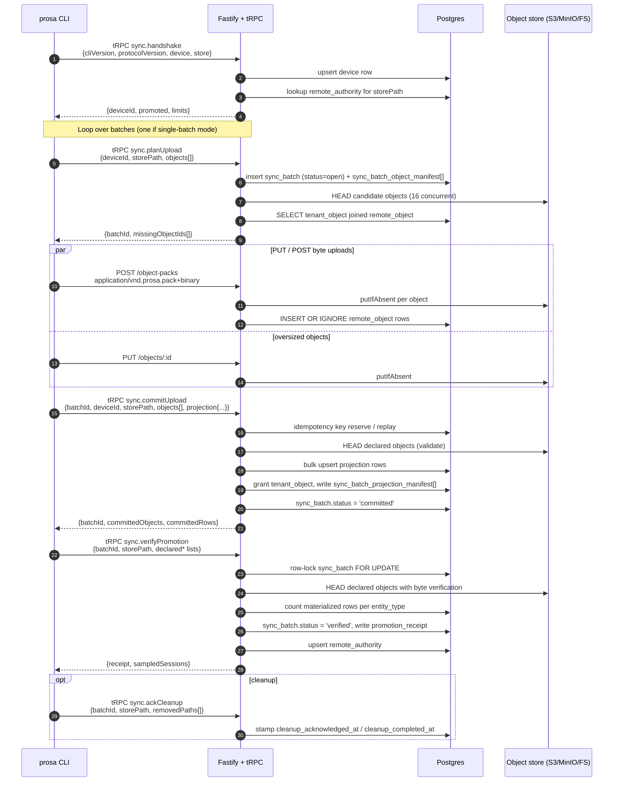

# 06 — Sync protocol

`prosa sync` promotes a local bundle to the remote API server. Promotion is one-way: the server is a destination, never a peer. This document specifies the wire protocol, the operational modes (single-batch vs chunked), the binary object-pack format, the retry and concurrency model, and where the time is spent.

The shared Zod schemas live in `packages/prosa-sync/src/schemas.ts`. The protocol version constant is `PROTOCOL_VERSION = 1` — bumping it is the cross-cutting signal for a future-incompatible change.

## High-level sequence



Every step except the byte PUT/POST is a tRPC mutation under `sync.*`. Byte uploads are direct HTTP routes at `/objects/:objectId` (single) and `/object-packs` (binary pack).

## Step 1 — `sync.handshake`

### Input

```ts
type HandshakeInput = {
  cliVersion: string                    // from process.env.npm_package_version
  protocolVersion: 1                    // PROTOCOL_VERSION
  device: { name: string; platform: string }   // e.g. {name: "macbook-pro-m3", platform: "darwin-arm64"}
  store: { path: string; bundleVersion: '1' }
}
```

### Output

```ts
type HandshakeOutput = {
  serverVersion: string
  protocolVersion: 1
  deviceId: string
  promoted: boolean                     // is this storePath already in remote_authority for this tenant?
  limits: {
    maxObjectsPerPlan: 10000            // objects per single planUpload call
    maxRowsPerCommit: 10000             // projection rows per single commitUpload call
    maxObjectBytes: 8 * 1024 * 1024     // 8 MB per binary object-pack
  }
}
```

### Server behavior

1. Resolve session + user via Better Auth bearer token; resolve tenant via `x-prosa-tenant-id` header or session's `activeOrganizationId`. Verify membership in the `member` table. Reject `403 FORBIDDEN` if not a member.
2. Upsert a `device` row scoped to `(tenantId, userId, name)`. Returns the existing `deviceId` if `(name, platform)` has been seen before; otherwise inserts a new one.
3. Query `remote_authority` for `(tenantId, storePath)` and return `promoted = true` if found.
4. Return the negotiated limits.

The limits are server-controlled. The CLI uses them to decide between single-batch and chunked mode.

## Step 2 — `sync.planUpload`

### Input

```ts
type PlanUploadInput = {
  deviceId: string
  storePath: string
  objects: Array<{
    objectId: string                    // "blake3:<hex>"
    hash: string                        // canonical BLAKE3 of uncompressed bytes
    transportHash?: string              // BLAKE3 of bytes-on-wire (compressed payload)
    hashAlgorithm: 'blake3'
    compression: 'zstd' | 'none'
    uncompressedSize: number
    compressedSize: number
    contentType?: string
  }>
}
```

The CLI builds `objects[]` from the local `objects` table for the batch's range. The `transport_hash` column (added by migration 005) is the cached BLAKE3 of the bytes-on-disk, so the CLI doesn't re-hash compressed bytes here.

### Output

```ts
type PlanUploadOutput = {
  batchId: string                       // "batch_<uuid>"
  missingObjectIds: string[]            // ids the server doesn't have yet, in manifest order
  uploadUrlTemplate: '/objects/:objectId'
}
```

### Server behavior

```ts
// apps/api/src/trpc/routers/sync/plan-upload.ts (simplified)
export async function planUpload(ctx, input) {
  // 1. Create sync_batch row in 'open' status
  const batchId = `batch_${uuid()}`
  await ctx.rawExec(
    `INSERT INTO sync_batch (id, tenant_id, user_id, device_id, store_path, status, object_count)
     VALUES ($1, $2, $3, $4, $5, 'open', $6)`,
    [batchId, ctx.tenantId, ctx.user.id, input.deviceId, input.storePath, input.objects.length],
  )

  // 2. Write per-object manifest rows
  await batchInsertObjectManifest(ctx, batchId, input.objects)

  // 3. Find which objects the server already has
  const missingObjectIds = await findMissingObjectIds({
    rawExec: ctx.rawExec,
    objectStore: ctx.objectStore,
    objects: input.objects,
    tenantId: ctx.tenantId,
  })

  // 4. Update plan_missing_count for telemetry
  await ctx.rawExec(
    `UPDATE sync_batch SET plan_missing_count = $1, updated_at = now() WHERE id = $2`,
    [missingObjectIds.length, batchId],
  )

  return { batchId, missingObjectIds, uploadUrlTemplate: '/objects/:objectId' }
}
```

### `findMissingObjectIds` — the hot path

```ts
// apps/api/src/objects/locations.ts
const OBJECT_STORE_IO_CONCURRENCY = 16

export async function findMaterializedObjectIds(opts: {
  rawExec: RawExec
  objectStore: RemoteObjectStore
  objects: MaterializedObjectCandidate[]
  tenantId: string
  verifyBytes?: boolean
  concurrency?: number
}): Promise<Set<string>> {
  if (opts.objects.length === 0) return new Set()

  // Dedup by object ID (preserve first occurrence)
  const byObjectId = new Map<string, MaterializedObjectCandidate>()
  for (const candidate of opts.objects) {
    if (!byObjectId.has(candidate.object.objectId)) {
      byObjectId.set(candidate.object.objectId, candidate)
    }
  }

  // Single bulk query — which (tenantId, objectId) pairs exist?
  const rows = await opts.rawExec<LocationRow>(
    `SELECT ro.object_id, ro.hash, ...
       FROM "tenant_object" to_
       JOIN "remote_object" ro ON ro.object_id = to_.object_id
       LEFT JOIN "remote_object_location" l ON l.object_id = ro.object_id AND l.tenant_id = to_.tenant_id
       LEFT JOIN "remote_blob" b ON b.id = l.blob_id
      WHERE to_.tenant_id = $1 AND to_.object_id = ANY($2::text[])`,
    [opts.tenantId, [...byObjectId.keys()]],
  )

  // Concurrent HEAD on object store, up to concurrency=16.
  // Preserves manifest order on the way out.
  const found = new Set<string>()
  await mapConcurrent(rows, opts.concurrency ?? OBJECT_STORE_IO_CONCURRENCY, async (row) => {
    const candidate = byObjectId.get(row.object_id)
    if (!candidate) return
    if (await rowHasCompatibleObjectBytes(opts.objectStore, row, candidate, opts.verifyBytes ?? false)) {
      found.add(row.object_id)
    }
  })

  return found
}

export async function findMissingObjectIds(opts: {...}): Promise<string[]> {
  const found = await findMaterializedObjectIds({ ...opts })
  return opts.objects
    .filter((object) => !found.has(object.objectId))
    .map((object) => object.objectId)
}
```

PR #45 (`ddcb3ab`, "perf(sync): batch tenant_object lookup in findMissingObjectIds") replaced a per-object SELECT loop with the single bulk query above and made the HEAD checks concurrent while preserving manifest order. The concurrency cap is hard-coded at 16.

## Step 3 — Object byte upload

Two HTTP routes, both authenticated by the same Bearer + tenant header pair, both verifying batch ownership.

### 3a. Binary object pack (preferred; faster)

`POST /object-packs?batchId=<id>`, body `application/vnd.prosa.pack+binary`.

The pack is encoded as one JSON header (declaring the entries and their byte offsets) followed by the concatenated payload.

```ts
// apps/cli/src/cli/auth/client.ts (prepareObjectPackUpload, simplified)
type ObjectPackWireEntry = {
  objectId: string
  hash: string
  hashAlgorithm: 'blake3'
  transportHash?: string
  compression: 'zstd' | 'none'
  compressedSize: number
  uncompressedSize: number
  contentType?: string
  offset: number                        // byte offset into payload
  length: number                        // byte length in payload
}

function prepareObjectPackUpload(
  objects: ObjectPackUploadEntry[],
): { entries: ObjectPackWireEntry[]; payload: Buffer } {
  let offset = 0
  const buffers: Buffer[] = []
  const entries: ObjectPackWireEntry[] = objects.map((object) => {
    const bytes = Buffer.from(object.bytes.buffer, object.bytes.byteOffset, object.bytes.byteLength)
    buffers.push(bytes)
    const length = bytes.byteLength
    const entry: ObjectPackWireEntry = {
      objectId: object.objectId,
      hash: object.hash,
      hashAlgorithm: object.hashAlgorithm,
      ...(object.transportHash ? { transportHash: object.transportHash } : {}),
      compression: object.compression,
      compressedSize: object.compressedSize,
      uncompressedSize: object.uncompressedSize,
      ...(object.contentType ? { contentType: object.contentType } : {}),
      offset,
      length,
    }
    offset += length
    return entry
  })
  return { entries, payload: Buffer.concat(buffers, offset) }
}
```

The server parses the header, validates each entry, decompresses zstd payloads, verifies the canonical BLAKE3 of decompressed bytes matches the declared `hash`, then `objectStore.putIfAbsent(storageKey, payload)`.

Limits per pack:
- `OBJECT_PACK_ENTRY_LIMIT = 1024` objects per pack.
- `DEFAULT_OBJECT_PACK_MAX_BYTES = 8 * 1024 * 1024` (8 MB) — both compressed and uncompressed totals must stay under this.

### 3b. Individual PUT (fallback for old servers and oversized objects)

`PUT /objects/:objectId?batchId=&hash=&size=&uncompressed=&compression=&transportHash=`, body `application/octet-stream`.

The route does the same validation as the pack version, then writes through `objectStore.putIfAbsent`. Used when an object exceeds the 8 MB pack limit, or when the older server version doesn't advertise pack support.

### Split between pack and PUT

```ts
// apps/cli/src/cli/sync/promotion.ts
const OBJECT_PACK_ENTRY_LIMIT = 1024
const DEFAULT_OBJECT_PACK_MAX_BYTES = 8 * 1024 * 1024

export function splitMissingObjectUploads(
  missingObjects: LocalCasObject[],
  maxObjectPackBytes: number = DEFAULT_OBJECT_PACK_MAX_BYTES,
): { packs: PackableCasObject[][]; putObjects: LocalCasObject[] } {
  const packs: PackableCasObject[][] = []
  const putObjects: LocalCasObject[] = []
  let current: PackableCasObject[] = []
  let currentCompressed = 0
  let currentUncompressed = 0

  for (const object of missingObjects) {
    if (!isSafePackObject(object, maxObjectPackBytes)) {
      putObjects.push(object)        // single object exceeds 8 MB → individual PUT
      continue
    }
    const nextCompressed = currentCompressed + object.entry.compressedSize
    const nextUncompressed = currentUncompressed + object.entry.uncompressedSize
    if (
      current.length >= OBJECT_PACK_ENTRY_LIMIT ||
      nextCompressed > maxObjectPackBytes ||
      nextUncompressed > maxObjectPackBytes
    ) {
      if (current.length > 0) packs.push(current)
      current = []
      currentCompressed = 0
      currentUncompressed = 0
    }
    current.push(object)
    currentCompressed = nextCompressed
    currentUncompressed = nextUncompressed
  }

  if (current.length > 0) packs.push(current)
  return { packs, putObjects }
}
```

### Uploading concurrently

```ts
// apps/cli/src/cli/sync/promotion.ts
export async function uploadMissingCasObjects({
  client, batchId, missingObjects, objectConcurrency, uploadConcurrency,
  maxObjectPackBytes = DEFAULT_OBJECT_PACK_MAX_BYTES,
}): Promise<MissingObjectUploadStats> {
  const { packs, putObjects } = splitMissingObjectUploads(missingObjects, maxObjectPackBytes)
  const concurrency = () => uploadConcurrency?.current() ?? objectConcurrency

  await mapConcurrent(packs, concurrency(), async (pack) => {
    await client.uploadObjectPack({
      batchId,
      objects: pack.map(({ entry, bytes }) => ({ ...entry, bytes })),
    })
  })

  await mapConcurrent(putObjects, concurrency(), async (object) => {
    await uploadObjectPut(client, batchId, object)
  })

  return {
    packedObjectCount: packs.reduce((sum, pack) => sum + pack.length, 0),
    packCount: packs.length,
    putObjectCount: putObjects.length,
  }
}
```

### Default concurrency

```ts
// apps/cli/src/cli/commands/sync.ts
const DEFAULT_OBJECT_UPLOAD_CONCURRENCY = 32   // packs + PUTs in flight
const MIN_OBJECT_UPLOAD_CONCURRENCY = 1
const MAX_OBJECT_UPLOAD_CONCURRENCY = 128
const DEFAULT_BATCH_CONCURRENCY = 4            // parallel projection phase chunks
const MIN_BATCH_CONCURRENCY = 1
const MAX_BATCH_CONCURRENCY = 8
```

Both flags are user-tunable: `--object-concurrency <n>`, `--batch-concurrency <n>`.

### Producer-consumer pipeline (memory bounding)

Reading object bytes from local CAS files and uploading them are decoupled to keep memory bounded. PR #44 (`567fc0f`, "perf(sync): producer-consumer pipeline for sync object upload") introduced this:

```ts
// apps/cli/src/cli/sync/pipeline.ts (simplified)
await runReadUploadPipeline<LocalCasObjectChunk, LocalCasObjectUpload>({
  items: opts.missingObjects,
  readConcurrency: Math.min(8, opts.objectConcurrency),    // up to 8 disk readers
  uploadConcurrency: 1,                                    // serialize pack assembly
  queueBound: 32,                                          // max 32 objects in flight in memory
  maxBufferedBytes: 8 * 1024 * 1024,                       // 8 MB buffered total
  loadedByteLength: ({ bytes }) => bytes.byteLength,
  load: async (object) => {
    const bytes = await bytesForUpload(opts.storePath, object, opts.metrics)
    return { object, bytes }
  },
  consume: async ({ object, bytes }) => {
    pendingObjects.push({ ...object, bytes })
    pendingBytes += bytes.byteLength
    if (pendingObjects.length >= 1024 || pendingBytes >= flushThresholdBytes) {
      await flushPending()   // POST /object-packs
    }
  },
  releaseLoaded: ({ object }) => {
    object.bytes = undefined  // free memory after upload
  },
})
```

Disk-bound and network-bound stages run independently with a bounded queue between them.

### Retry and backoff

```ts
// apps/cli/src/cli/auth/client.ts
const OBJECT_UPLOAD_MAX_ATTEMPTS = 6
const OBJECT_UPLOAD_BASE_BACKOFF_MS = 500
const OBJECT_UPLOAD_MAX_BACKOFF_MS = 15_000

// Backoff: min(15s, 500ms × 2^attempt) + random(0..250ms)
// Retryable: ECONNRESET, ETIMEDOUT, AbortError, etc., and HTTP 408, 429, 5xx
// Honors `Retry-After` header if present.

private async retriableFetch<T>({ operation, request, parse }: RetriableFetchOptions): Promise<T> {
  for (let attempt = 0; attempt < OBJECT_UPLOAD_MAX_ATTEMPTS; attempt += 1) {
    try {
      response = await request()
    } catch (err) {
      if (!isRetryableNetworkError(err) || attempt >= OBJECT_UPLOAD_MAX_ATTEMPTS - 1) throw
      const delayMs = objectUploadBackoffMs(attempt)
      this.onRetry?.({ operation, attempt: attempt + 1, delayMs, reason: networkErrorReason(err) })
      await sleep(delayMs)
      continue
    }
    if (isRetryableObjectUploadStatus(response.status) && attempt < OBJECT_UPLOAD_MAX_ATTEMPTS - 1) {
      const delayMs = objectUploadBackoffMs(attempt, response.headers)
      this.onRetry?.({ operation, attempt: attempt + 1, delayMs, reason: `HTTP ${response.status}` })
      await sleep(delayMs)
      continue
    }
    return parse(response)
  }
}
```

### Adaptive upload concurrency

Commit `10b40d1` ("fix(cli): harden chunked sync retries") added this controller so transient retries automatically reduce in-flight pressure:

```ts
// apps/cli/src/cli/sync/promotion.ts
export class AdaptiveUploadConcurrencyController {
  private value: number
  private successStreak = 0

  constructor(private readonly ceiling: number,
              private readonly onChange?: (change: AdaptiveUploadConcurrencyChange) => void) {
    this.value = Math.max(1, ceiling)
  }

  current(): number { return this.value }

  recordRetry(): void {
    const previous = this.value
    this.value = Math.max(1, Math.floor(this.value / 2))   // halve on every retry
    this.successStreak = 0
    if (this.value !== previous) {
      this.onChange?.({ previous, current: this.value, reason: 'retry' })
    }
  }

  recordSuccess(): void {
    if (this.value >= this.ceiling) return
    this.successStreak += 1
    if (this.successStreak < 10) return                    // require 10 successes
    this.successStreak = 0
    const previous = this.value
    this.value = Math.min(this.ceiling, this.value + 1)    // grow by 1
    if (this.value !== previous) {
      this.onChange?.({ previous, current: this.value, reason: 'success' })
    }
  }
}
```

Wired in:

```ts
const uploadConcurrency = new AdaptiveUploadConcurrencyController(options.objectConcurrency, ...)
const client = new ProsaApiClient({
  baseUrl: server, token: entry.token, tenantId: tenantHint,
  onRetry: (event) => {
    if (event.operation.startsWith('object ')) uploadConcurrency.recordRetry()
  },
  onRequestSuccess: (event) => {
    if (event.operation.startsWith('object ')) uploadConcurrency.recordSuccess()
  },
})
```

## Step 4 — `sync.commitUpload`

### Input

```ts
type CommitUploadInput = {
  batchId: string
  deviceId: string
  storePath: string
  objects: Array<ObjectManifestEntry>   // same shape as in planUpload
  projection: {
    sourceFiles?: ProjectionSourceFileRow[]
    rawRecords?: ProjectionRawRecordRow[]
    sessions?: ProjectionSessionRow[]
    searchDocs?: SearchDocRow[]
    toolCalls?: ProjectionToolCallRow[]
    toolResults?: ProjectionToolResultRow[]
    messages?: ProjectionMessageRow[]
    contentBlocks?: ProjectionContentBlockRow[]
    events?: ProjectionEventRow[]
    artifacts?: ProjectionArtifactRow[]
  }
}
```

Each projection row carries `(tenant_id, id)`-compatible keys plus the columns the server's mirror table needs. The shape mirrors the canonical projection from §03.

### Output

```ts
type CommitUploadOutput = {
  batchId: string
  committedObjects: number
  committedRows: number
}
```

### Server behavior

```ts
// apps/api/src/trpc/routers/sync/commit-upload.ts (simplified)
export async function commitUpload(ctx, input) {
  // Idempotency: reserve a key derived from (batchId, storePath). If a prior
  // request with the same key reached the response stage, return the cached
  // result instead of re-executing the transaction.
  const idempotency = await reserveCommitUploadIdempotency(ctx, input)
  if (idempotency?.replay) return idempotency.replay

  await ctx.transaction(async (tx) => {
    // 1. Insert (or no-op) remote_object rows for declared objects
    await batchUpsertRemoteObjects(tx, input.objects)

    // 2. Grant tenant_object access (refcount upsert)
    await batchInsertTenantObject(tx, ctx.tenantId, input.objects)

    // 3. Insert/upsert projection rows in FK order (sourceFiles → rawRecords → sessions → ...)
    await insertProjectionRows({
      rawExec: tx,
      tenantId: ctx.tenantId,
      batchId: input.batchId,
      projection: input.projection,
    })

    // 4. Write sync_batch_projection_manifest (one row per entity_type/entity_id)
    await batchInsertProjectionManifest(tx, ctx.tenantId, input.batchId, input.projection)

    // 5. Transition batch
    await tx(`UPDATE sync_batch SET status = 'committed', row_count = $1, updated_at = now()
              WHERE id = $2`, [totalRowCount, input.batchId])
  })

  // Stash the response for idempotent retries.
  const response = { batchId: input.batchId, committedObjects, committedRows }
  await idempotency?.store(response)
  return response
}
```

`insertProjectionRows` does bulk `INSERT ... ON CONFLICT (tenant_id, id) DO UPDATE` for every projection type, using prepared statements with row-batched parameters. PR #42 (`3d5da96`, "perf(sync): batch projection upserts in commit-upload") replaced per-row upserts with this bulk form.

### Idempotency

`syncCommitUpload` accepts an `idempotencyKey` header. The CLI sets it once per batch attempt and reuses it on retry. The server's idempotency store (a Postgres-backed reservation) caches the successful response so a network-truncated success isn't re-executed.

## Step 5 — `sync.verifyPromotion`

### Input

```ts
type VerifyPromotionInput = {
  batchId: string
  storePath: string
  sampleSessionIds: string[]            // up to 5; used for the response's sampledSessions echo
  declaredObjectIds: string[]
  declaredSourceFileIds: string[]
  declaredRawRecordIds: string[]
  declaredSessionIds: string[]
  declaredSearchDocIds: string[]
  declaredToolCallIds: string[]
  declaredToolResultIds: string[]
  declaredMessageIds: string[]
  declaredContentBlockIds: string[]
  declaredEventIds: string[]
  declaredArtifactIds: string[]
}
```

Each declared list is capped at 10,000 entries (server enforces).

### Output

```ts
type VerifyPromotionOutput = {
  receipt: PromotionReceipt
  sampledSessions: Array<{ id: string; title: string | null; turnCount: number }>
}

type PromotionReceipt = {
  batchId: string
  tenantId: string
  deviceId: string
  storePath: string
  manifestHash: string                  // cryptographic hash of batch contents
  sessionCount: number
  objectCount: number
  searchDocCount: number
  batchObjectCount: number
  batchSourceFileCount: number
  batchRawRecordCount: number
  batchSessionCount: number
  batchSearchDocCount: number
  batchToolCallCount: number
  batchToolResultCount: number
  batchMessageCount: number
  batchContentBlockCount: number
  batchEventCount: number
  batchArtifactCount: number
  declaredObjectsVerified: number
  declaredSourceFilesVerified: number
  declaredRawRecordsVerified: number
  declaredSessionsVerified: number
  declaredSearchDocsVerified: number
  declaredToolCallsVerified: number
  declaredToolResultsVerified: number
  declaredMessagesVerified: number
  declaredContentBlocksVerified: number
  declaredEventsVerified: number
  declaredArtifactsVerified: number
  cleanupEligible: boolean
  verifiedAt: string
}
```

### Server behavior

```ts
// apps/api/src/trpc/routers/sync/verify-promotion.ts (simplified)
export async function verifyPromotion(ctx, input) {
  await ctx.transaction(async (tx) => {
    // Row-lock the batch FOR UPDATE to serialize concurrent verify calls.
    const batch = await tx<...>(`SELECT * FROM sync_batch WHERE id = $1 AND tenant_id = $2 FOR UPDATE`,
                                [input.batchId, ctx.tenantId])

    // Load object manifest and projection manifest for this batch.
    const objectManifest = await loadObjectManifest(tx, ctx.tenantId, input.batchId)
    const projectionManifest = await loadProjectionManifest(tx, ctx.tenantId, input.batchId)

    // 1. Re-verify object bytes (HEAD with byte verification, concurrency=16)
    await verifyObjectManifest({
      rawExec: tx,
      objectStore: ctx.objectStore,
      tenantId: ctx.tenantId,
      objectManifest,
    })  // throws if any declared object's bytes aren't materialized

    // 2. Count declared vs materialized rows for every entity type
    const verified = await countVerifiedRows(tx, ctx.tenantId, input)

    // 3. Build the receipt and the manifestHash
    const receipt: PromotionReceipt = buildPromotionReceipt({...verified, manifestHash})

    // 4. Update sync_batch
    await tx(`UPDATE sync_batch SET status = 'verified', promotion_receipt = $1::jsonb,
              updated_at = now() WHERE id = $2`, [receipt, input.batchId])

    // 5. Upsert remote_authority for (tenantId, storePath)
    await tx(`
      INSERT INTO remote_authority(tenant_id, device_id, store_path, promotion_receipt)
      VALUES ($1, $2, $3, $4::jsonb)
      ON CONFLICT (tenant_id, store_path) DO UPDATE
        SET promotion_receipt = EXCLUDED.promotion_receipt, promoted_at = now()
    `, [ctx.tenantId, batch.device_id, input.storePath, receipt])

    return { receipt, sampledSessions: await sampleSessions(tx, input.sampleSessionIds) }
  })
}
```

`verifyObjectManifest` re-runs the same HEAD-based byte verification used in `planUpload`, but with `verifyBytes = true` so the storage adapter compares the on-store bytes against the declared transport hash. This is the single largest source of per-batch wall-clock time when most objects already exist — every declared object incurs an object-store HEAD plus a hash comparison.

## Step 6 — `sync.ackCleanup` (optional)

### Input

```ts
type AckCleanupInput = {
  batchId: string
  storePath: string
  removedPaths: string[]                // local paths the CLI deleted
}
```

### Server behavior

Stamps `cleanup_acknowledged_at` and `remote_authority.cleanup_completed_at`. Failures are non-fatal; the CLI catches and ignores them.

## Single-batch vs chunked mode

### Mode selection

```ts
// apps/cli/src/cli/commands/sync.ts (simplified)
const handshake = await client.syncHandshake({...})

const counts = readUploadCounts(bundle)
const estimatedBatches = estimateMixedChunkedUploadBatches(counts, handshake.limits)
const limitViolations = countLimitViolations(counts, handshake.limits)

if (limitViolations.length > 0) {
  // chunked mode
  const checkpoint = await openSyncCheckpoint({
    identity: { server, tenant, deviceId, storePath },
    resume: options.resume !== false,
  })
  result = await promoteChunkedUpload({
    client, deviceId, storePath, bundle,
    maxObjectsPerPlan: handshake.limits.maxObjectsPerPlan,
    maxRowsPerCommit: handshake.limits.maxRowsPerCommit,
    maxObjectPackBytes: handshake.limits.maxObjectBytes,
    objectConcurrency: options.objectConcurrency,
    uploadConcurrency: adaptiveController,
    batchConcurrency: options.batchConcurrency,
    progress, totalBatches: estimatedBatches, checkpoint,
  })
} else {
  // single-batch mode
  const upload = await readBundleForUpload(bundle, storePath)
  result = await promoteUpload({
    client, deviceId, storePath, upload,
    objectConcurrency: options.objectConcurrency,
    maxObjectPackBytes: handshake.limits.maxObjectBytes,
  })
}
```

### Chunked mode internals

Chunked mode is sequential at the protocol level: every batch is `planUpload → uploads → commitUpload → verifyPromotion`. Within a batch, object uploads are concurrent (controlled by `objectConcurrency`). Across batches, the loop is split into **phases** (CAS objects, then projection types in FK order), and **within a phase** batches run with `batchConcurrency` parallelism.

```ts
// apps/cli/src/cli/commands/sync.ts (simplified)
async function promoteChunkedUpload(opts) {
  // Phase 1: drain CAS objects in batches of maxObjectsPerPlan
  await promotePhase(objectCursors, batchConcurrency, async (cursor) => {
    const chunk = readObjectChunk(bundle, cursor)
    return promoteBatchTask({ casObjects: chunk.casObjects, projection: emptyProjection(), label: `cas ${cursor.sequence}` })
  })

  // Phase 2: source_files → raw_records → sessions → search_docs → tool_calls → tool_results → messages → content_blocks → events → artifacts
  for (const phase of ['source-files', 'raw-records', 'sessions', 'search-docs', 'tool-calls', 'tool-results', 'messages', 'content-blocks', 'events', 'artifacts']) {
    await promotePhase(phaseCursors[phase], batchConcurrency, async (cursor) => {
      const chunk = readChunk(bundle, phase, cursor)
      return promoteBatchTask({ casObjects: [], projection: toProjection(phase, chunk.rows), label: `${phase} ${cursor.sequence}` })
    })
  }
}
```

After each successful batch the checkpoint is saved so a re-run with `--resume` (default) can skip already-promoted batches. `--no-resume` ignores checkpoints; `--reset-sync-checkpoint` deletes them first.

### A note on batch counts (empirical)

For the 3,141-session / 834,333-object workload, chunked mode produces approximately **281 batches** under the default limits (one CAS batch per ~5,000 objects plus one projection batch per ~10,000 rows across the six projection types). Each batch is a full four-stage cycle. Even when `missingObjects = 0`, every batch pays:

- ~1 RTT for `planUpload`.
- 0 RTTs for byte upload.
- ~1 RTT for `commitUpload` + the Postgres transaction time.
- ~1 RTT for `verifyPromotion` + the object-store HEAD checks for every declared object.

At 5–20 ms per RTT plus the object-store HEAD time, each batch costs 30–300 ms even when no bytes move. 281 × 200 ms ≈ 56 seconds of pure protocol overhead; the empirical 2-hour sync includes additional latency from S3 round-trips and tenant verification cost. The redesign is encouraged to amortize this protocol overhead across batches or eliminate the per-batch verify pass.

## Checkpoint and resume

`apps/cli/src/cli/sync/checkpoint.ts` writes JSON checkpoints under `~/.config/prosa/sync-checkpoints/<hash>.json` keyed by `(server, tenant, deviceId, storePath)`. After every successful batch the cursor advances and the checkpoint is rewritten atomically. A crash or kill mid-run leaves a valid checkpoint at the last good cursor; the next invocation resumes from there.

Flag matrix:

- (default) — read checkpoint, resume from last good cursor.
- `--no-resume` — ignore checkpoint, restart from the first cursor.
- `--reset-sync-checkpoint` — delete checkpoint before starting.

## Authentication on the wire

Every tRPC mutation includes:

- `Authorization: Bearer <token>` — issued by Better Auth's `bearer` plugin during `prosa auth login` or device flow.
- `x-prosa-tenant-id: <organization-id>` — the active tenant from `prosa auth use <id>`.
- `Idempotency-Key: <uuid>` — set on `commitUpload` retries.

Object PUT/POST routes include the same `Authorization` and `x-prosa-tenant-id` headers. The server verifies tenant membership on every request — the header is never trusted alone.

```ts
// apps/api/src/trpc/context.ts
async function resolveMembership(opts) {
  const rows = await opts.rawExec<{ role: string }>(
    `SELECT role FROM "member" WHERE organization_id = $1 AND user_id = $2
       ORDER BY created_at ASC, id ASC`,
    [opts.tenantId, opts.userId],
  )
  // member < admin < owner precedence
}
```

`tenantProcedure` rejects requests without both `tenantId` and `memberRole`.

## CLI surface

```
prosa sync \
  [--server <url>] \
  [--tenant <id-or-slug>] \
  [--store <path>] \
  [--dry-run] \
  [--keep-local] \
  [--purge-bundle] \
  [--no-resume] \
  [--reset-sync-checkpoint] \
  [--object-concurrency <n>] \
  [--batch-concurrency <n>] \
  [--json] \
  [--verbose] \
  [--config <path>]
```

Behaviors:

- `--dry-run`: walks the bundle, prints the upload plan, exits without making any network calls.
- `--keep-local`: marks the bundle remote-authoritative but skips local cleanup. The bundle stays on disk for next-run idempotency.
- `--purge-bundle`: also removes `objects/`, `raw/`, `prosa.sqlite`, and `manifest.json` after verification. Default cleanup only removes derived sidecars (`search/`, `parquet/`, `exports/`).
- `--json`: machine-readable single-document output. Sample fields: `batchId`, `mode` (`single-batch`/`chunked`), `batches`, `sessions`, `searchDocs`, `metrics.planMs`, `metrics.uploadMs`, `metrics.commitMs`, `metrics.verifyMs`, `metrics.bytesUploaded`, `metrics.rowsCommitted`, `removedPaths`.
- `--verbose`: streams retry events and concurrency changes to stderr.

## Open proposals (not yet implemented)

Five sync-performance proposals remain open in the repo (`docs/sync-performance/*.md`). They are listed here because they're the obvious next steps in the current architecture, even though the redesign team is not required to implement them:

| Proposal | Idea | Estimated impact |
|---|---|---|
| #03 | Parallel batches client-side via worker pool (`pLimit(N)`) | 4–8× wall-clock under steady-state |
| #05 | Mix CAS and multiple projection types per batch | 281 → ~167 batches (-40 %) |
| #07 | New `POST /objects:bulk` pack-streaming endpoint with cap of 64 objects / 16 MB | 5–10× on byte-bound syncs |
| #10 | Per-phase metrics, throughput, ETA, and a phase progress bar | UX, not wall clock |
| #12 | Server-side packed blobs (group CAS into one blob per shard) | Cuts per-object I/O on the server |

The redesign team should treat these proposals as evidence of what the current authors believe the next layer of wins looks like, **not** as requirements. A redesign may make some of them irrelevant (e.g. log-shipping replication makes per-batch verification moot).
