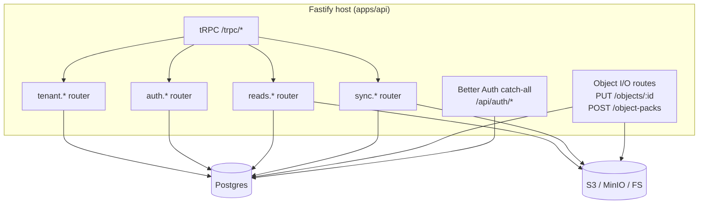
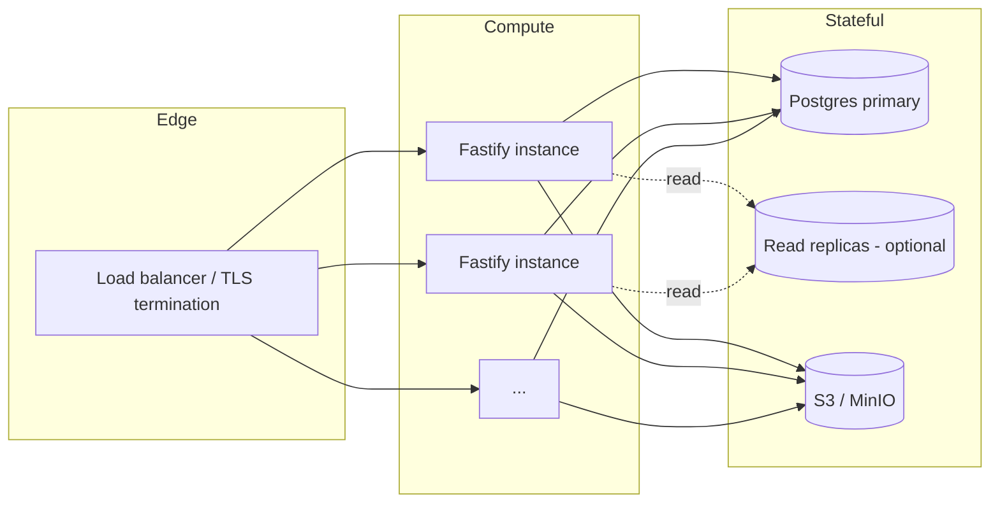

# 07 — Server architecture

The remote server is a Fastify application backed by Postgres for metadata + projection mirror and by a pluggable `RemoteObjectStore` (memory / fs / S3) for CAS bytes. It is multi-tenant, with each tenant being a Better Auth organization. This document covers the database schema, the storage abstraction, the auth and tenant model, and every tRPC + HTTP endpoint that exists today.

## Top-level component map



## Storage split

Two stores back the server:

- **Postgres** (`PROSA_DATABASE_URL`) — every row of metadata. Auth state, sync bookkeeping, CAS catalog, tenant-scoped access grants, projection mirror, search documents.
- **Object store** (`PROSA_OBJECT_STORE_*`) — every CAS byte. Implementations are interchangeable via `packages/prosa-storage`.

`PROSA_RUNTIME_MODE=production` refuses to boot with the in-memory driver and requires `PROSA_AUTH_SECRET` plus `PROSA_DATABASE_URL`.

## Postgres schema

Defined in `packages/prosa-db/src/schema/` as Drizzle ORM declarations and applied on API startup via `applySchema(raw)` (idempotent `CREATE ... IF NOT EXISTS`). A post-check fails startup if any of `user`, `session`, `organization`, `member`, `device`, `sync_batch`, `remote_object`, `tenant_object`, `projection_session`, `search_doc` is missing.

### Auth (`schema/auth.ts`)

Better Auth manages these. Used columns are documented inline:

```sql
CREATE TABLE "user" (
  id              TEXT PRIMARY KEY,
  email           TEXT NOT NULL UNIQUE,
  name            TEXT NOT NULL,
  email_verified  BOOLEAN NOT NULL DEFAULT false,
  created_at      TIMESTAMP NOT NULL DEFAULT now(),
  updated_at      TIMESTAMP NOT NULL DEFAULT now()
);

CREATE TABLE "session" (
  id                       TEXT PRIMARY KEY,
  user_id                  TEXT NOT NULL REFERENCES "user"(id) ON DELETE CASCADE,
  expires_at               TIMESTAMP NOT NULL,
  active_organization_id   TEXT,         -- the user's active tenant
  ip_address               TEXT,
  user_agent               TEXT,
  created_at               TIMESTAMP NOT NULL DEFAULT now(),
  updated_at               TIMESTAMP NOT NULL DEFAULT now()
);

CREATE TABLE "account" (
  -- OAuth / password account credentials
  id            TEXT PRIMARY KEY,
  user_id       TEXT NOT NULL REFERENCES "user"(id),
  provider_id   TEXT NOT NULL,
  account_id    TEXT NOT NULL,
  ...
);

CREATE TABLE "organization" (
  -- Each organization is a prosa tenant
  id          TEXT PRIMARY KEY,
  name        TEXT NOT NULL,
  slug        TEXT NOT NULL UNIQUE,
  created_at  TIMESTAMP NOT NULL DEFAULT now()
);

CREATE TABLE "member" (
  -- Per-(org, user) role assignment
  id              TEXT PRIMARY KEY,
  organization_id TEXT NOT NULL REFERENCES "organization"(id),
  user_id         TEXT NOT NULL REFERENCES "user"(id),
  role            TEXT NOT NULL,         -- 'member' | 'admin' | 'owner'
  created_at      TIMESTAMP NOT NULL DEFAULT now()
);

CREATE TABLE "invitation" (...);
CREATE TABLE "device_code" (...);       -- OAuth 2.0 device authorization flow
CREATE TABLE "jwks" (...);              -- Better Auth JWT signing keys
CREATE TABLE "verification" (...);
```

### Sync bookkeeping (`schema/sync.ts`)

```sql
CREATE TABLE "device" (
  -- One row per (tenant, user, device name) — the user's machine identifier.
  id           TEXT PRIMARY KEY,
  tenant_id    TEXT NOT NULL,
  user_id      TEXT NOT NULL,
  name         TEXT NOT NULL,
  platform     TEXT NOT NULL,
  cli_version  TEXT,
  created_at   TIMESTAMP NOT NULL DEFAULT now(),
  updated_at   TIMESTAMP NOT NULL DEFAULT now(),
  UNIQUE (tenant_id, user_id, name)
);

CREATE TABLE "sync_batch" (
  id                   TEXT PRIMARY KEY,         -- "batch_<uuid>"
  tenant_id            TEXT NOT NULL,
  user_id              TEXT NOT NULL,
  device_id            TEXT NOT NULL,
  store_path           TEXT NOT NULL,            -- local bundle path on the user's machine
  status               TEXT NOT NULL,            -- 'open' | 'committing' | 'committed' |
                                                 -- 'verifying' | 'verified' | 'failed'
  object_count         INTEGER,                  -- number of CAS objects declared
  plan_missing_count   INTEGER,                  -- number marked missing after plan
  row_count            INTEGER,                  -- projection rows committed
  promotion_receipt    JSONB,                    -- PromotionReceipt after verify
  error                JSONB,                    -- error message if failed
  created_at           TIMESTAMP NOT NULL DEFAULT now(),
  updated_at           TIMESTAMP NOT NULL DEFAULT now()
);

CREATE TABLE "sync_batch_object_manifest" (
  batch_id           TEXT NOT NULL,
  tenant_id          TEXT NOT NULL,
  object_id          TEXT NOT NULL,
  canonical_hash     TEXT NOT NULL,             -- BLAKE3 of uncompressed bytes
  transport_hash     TEXT,                      -- BLAKE3 of bytes-on-store
  compression        TEXT NOT NULL,
  uncompressed_size  BIGINT NOT NULL,
  compressed_size    BIGINT NOT NULL,
  storage_key        TEXT NOT NULL,             -- derived from hash + compression
  content_type       TEXT,
  PRIMARY KEY (batch_id, tenant_id, object_id)
);

CREATE TABLE "sync_batch_projection_manifest" (
  -- One row per (entity_type, entity_id) declared in a commitUpload.
  -- Reads gate against EXISTS in this table joined with sync_batch.status='verified'.
  batch_id     TEXT NOT NULL,
  tenant_id    TEXT NOT NULL,
  entity_type  TEXT NOT NULL,                   -- 'session' | 'message' | 'tool_call' | ...
  entity_id    TEXT NOT NULL,
  PRIMARY KEY (batch_id, tenant_id, entity_type, entity_id)
);

CREATE TABLE "sync_source" (...);  -- per-source enumeration of which providers a sync covered

CREATE TABLE "remote_authority" (
  -- After verifyPromotion, this maps a storePath to its signed receipt.
  -- Reads for that storePath go to the server's tenant projection.
  tenant_id                  TEXT NOT NULL,
  device_id                  TEXT,
  store_path                 TEXT NOT NULL,
  promotion_receipt          JSONB NOT NULL,
  promoted_at                TIMESTAMP NOT NULL DEFAULT now(),
  cleanup_acknowledged_at    TIMESTAMP,
  cleanup_completed_at       TIMESTAMP,
  PRIMARY KEY (tenant_id, store_path)
);
```

### CAS catalog (`schema/objects.ts`)

```sql
CREATE TABLE "remote_object" (
  -- Global catalog: one row per unique BLAKE3 hash.
  object_id          TEXT PRIMARY KEY,        -- "blake3:<hex>"
  hash               TEXT NOT NULL,           -- canonical BLAKE3 hex
  hash_algorithm     TEXT NOT NULL,           -- 'blake3'
  compression        TEXT NOT NULL,           -- 'zstd' | 'none'
  uncompressed_size  BIGINT NOT NULL,
  compressed_size    BIGINT NOT NULL,
  storage_key        TEXT NOT NULL,           -- "objects/blake3/aa/bb/<hash>.zst"
  content_type       TEXT
);

CREATE TABLE "tenant_object" (
  -- Per-tenant access grant. Reads check this to enforce tenant isolation.
  tenant_id        TEXT NOT NULL,
  object_id        TEXT NOT NULL,
  first_batch_id   TEXT,                      -- batch that introduced this object
  ref_count        INTEGER DEFAULT 1,         -- currently unused; reserved for GC
  PRIMARY KEY (tenant_id, object_id)
);

CREATE TABLE "remote_object_location" (
  -- Packed-blob location (optional; reserved for proposal #12).
  object_id      TEXT NOT NULL,
  tenant_id      TEXT NOT NULL,
  location_type  TEXT NOT NULL,               -- 'pack'
  storage_key    TEXT,
  blob_id        TEXT,
  byte_offset    BIGINT NOT NULL,
  byte_length    BIGINT NOT NULL,
  PRIMARY KEY (object_id, tenant_id)
);

CREATE TABLE "remote_blob" (
  -- Blob container for packed objects (reserved for proposal #12).
  id               TEXT PRIMARY KEY,
  hash             TEXT NOT NULL,             -- BLAKE3 of the blob
  hash_algorithm   TEXT NOT NULL,
  byte_size        BIGINT NOT NULL,
  storage_key      TEXT NOT NULL
);
```

### Projection mirror (`schema/projection.ts`)

Every server-side projection table mirrors a canonical table from §03 and is keyed `(tenant_id, id)`. The columns are essentially identical to the SQLite versions; key examples:

```sql
CREATE TABLE "projection_session" (
  tenant_id            TEXT NOT NULL,
  id                   TEXT NOT NULL,                       -- session_id
  source_tool          TEXT NOT NULL,
  source_session_id    TEXT NOT NULL,
  project_id           TEXT,
  parent_session_id    TEXT,
  is_subagent          BOOLEAN NOT NULL DEFAULT false,
  agent_role           TEXT,
  agent_nickname       TEXT,
  title                TEXT,
  summary              TEXT,
  started_at           TIMESTAMP,
  ended_at             TIMESTAMP,
  cwd_initial          TEXT,
  git_branch_initial   TEXT,
  model_first          TEXT,
  model_last           TEXT,
  status               TEXT,
  timeline_confidence  TEXT,
  metadata             JSONB,                                -- raw payload reference + extras
  created_at           TIMESTAMP NOT NULL DEFAULT now(),
  PRIMARY KEY (tenant_id, id),
  UNIQUE (tenant_id, source_tool, source_session_id)
);

CREATE TABLE "projection_message" (
  tenant_id           TEXT NOT NULL,
  id                  TEXT NOT NULL,
  session_id          TEXT NOT NULL,
  turn_id             TEXT,
  event_id            TEXT,
  source_message_id   TEXT,
  role                TEXT NOT NULL,
  author_name         TEXT,
  model               TEXT,
  created_at          TIMESTAMP NOT NULL DEFAULT now(),
  -- ordinal is derived from row_number() over (PARTITION BY session ORDER BY created_at, id)
  -- because the remote schema has no explicit ordinal column.
  PRIMARY KEY (tenant_id, id)
);
CREATE INDEX projection_message_session_idx ON "projection_message"(tenant_id, session_id);

-- Equivalent shapes for: projection_turn, projection_event, projection_content_block,
-- projection_tool_call, projection_tool_result, projection_artifact, projection_edge,
-- plus source_file, raw_record, import_batch, project.

CREATE TABLE "search_doc" (
  tenant_id    TEXT NOT NULL,
  id           TEXT NOT NULL,
  entity_type  TEXT NOT NULL,
  entity_id    TEXT NOT NULL,
  session_id   TEXT,
  body         TEXT NOT NULL,
  kind         TEXT NOT NULL,                                -- field_kind
  PRIMARY KEY (tenant_id, id)
);
CREATE INDEX search_doc_session_idx ON "search_doc"(tenant_id, session_id);
-- Full-text search: a tsvector column + GIN index (or pg_trgm fallback).
```

### Verified-projection gate

This is the single most important invariant on the server's read side. Every read query is wrapped by:

```ts
// apps/api/src/trpc/routers/reads/shared.ts
export function verifiedProjectionExistsSql(
  alias: string,
  entityType: ProjectionEntityType,
): string {
  return `EXISTS (
    SELECT 1
      FROM "sync_batch_projection_manifest" m
      JOIN "sync_batch" b
        ON b.id = m.batch_id
       AND b.tenant_id = m.tenant_id
       AND b.status = 'verified'
     WHERE m.tenant_id = ${alias}.tenant_id
       AND m.entity_type = '${entityType}'
       AND m.entity_id = ${alias}.id
  )`
}

export function tenantVerifiedProjectionSql(
  alias: string,
  entityType: ProjectionEntityType,
  tenantParam = '$1',
): string {
  return `${alias}.tenant_id = ${tenantParam} AND ${verifiedProjectionExistsSql(alias, entityType)}`
}
```

A row that was upserted by `commitUpload` but whose batch never reached `status = 'verified'` is treated as not present. This protects against partial promotions and prevents read traffic from seeing rows that haven't been receipted.

Current entity types accepted by the gate:

```
source_file, raw_record, session, search_doc,
tool_call, tool_result,
message, content_block, event, artifact
```

Adding a new entity type requires the entity type to be propagated through `manifest.ts`, `plan-upload.ts`, `commit-upload.ts`, `projection-upserts.ts`, `verify-promotion.ts`, the CLI sync emitter, and the test suite.

## Object store abstraction

```ts
// packages/prosa-storage/src/index.ts (signature)
export interface RemoteObjectStore {
  head(storageKey: string): Promise<ObjectHead | null>
  putIfAbsent(storageKey: string, bytes: Uint8Array | AsyncIterable<Uint8Array>): Promise<PutResult>
  get(storageKey: string): Promise<ReadableStream<Uint8Array>>
  delete(storageKey: string): Promise<void>
}

export interface ObjectHead {
  byteLength: number
  contentType?: string
  etag?: string
}

export interface PutResult {
  alreadyExisted: boolean
}
```

Adapters:

- `MemoryObjectStore` — Map<string, Buffer>. Test only.
- `FsObjectStore` — local filesystem under `PROSA_OBJECT_STORE_ROOT`. Used by `docker-compose.yml` and dev setups.
- `S3ObjectStore` — AWS SDK v3. PR #39 (`9b7431b`) enabled HTTP keep-alive (`agentOptions.keepAlive = true`) to avoid TLS handshake per request. Default `s3` SDK uses bucket `PROSA_OBJECT_STORE_BUCKET` + prefix `PROSA_OBJECT_STORE_PREFIX` + region `PROSA_OBJECT_STORE_REGION` + credentials `PROSA_OBJECT_STORE_ACCESS_KEY_ID` / `PROSA_OBJECT_STORE_SECRET_ACCESS_KEY` + optional `PROSA_OBJECT_STORE_ENDPOINT` (for MinIO).

CAS objects use the same fanout as the local bundle: `<prefix>/objects/blake3/<aa>/<bb>/<hash>.zst`. This lets a local bundle's `objects/` directory be uploaded straight to S3 with `aws s3 sync` and read back compatible (though the actual sync protocol doesn't do this — every byte upload goes through the API's PUT/POST handlers because tenant ownership has to be recorded in Postgres).

## Auth and tenancy

### Better Auth plugins

```ts
// apps/api/src/auth.ts (simplified)
betterAuth({
  database: drizzleAdapter(db, { provider: 'pg', schema: authSchema }),
  secret: PROSA_AUTH_SECRET,
  plugins: [
    organization({ allowUserToCreateOrganization: true }),
    deviceAuthorization({ pollingInterval: 5, expiresIn: 600 }),
    bearer(),
  ],
})
```

`/api/auth/*` is a catch-all Fastify route forwarding to the Better Auth handler. Endpoints exposed:

- `POST /api/auth/sign-up/email` — sign up with email + password + name + tenant.
- `POST /api/auth/sign-in/email` — sign in.
- `POST /api/auth/sign-out`.
- `POST /api/auth/organization/*` — create / list / set-active / invite / accept.
- `POST /api/auth/device/code` and `POST /api/auth/device/token` — OAuth 2.0 device flow.
- `GET /api/auth/jwks.json` — JWT signing keys.

The CLI's `prosa auth login` calls `sign-in/email`. `prosa auth device-login` does the device authorization flow. Both store the resulting bearer token in `~/.config/prosa/config.json` (mode 0600).

### Tenant resolution (per request)

```ts
// apps/api/src/trpc/context.ts (simplified)
export async function buildCreateContext(deps) {
  return async (opts) => {
    const headerTenant = readFirstHeader(opts.req, 'x-prosa-tenant-id')
    let session = null, user = null, memberRole = null, resolvedTenant = null

    try {
      const result = await auth.api.getSession({ headers: requestToHeaders(opts.req) })
      if (result) {
        session = result.session
        user = { id: result.user.id, email: result.user.email, name: result.user.name }
      }
    } catch { /* unauthenticated requests still get a null-session context */ }

    if (user) {
      // Tenant resolution precedence:
      //   1. explicit `x-prosa-tenant-id` header
      //   2. active organization on the session
      // Both paths must clear membership verification before tenantId is exposed.
      const candidate = headerTenant ?? session?.activeOrganizationId ?? null
      if (candidate) {
        const role = await resolveMembership({ rawExec, tenantId: candidate, userId: user.id })
        if (role) {
          resolvedTenant = candidate
          memberRole = role
        }
      }
    }

    return {
      req, res, config, requestId, auth, db, rawExec, transaction, objectStore,
      clientIp, session, user,
      tenantId: resolvedTenant,           // null if unauthenticated or not a member
      memberRole,
      isAdmin: memberRole === 'admin' || memberRole === 'owner',
    }
  }
}

async function resolveMembership(opts) {
  const rows = await opts.rawExec<{ role: string }>(
    `SELECT role FROM "member" WHERE organization_id = $1 AND user_id = $2
       ORDER BY created_at ASC, id ASC`,
    [opts.tenantId, opts.userId],
  )
  const roles = rows.map((row) => normalizeRole(row.role)).filter(Boolean)
  if (roles.length === 0) return null
  // member < admin < owner — highest wins.
  if (roles.includes('owner')) return 'owner'
  if (roles.includes('admin')) return 'admin'
  return 'member'
}
```

### Procedure middleware

```ts
// apps/api/src/trpc/init.ts (simplified)
export const publicProcedure = t.procedure
export const requireUser = t.procedure.use(({ ctx, next }) => {
  if (!ctx.user) throw new TRPCError({ code: 'UNAUTHORIZED' })
  return next({ ctx })
})

const requireTenant = requireUser.unstable_pipe(({ ctx, next }) => {
  if (!ctx.tenantId) {
    throw new TRPCError({
      code: 'FORBIDDEN',
      message: 'Tenant not resolved. Add the x-prosa-tenant-id header or ensure an active organization.',
    })
  }
  return next({ ctx })
})

export const tenantProcedure = t.procedure.use(requireTenant)
export const adminTenantProcedure = tenantProcedure.use(({ ctx, next }) => {
  if (!ctx.isAdmin) throw new TRPCError({ code: 'FORBIDDEN' })
  return next({ ctx })
})

export const rateLimitedProcedure = t.procedure.use(rateLimitMiddleware)
```

Better Auth's plugins enforce rate limits on sign-in / sign-up / device endpoints. The in-process `rateLimitedProcedure` adds an additional bucket for high-cost mutations.

## HTTP object routes

Defined in `apps/api/src/http/objects.ts` and wired in `apps/api/src/app.ts`:

```
PUT  /objects/:objectId?batchId=&hash=&size=&uncompressed=&compression=&transportHash=
POST /object-packs?batchId=
```

Both routes verify in order:

1. Authorization: Bearer token resolves to a member of `x-prosa-tenant-id`.
2. The referenced `sync_batch` exists, status is `'open'`, and `tenant_id` / `user_id` match the caller.
3. The object is declared by a `sync_batch_object_manifest` row for this batch.
4. Body size and declared transport hash match.
5. Decompress (if `compression='zstd'`); the canonical BLAKE3 of the decompressed bytes matches the declared `hash`.
6. Any existing `remote_object` row for the same `object_id` has compatible columns.
7. Call `objectStore.putIfAbsent(storageKey, bytes)`. If the bytes already exist, return `{ alreadyExisted: true }`.
8. `INSERT OR IGNORE remote_object` row. On insert failure after a fresh PUT, best-effort delete the bytes to avoid storage leaks.
9. Return `{ alreadyExisted }`.

`/object-packs` runs steps 3–9 for each entry in the binary pack, in sequence within one request. The pack format is described in §06.

`POST /object-packs` uses a custom Fastify content-type parser registered against `application/vnd.prosa.pack+binary` with `parseAs: 'buffer'`. The Fastify request body is the concatenated binary payload; the pack header is at the start and is followed by the concatenated entry bytes.

## tRPC routers

### `sync.*` (covered in §06)

```ts
// apps/api/src/trpc/routers/sync.ts
export const syncRouter = router({
  handshake:        tenantProcedure.input(handshakeInputSchema).mutation(...),
  planUpload:       tenantProcedure.input(planUploadInputSchema).mutation(...),
  commitUpload:     tenantProcedure.input(commitUploadInputSchema).mutation(...),
  verifyPromotion:  tenantProcedure.input(verifyPromotionInputSchema).mutation(...),
  ackCleanup:       tenantProcedure.input(ackCleanupInputSchema).mutation(...),
  status:           tenantProcedure
    .input(z.object({ storePath: z.string().min(1).optional() }).optional())
    .query(async ({ ctx, input }) => {
      // Returns remote_authority rows for the active tenant (or a specific storePath).
    }),
})
```

### `reads.*` (covered in §08)

```ts
// apps/api/src/trpc/routers/reads.ts
export const readsRouter = router({
  sessions:   sessionsRouter,    // list, count, detail, transcript, get
  search:     searchRouter,      // query
  toolCalls:  toolCallsRouter,   // list
  artifacts:  artifactsRouter,   // getText
  analytics:  analyticsRouter,   // summary, report
})
```

Every procedure in these routers is `tenantProcedure`, scoped to `ctx.tenantId`, and gated on `verifiedProjectionExistsSql` for projection reads.

### `tenant.*` (admin / membership)

```ts
export const tenantRouter = router({
  listMembers:   adminTenantProcedure.query(...),
  invite:        adminTenantProcedure.input(...).mutation(...),
  removeMember:  adminTenantProcedure.input(...).mutation(...),
  setRole:       adminTenantProcedure.input(...).mutation(...),
  // ... organization management
})
```

### `auth.*`

Read-only views into Better Auth state plus a handful of helpers (e.g. `auth.signupWithTenant` for atomic user + org + member creation).

## Operational environment variables

| Variable | Purpose |
|---|---|
| `PROSA_API_URL` | External base URL (used by Better Auth for redirect URIs) |
| `PROSA_API_HOST` | Fastify bind host |
| `PROSA_API_PORT` | Fastify bind port |
| `PROSA_LOG_LEVEL` | pino log level |
| `PROSA_RUNTIME_MODE` | `production` enforces secret + DB env; non-production allows the memory store |
| `PROSA_DATABASE_URL` | Postgres connection string (required outside tests) |
| `PROSA_AUTH_SECRET` | Better Auth signing secret (≥ 16 chars, required in production) |
| `PROSA_OBJECT_STORE_DRIVER` | `s3` \| `fs` \| `memory` |
| `PROSA_OBJECT_STORE_BUCKET` | S3 bucket |
| `PROSA_OBJECT_STORE_PREFIX` | Key prefix inside the bucket |
| `PROSA_OBJECT_STORE_ENDPOINT` | S3 endpoint override (MinIO) |
| `PROSA_OBJECT_STORE_REGION` | S3 region |
| `PROSA_OBJECT_STORE_ACCESS_KEY_ID` | S3 access key |
| `PROSA_OBJECT_STORE_SECRET_ACCESS_KEY` | S3 secret |
| `PROSA_OBJECT_STORE_ROOT` | Required for the filesystem driver |

## Deployment topology



Production currently runs in single-region. Postgres is a single primary (no replication wired in code today). S3 / MinIO is the standard object store. Better Auth's session table is in the same Postgres; the cookie cache (PR #38, `7581ee6` and `a3f536b`) avoids a DB round-trip on the hot tRPC path for active sessions.

## Docker harness

The repository ships a local end-to-end stack driven by `.justfile` and `docker-compose.yml`:

- `just docker-up` / `just docker-down` / `just docker-logs` — full local stack (API, Postgres, MinIO).
- `just dev-api` — run the API server through SWC against the docker-compose services.
- `just e2e-up` / `just e2e-down` — start/stop the Postgres + MinIO services used by the E2E suites.
- `just e2e` — API E2E suite (`apps/api/test/sync.test.ts`, `apps/api/test/verified-provenance.test.ts`, `apps/api/test/find-missing-objects.test.ts`, etc.).
- `just e2e-cli` — two-device CLI E2E suite that drives the CLI against the same harness.

The test harness gives the redesign team a working reference for the current flow.

## Where the server spends time (qualitative)

In the empirical 2-hour sync:

- **Most batches reported `missingObjects = 0`**. No bytes moved. The server still paid:
  - `planUpload`: insert sync_batch + manifest rows (~10 ms), HEAD 5,000 candidate objects with concurrency 16 (~5–30 s per batch). The HEAD step is the dominant cost when objects are already on the server because each HEAD round-trips to S3.
  - `commitUpload`: idempotency reservation + bulk projection upserts in a transaction (~50–500 ms depending on payload).
  - `verifyPromotion`: row-lock the batch, HEAD declared objects with byte verification, count rows per entity_type, write receipt, upsert `remote_authority` (~1–5 s).
  - **Total per "empty" batch**: 6–35 seconds, dominated by the two waves of object-store HEAD calls.

- The S3 keep-alive PR (#39, `686621d`) eliminated TLS handshake per request, which had been a 30–60 ms tax per HEAD. With ~5,000 HEADs per batch × 281 batches that overhead alone was on the order of 7–14 minutes before the fix.

- Postgres queries are not the dominant cost. The batched `tenant_object` lookup (PR #45) and the cookie cache (PR #38) shrank the Postgres footprint to single-digit milliseconds per call. The remaining DB time is mostly the projection bulk upserts.

The redesign team should treat the **per-batch object-store HEAD wave** as the highest-leverage hot path in the current architecture. A protocol that doesn't require re-verifying every object's bytes on every batch (or that lets bytes be verified once across many batches) is the most direct path to a sub-minute sync of an unchanged bundle.
