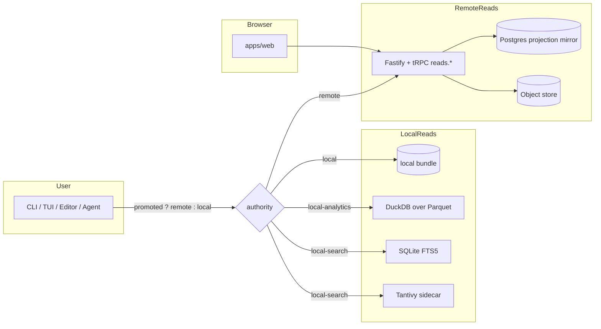

# 08 — Read paths and query API

After data has been compiled (and optionally promoted), four kinds of consumer read it back: the CLI, the MCP server, the web console, and direct ad-hoc DuckDB queries. This document covers how each one decides where to read from and what the read interfaces look like.

## The local-vs-remote decision (CLI)

Every CLI read command passes through `resolveReadAuthorityOrFailClosed` to decide whether to read locally or remotely:

```ts
// apps/cli/src/cli/auth/routing.ts (simplified)

/**
 * Decide whether a read command should hit the server or the local bundle.
 *
 * Resolution order:
 *   1. If the resolved store path has a promotion receipt, return remote
 *      authority — or fail closed if remote is unsupported for this command.
 *   2. If `--local` was provided, read locally and print an explicit stale
 *      warning when the store has a promotion receipt.
 *   3. Otherwise, return local authority with the resolved store path.
 */
export async function resolveReadAuthorityOrFailClosed(opts: {
  commandName: string
  storePath?: string
  forceLocal?: boolean
  configPath?: string
  remoteSupported: boolean
}): Promise<ReadAuthority>
```

Promotion receipts live in `~/.config/prosa/config.json` under `promotions[storePath]`, written when `sync.verifyPromotion` succeeds. They include the tenant ID, the bearer token entry to use, and the receipt's `verifiedAt`.

If a receipt exists and the command supports remote reads, a `ProsaApiClient` is instantiated tenant-scoped:

```ts
const client = new ProsaApiClient({
  baseUrl: promoted.entry.url,
  token: promoted.entry.token,
  tenantId: promoted.promotion.tenantId,
})
return { kind: 'remote', client, entry: promoted.entry, storePath: resolvedStore }
```

`--local` always reads the bundle on disk and warns if the store has been promoted.

### Per-command support matrix

| Command | `remoteSupported` | Behavior when promoted |
|---|---|---|
| `prosa sessions list` | true | Reads from `reads.sessions.list` |
| `prosa sessions count` | true | Reads from `reads.sessions.count` |
| `prosa session show` | false | Fails closed unless `--local` |
| `prosa search` | true | Returns remote results (limited filter set, see below) |
| `prosa query duckdb` | false | Fails closed; always local |
| `prosa analytics <report>` | false | Fails closed; always local |
| `prosa export session` | false | Fails closed; always local |
| `prosa export parquet` | false | Fails closed; always local |
| `prosa mcp serve` | false | Fails closed; always local |
| `prosa mcp stdio` | false | Fails closed; always local |
| `prosa tui` | false | Fails closed; always local |
| `prosa doctor` | false | Always local (bundle health check) |
| `prosa index *` | false | Always local |

The fail-closed default is deliberate: surfacing local data when the user thinks they're reading the server, or vice versa, would silently break user mental models. Commands that don't have a remote equivalent (analytics over Parquet, DuckDB, transcript rendering) must be invoked with `--local` explicitly when the store is promoted.

## Remote read API (tRPC `reads.*`)

All read procedures use `tenantProcedure`, requiring a verified tenant context. All projection reads gate on the verified-projection EXISTS subquery from §07.

### `reads.sessions`

```ts
// apps/api/src/trpc/routers/reads/sessions.ts (sketch)
export const sessionsRouter = router({
  list: tenantProcedure.input(sessionsListInput.default({})).query(async ({ ctx, input }) => {
    // Cursor-paginated list over projection_session with verified manifest entries
    // Reads: projection_session (tenant_id, started_at, source_kind, title, project_id),
    //        projection_tool_call (verified manifest gate, optional join for counts),
    //        projection_tool_result (for error_count aggregates).
    // Returns: { rows: SessionRow[], nextCursor: string | null }
  }),

  count: tenantProcedure.input(sessionsCountInput.default({})).query(async ({ ctx, input }) => {
    // Scalar count of sessions matching filters.
    // Returns: { count: number }
  }),

  detail: tenantProcedure.input(eventCursorPageInput.extend({ sessionId: z.string().min(1) })).query(async ({ ctx, input }) => {
    // Session header + paginated events.
    // CQ-004: projection_event / projection_artifact don't have row-level
    // verified-manifest entries in v0, so this returns empty pages with an
    // explicit `auxiliaryRowsAvailable: false` flag until the manifest grows
    // those entity_types.
    // Returns: { session, events: { rows: [], nextCursor: null }, relatedArtifacts: [],
    //            auxiliaryRowsAvailable: false }
  }),

  transcript: transcriptProcedure,
  get: tenantProcedure.input(z.object({ id: z.string().min(1) })).query(async ({ ctx, input }) => {
    // Legacy single-session fetch kept for CLI/MCP consumers.
    // Returns: SessionRow & { metadata }
  }),
})
```

### `reads.sessions.transcript`

The transcript procedure is the heaviest read. It mirrors the local `loadTranscript` shape but defers large bodies to CAS to keep payload bounded.

```ts
// apps/api/src/trpc/routers/reads/transcript.ts (sketch)
const INLINE_TEXT_BUDGET_BYTES = 8 * 1024  // 8 KiB

export const transcriptProcedure = tenantProcedure.input(transcriptInput).query(async ({ ctx, input }) => {
  // Multi-pass over a cursor page of messages:
  //   1. projection_session — header (or null if not verified-promoted)
  //   2. COUNT queries for message_count, tool_call_count, error_count
  //   3. projection_message — page of messages, with row_number() OVER ()
  //      providing a derived ordinal (no explicit ordinal column on the remote schema)
  //   4. projection_content_block — by message_ids on this page
  //   5. projection_tool_call — by turn_ids on this page
  //   6. projection_tool_result — DISTINCT ON (tool_call_id) latest per call
  //   7. de-duplicate tool calls across sibling messages in the same turn
  //
  // Inline blocks ≤ 8 KiB; larger ones return { textObjectId, textInline: null }
  // so the web fetches via `artifacts.getText` on demand.
  //
  // Returns: RemoteTranscriptPage | null
})
```

The choice to derive ordinal via `row_number() OVER (...)` (instead of carrying a stable column) is a current-design trade-off: it works but adds non-trivial cost on the order of "session messages count", which the redesign should weigh.

### `reads.search`

```ts
// apps/api/src/trpc/routers/reads/search.ts
export const searchRouter = router({
  query: tenantProcedure.input(searchInput).query(async ({ ctx, input }) => {
    // Cursor-paginated search over search_doc with session context.
    // Currently joins to projection_session for sessionTitle, sourceKind, started_at.
    // Unsupported filters fail gracefully with empty results:
    //   - roles, toolNames, canonicalToolTypes (not promoted yet)
    //   - errorsOnly (not in search_doc schema)
    // Returns: { rows: SearchRow[], nextCursor: string | null }
    //   where SearchRow = { id, sessionId, sessionTitle, sourceKind,
    //                       timestamp, fieldKind, snippet (truncated to 240 chars) }
  }),
})
```

Remote search is **fail-closed** for filters that don't have first-class server columns. The note in the code:

> CQ-005: remote search is fail-closed in v0. The CLI must not pretend to serve remote search results; instead it surfaces a clear error pointing the user back at `--local`.

That fail-closed posture is part of the read contract: the server only returns data it can prove it has.

### `reads.toolCalls`

```ts
// apps/api/src/trpc/routers/reads/tool-calls.ts
export const toolCallsRouter = router({
  list: tenantProcedure.input(toolCallsListInput.default({})).query(async ({ ctx, input }) => {
    // Cursor-paginated tool call audit with inline result status.
    // Joins:
    //   projection_tool_call (verified manifest gate)
    //   projection_session (title, source_kind)
    //   projection_tool_result (LATERAL JOIN for latest result per call)
    // Rejects unsupported filters: canonicalToolTypes, pathSubstring (not promoted yet).
    // Returns: { rows: ToolCallRow[], nextCursor: string | null,
    //            verifiedAuxiliaryAvailable: true }
  }),
})
```

### `reads.artifacts.getText`

```ts
// apps/api/src/trpc/routers/reads/artifacts.ts
export const artifactsRouter = router({
  getText: tenantProcedure.input(artifactInput).query(async ({ ctx, input }) => {
    // CQ-003: require BOTH verified projection ownership AND verified object provenance.
    //   1. The projection_artifact row must belong to a verified-promoted session.
    //   2. The referenced object must be granted to this tenant (tenant_object).
    //   3. That object must be declared by a verified batch's object manifest.
    //
    // Reads bytes from object_store (zstd decompress).
    // Truncates returned text to a configured byte budget; returns
    //   { id, objectId, contentType, bytesReturned, truncated, text, kind }
  }),
})
```

This is the on-demand body fetch that completes the transcript page. The web fetches it for any content block whose inline text was elided (text > 8 KiB).

### `reads.analytics`

```ts
// apps/api/src/trpc/routers/reads/analytics.ts
export const analyticsRouter = router({
  summary: tenantProcedure.query(async ({ ctx }) => {
    // Lightweight counts.
    // Reads: projection_session (verified), sync_batch_object_manifest, search_doc (verified).
    // Returns: { counts: { sessions, objects, docs, sources },
    //            sources: Array<{ sourceKind, count }> }
  }),

  report: tenantProcedure.input(analyticsReportInput).query(async ({ ctx, input }) => {
    // Fixed reports: 'sessions' | 'tools' | 'errors' | 'models' | 'projects'.
    // SQL templates mirror the local SQLite analytics views.
    // Returns: { report, rows: Array<Record<string, unknown>>, generatedAt }
  }),
})
```

The remote analytics report does **not** run DuckDB; it executes the same SQL templates (one per dialect) against Postgres, joining the verified-projection gate. Heavy analytics that exceed Postgres's comfortable shape are still expected to be run locally against the bundle's Parquet sidecar.

## Pagination (cursor contract)

All paginated reads use base64url-encoded JSON cursors:

```ts
// apps/api/src/trpc/routers/reads/shared.ts
export function encodeCursor(payload: CursorPayload): string {
  return Buffer.from(JSON.stringify(payload), 'utf8').toString('base64url')
}

export function decodeCursor<T extends CursorPayload = CursorPayload>(
  cursor: string | undefined,
): T | null {
  // decode, fail gracefully → null
}

export const cursorPageInput = z.object({
  cursor: z.string().optional(),
  limit: z.number().int().min(1).max(500).default(50),
})
```

Cursor payloads carry the stable sort tuple (e.g. `{ startedAt, id }`) so reads are deterministic across pages. There is no offset-based pagination.

## MCP server (local only)

The MCP server lets agent clients (Claude Code, Codex CLI, etc.) read the bundle via JSON-RPC. It runs locally and only against the local bundle — promotion does not change MCP behavior.

### Tools registered

```ts
// packages/prosa-core/src/mcp/tools.ts (sketch)
server.registerTool('search', {
  title: 'Full-text search',
  description: `Search messages, commands, paths, diffs, and result previews using the server-selected ${searchEngine} engine.
    Start here for open-ended questions with 2-5 concrete terms; then call \`sessions\` for relevant hits.`,
  inputSchema: {
    query: z.string().min(1),
    engine: z.enum(['fts5', 'tantivy']).optional(),
    field_kind: z.enum(FIELD_KINDS).optional(),
    limit: z.number().int().min(1).max(500).optional().default(50),
    raw: z.boolean().optional().default(false),
  },
  annotations: { readOnlyHint: true, idempotentHint: true },
}, async ({ query, engine, field_kind, limit, raw }) => { /* searchFullText */ })

server.registerTool('sessions', {
  title: 'List or open sessions',
  description: 'Without `session_id`, lists sessions filtered by source/time/limit. ' +
    'With `session_id`, opens that session: `format=detail` (default) returns metadata plus ' +
    'timeline events; `format=summary` returns only the session row; `format=markdown` renders ' +
    'the readable transcript.',
  inputSchema: {
    session_id: z.string().min(1).optional(),
    format: z.enum(['summary', 'detail', 'markdown']).optional().default('detail'),
    source: z.enum(SOURCE_TOOLS).optional(),
    since: z.string().optional().describe('ISO timestamp lower bound (inclusive)'),
    until: z.string().optional().describe('ISO timestamp upper bound (exclusive)'),
    limit: z.number().int().min(1).max(500).optional().default(50),
  },
  annotations: { readOnlyHint: true, idempotentHint: true },
})

server.registerTool('tool_calls', {
  title: 'Audit tool calls and file touches',
  description: 'Audit commands and tool usage. Filter by tool_name, canonical_type, session_id, ' +
    'errors_only, or path_substring. When `path_substring` is set, also surfaces matching ' +
    'artifacts so file-history questions return both invocations and produced files.',
  inputSchema: {
    session_id: z.string().min(1).optional(),
    tool_name: z.string().optional(),
    canonical_type: z.enum(CANONICAL_TOOL_TYPES).optional(),
    path_substring: z.string().min(1).optional(),
    errors_only: z.boolean().optional().default(false),
    since: z.string().optional(),
    until: z.string().optional(),
    limit: z.number().int().min(1).max(500).optional().default(100),
  },
  annotations: { readOnlyHint: true, idempotentHint: true },
})

server.registerTool('analytics', {
  title: 'Aggregate analytics reports',
  description: 'Run a built-in aggregation over the bundle: per-session metrics (`sessions`), ' +
    'tool usage rollup (`tools`), error timeline (`errors`), model usage (`models`), or ' +
    'project activity (`projects`). Backed by SQLite views; mirrors the `prosa analytics` CLI.',
  inputSchema: {
    report: z.enum(ANALYTICS_REPORTS),
    source: z.enum(SOURCE_TOOLS).optional(),
    since: z.string().optional(),
    until: z.string().optional(),
    limit: z.number().int().min(1).max(500).optional().default(50),
    // ... report-specific filters
  },
  annotations: { readOnlyHint: true, idempotentHint: true },
})

server.registerTool('artifact', {
  title: 'Get artifact bytes/text',
  description: 'Retrieve full text for an `artifact_id`. Use this when previews are not enough; ' +
    'binary artifacts return a placeholder.',
  inputSchema: { artifact_id: z.string().min(1) },
  annotations: { readOnlyHint: true, idempotentHint: true },
})

server.registerTool('compile', {
  title: 'Compile sessions or report bundle status',
  description: 'Without input, returns a status snapshot. With `source`, imports that provider; ' +
    '`overwrite: true` forces a full Tantivy rebuild.',
  inputSchema: {
    source: z.enum(SOURCE_TOOLS).optional(),
    sessions_path: z.string().min(1).optional(),
    overwrite: z.boolean().optional(),
  },
  annotations: { readOnlyHint: false, destructiveHint: false, idempotentHint: true },
})
```

### Transports

```ts
// packages/prosa-core/src/mcp/server.ts (sketch)
export async function listenMcpServer(bundle: Bundle, options: McpServerOptions): Promise<RunningServer> {
  // HTTP Streamable transport:
  // POST /mcp — JSON-RPC requests; opens a session if MCP-Session-Id header is missing
  // DELETE /mcp — close an existing session by header
  // GET /mcp — 405 (no server-initiated SSE streams)
}

export async function listenMcpStdioServer(bundle: Bundle, options: McpStdioServerOptions = {}): Promise<RunningStdioServer> {
  // Stdio transport for embedding in agent CLIs.
  const server = createMcpServer(bundle, options.searchEngine ?? 'fts5', options.storePath)
  const transport = new StdioServerTransport()
  await server.connect(transport)
}
```

## Web console (`apps/web/`)

The web UI is a Vite + React + TanStack Router app. It uses a tRPC client + React Query. The active tenant is injected by the auth context.

### Routes and their tRPC endpoints

| Route | Endpoints called |
|---|---|
| `/console/dashboard` | `analytics.summary` |
| `/console/sessions` | `sessions.list`, `sessions.count` (with filters) |
| `/console/session/:id` | `sessions.transcript` (cursor-paginated) |
| `/console/search` | `search.query` |
| `/console/tool-calls` | `toolCalls.list` |
| `/console/analytics` | `analytics.report` (five fixed reports) |

Lazy CAS body fetch via `artifacts.getText` happens on demand for content blocks larger than the 8 KiB inline budget. Pagination uses React Query's `keepPreviousData` so page transitions are smooth.

### Sample fetch shape

```ts
// apps/web/src/routes/console/sessions.tsx (sketch)
const sessions = useQuery({
  enabled: Boolean(tenantId && Object.keys(filters).some(...)),
  queryKey: tenantId ? queryKeys.sessionsList(tenantId, input) : ['sessions', 'list', 'no-tenant'],
  queryFn: async (): Promise<SessionsPage> =>
    api.sessions.list.query(buildListInput(filters, cursor)),
  placeholderData: keepPreviousData,
})
```

All queries gate on `tenantId` from `useAuth()`. The tRPC client injects the active tenant header automatically; the user can switch tenants via the org switcher in the navbar, which calls Better Auth's `setActive` and triggers a query invalidation.

## Local DuckDB query path

Two distinct execution surfaces share the same SQL templates and view shapes.

### From SQLite (MCP, CLI `--local`)

```ts
// packages/prosa-core/src/services/analytics.ts (sketch)
export function runAnalyticsReportFromBundle(options: AnalyticsBundleReportOptions): DuckDbQueryResult {
  const sql = buildAnalyticsSql(options.report, options.filters ?? {}, 'sqlite')
  const stmt = options.bundle.db.prepare<unknown[], Record<string, unknown>>(sql)
  const rows = stmt.all()
  const columns = stmt.columns().map((column) => column.name)
  return { columns, rows }
}
```

This is what `prosa analytics --local` and the MCP `analytics` tool run. The SQL is parameterized by report name and filter set; the SQLite analytics views (migration 003) provide the column shapes.

### From DuckDB over Parquet

```ts
export async function runAnalyticsReport(options: AnalyticsReportOptions): Promise<DuckDbQueryResult> {
  return queryDuckDbParquet({
    parquetDir: options.parquetDir,
    sql: buildAnalyticsSql(options.report, options.filters ?? {}, 'duckdb'),
  })
}
```

`queryDuckDbParquet` (covered in §05) wires Parquet files as DuckDB views, recreates the analytics views, and runs the SQL. CLI surface:

```
prosa analytics sessions|tools|errors|models|projects [--refresh] [filters]
prosa query duckdb '<sql>'                                # ad-hoc raw SQL
```

`--refresh` calls `exportBundleParquet` before querying, ensuring the Parquet snapshot matches the current SQLite state. Without `--refresh`, the report runs against whatever Parquet snapshot exists (potentially stale by import deltas).

## Latency characteristics (qualitative)

The current shape produces these observed latencies for typical reads:

| Read | Surface | Typical p95 |
|---|---|---|
| `sessions list` (50 rows, no filters) | Local SQLite | < 30 ms |
| `sessions list` (50 rows, no filters) | Remote Postgres | < 80 ms |
| `sessions transcript` (small session, < 50 turns) | Local SQLite | < 100 ms |
| `sessions transcript` (small session, < 50 turns) | Remote Postgres | 200–500 ms |
| `sessions transcript` (large session, > 500 turns, paginated) | Remote Postgres | 1–3 s per page |
| `search query` (FTS5, 50 hits) | Local SQLite | 50–200 ms |
| `search query` (Tantivy, 50 hits) | Local Tantivy | < 50 ms |
| `search query` | Remote Postgres | 80–200 ms |
| `analytics summary` | Remote Postgres | 50–150 ms |
| `analytics report sessions` | Local SQLite views | 100–400 ms |
| `analytics report sessions` | DuckDB over Parquet | 200–600 ms |
| `analytics report tools` (full bundle, no filter) | DuckDB over Parquet | 0.5–2 s |
| `query duckdb` (custom 5-table join) | DuckDB | 0.5–10 s |
| `artifacts.getText` (8 KiB) | Remote Postgres + S3 GET | 100–300 ms |
| `artifacts.getText` (1 MiB) | Remote Postgres + S3 GET | 300 ms – 2 s |

These numbers are not from a benchmark suite — they are the observed feel during development and the project lead's daily use. They are included here to set the order of magnitude that the redesign should beat or hold.

## Read-path topology



## Notes for the redesign

- The read API today is **fail-closed by design**: any filter or entity type that isn't represented by a verified-projection manifest column returns empty / errors out. This is good for consistency but it does mean adding features requires touching the full promotion pipeline.
- **Transcript paging is the heaviest read**. Multi-pass joins, cursor decoding, and CAS body fetch dominate. A redesign that pre-shapes the per-session payload at promotion time (or that ships compressed session blobs) would be a clear win.
- **Search filter parity** between local and remote is a known gap. The local engines (FTS5, Tantivy) carry every `search_docs` column; the remote `search_doc` table doesn't yet carry `role`, `tool_name`, `canonical_tool_type`, or `errors_only` first-class. The redesign should decide whether to align them or to converge on a single engine.
- **Analytics dual-path** (Postgres for `reads.analytics.report`, DuckDB for `prosa analytics` and `query duckdb`) keeps the SQL templates in lockstep but doubles the surface area. A redesign that runs analytics through a single OLAP engine — or that pushes Parquet snapshots to S3 and queries them server-side via DuckDB-Wasm or ClickHouse — could collapse this.
- **MCP local-only** is a hard constraint today. The MCP server has no equivalent of the verified-projection gate, and it exposes side-effecting tools like `compile`. A remote MCP for promoted bundles is a redesign question, not a current capability.
