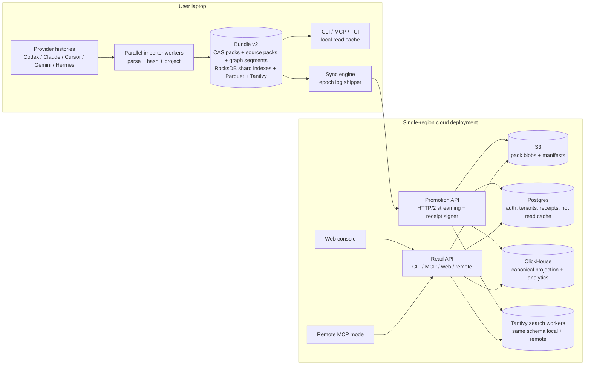

I would redesign prosa around one decisive idea: **the bundle is no longer a mutable SQL database plus loose CAS files; it becomes an append-only, content-addressed segment log with materialized read indexes.** Compile writes immutable epochs. Sync ships epochs. Reads use receipt-pinned snapshots. SQLite’s single-writer ceiling and the 281-batch plan/commit/verify loop both disappear.

## 1. High-level architecture



Deployment is **single-region, AWS-first**: API workers, Postgres, ClickHouse, Tantivy search workers, and S3 live in one region. The local bundle remains fully usable offline. Promotion is one-way, but it is now **epoch log shipping** instead of per-batch RPC bookkeeping. This fits the workload because today’s pain is not raw bytes; the current bundle has about 3,141 sessions, 811,511 raw records, 291,498 search docs, 834,333 CAS objects, and a 1.4 GB compressed input footprint, yet unchanged sync still pays roughly 281 plan→upload→commit→verify cycles.  The redesign keeps the five invariants: raw byte preservation, idempotent re-imports, canonical cross-provider graph, content-addressed dedupe, and signed promotion receipts.

## 2. Detailed sync protocol with wire formats

The new protocol is **Promotion Protocol v2**. It replaces tRPC batch promotion with four calls:

1. `BeginPromotion`
2. `UploadSegment` / `UploadObjectPack`
3. `SealPromotion`
4. `GetReceipt`

The key change is that the client does not ask the server to HEAD every object in every batch. The client sends a **bundle-root Merkle manifest**. The server answers from its catalog and existing receipts. Object-store verification happens when bytes are first uploaded, at pack granularity, and later via background audit, not during every no-op sync.

### 2.1 Bundle head and segment model

A local compile creates an immutable epoch:

```ts
type BundleHeadV2 = {
  bundleFormat: 2
  storeId: string                  // stable UUID for the logical local store
  storePath: string                // informational; not the primary identity
  epoch: number
  parserVersion: string
  createdAt: string

  previousBundleRoot: string | null
  bundleRoot: string               // Merkle root over everything below

  rawSourceRoot: string            // Merkle root over preserved source-file bytes
  objectSetRoot: string            // Merkle root over CAS object IDs + sizes + hashes
  projectionRoot: string           // Merkle root over canonical graph segments
  searchRoot: string               // Merkle root over search docs / index generation
  analyticsRoot: string            // Merkle root over Parquet/Arrow analytics segments
  sessionBlobRoot: string          // Merkle root over pre-shaped transcript blobs

  counts: {
    sourceFiles: number
    rawRecords: number
    objects: number
    sessions: number
    turns: number
    events: number
    messages: number
    contentBlocks: number
    toolCalls: number
    toolResults: number
    artifacts: number
    edges: number
    searchDocs: number
    projectionRows: number
  }

  segments: SegmentRef[]
}
```

Segments are immutable files. They are referenced by digest, not by local path.

```ts
type SegmentKind =
  | 'raw_source_pack'
  | 'cas_object_pack'
  | 'projection_arrow'
  | 'projection_parquet'
  | 'search_docs_arrow'
  | 'session_blob_pack'
  | 'manifest'

type SegmentRef = {
  segmentId: string                // "seg_<base32(blake3)>"
  kind: SegmentKind
  digest: string                   // "blake3:<hex>", over stored bytes
  logicalRoot: string              // root represented by this segment
  compression: 'zstd' | 'none'
  byteLength: number

  entityType?: CanonicalEntityType
  rowCount?: number
  minKey?: string
  maxKey?: string
  minTimestamp?: string | null
  maxTimestamp?: string | null

  objectCount?: number             // for CAS/source packs
  objectSetRoot?: string           // Merkle root of objects inside the pack
}
```

Canonical entity types remain the product’s unified graph grain:

```ts
type CanonicalEntityType =
  | 'source_file'
  | 'raw_record'
  | 'project'
  | 'session'
  | 'turn'
  | 'event'
  | 'message'
  | 'content_block'
  | 'tool_call'
  | 'tool_result'
  | 'artifact'
  | 'edge'
  | 'search_doc'
```

### 2.2 BeginPromotion

```ts
type BeginPromotionRequest = {
  protocolVersion: 2
  clientVersion: string
  device: {
    deviceId?: string
    name: string
    platform: string
    publicKey: string              // Ed25519 device key, base64url
  }
  tenantId: string
  store: {
    storeId: string
    storePath: string
  }
  head: BundleHeadV2

  previousReceiptId?: string
  previousBundleRoot?: string

  // Signature over canonical CBOR(BeginPromotionRequest without this field)
  // by the device key above.
  clientSignature: string

  options?: {
    dryRun?: boolean
    preferDirectS3?: boolean
    maxUploadBytesPerSegment?: number
  }
}
```

```ts
type BeginPromotionResponse =
  | {
      status: 'already_promoted'
      receipt: PromotionReceiptV2
    }
  | {
      status: 'needs_upload'
      promotionId: string
      resumeToken: string

      // Segments the server lacks as whole segments.
      missingSegments: Array<{
        segmentId: string
        digest: string
        kind: SegmentKind
        upload: UploadTarget
      }>

      // CAS objects the server lacks even if the exact local pack is unknown.
      // Encoded as compressed ranges or roaring bitmaps over the object manifest order.
      missingObjects: MissingObjectPlan

      acceptedExisting: {
        segmentCount: number
        objectCount: number
        rowCount: number
      }

      serverLimits: {
        maxSegmentBytes: number
        maxObjectPackBytes: number
        maxConcurrentUploads: number
      }
    }

type UploadTarget =
  | {
      mode: 'api_stream'
      url: string
      headers: Record<string, string>
    }
  | {
      mode: 's3_multipart'
      createMultipartUrl: string
      completeMultipartUrl: string
      headers: Record<string, string>
    }

type MissingObjectPlan = {
  manifestRoot: string
  encoding: 'none' | 'range_list' | 'roaring_bitmap_zstd'
  objectCount: number
  payloadBase64?: string
}
```

Server behavior:

The server first checks `remote_authority_v2` by `(tenant_id, store_id, bundle_root)`. If found, it returns the receipt immediately. This is the no-op path: one request, one response, no object list, no object-store HEAD.

If the root is unknown, the server compares segment digests and CAS object IDs against its metadata catalog, not against S3. It returns missing segments and missing object ranges. For fresh promotion, most objects are missing. For same-tenant multi-machine sync, only objects absent from the global CAS catalog are missing.

### 2.3 UploadSegment and UploadObjectPack

Projection and read-shape segments upload as whole files:

```http
PUT /v2/promotions/{promotionId}/segments/{segmentId}
Content-Type: application/vnd.prosa.segment
X-Prosa-Segment-Kind: projection_parquet
X-Prosa-Digest: blake3:<hex>
X-Prosa-Compression: zstd
X-Prosa-Resume-Token: <token>
```

Body: exact stored bytes. The server streams the body, computes BLAKE3 while receiving, rejects digest mismatch, writes to S3, then inserts one `remote_segment` row.

CAS object uploads are transport packs built from the missing object plan. These packs do **not** need to match the local on-disk pack layout.

```ts
type ObjectPackHeaderV2 = {
  format: 'prosa.object-pack.v2'
  packDigest: string               // digest over header canonical bytes + payload bytes
  compression: 'zstd' | 'none'
  objectCount: number

  entries: Array<{
    objectId: string                // "blake3:<hex>"
    hashAlg: 'blake3'
    uncompressedHash: string        // same hex as objectId
    uncompressedSize: number
    storedOffset: number
    storedLength: number
    storedHash: string              // BLAKE3 over stored bytes slice
    mimeType?: string
    encoding?: string
  }>
}
```

Wire shape:

```http
PUT /v2/promotions/{promotionId}/object-packs/{packDigest}
Content-Type: application/vnd.prosa.object-pack-v2
X-Prosa-Pack-Digest: blake3:<hex>
X-Prosa-Resume-Token: <token>
```

Body:

```text
u32le header_len
header_len bytes canonical JSON or CBOR ObjectPackHeaderV2
remaining bytes concatenated object payloads
```

The server validates every entry while streaming:

* stored slice hash matches `storedHash`
* decompressed bytes match `uncompressedHash`
* object ID equals `blake3:<uncompressedHash>`
* offsets are non-overlapping and inside the payload
* duplicate object IDs in one pack collapse to the first valid entry

After validation, the server writes one pack blob to S3 and inserts catalog rows mapping `object_id -> pack_digest, offset, length, hashes`. AWS S3 supports multipart uploads and stores checksums for objects or parts; for large packs, the direct-S3 path can use multipart upload with checksum validation instead of proxying through the API. ([AWS Documentation][1])

### 2.4 SealPromotion

```ts
type SealPromotionRequest = {
  protocolVersion: 2
  tenantId: string
  promotionId: string
  storeId: string
  storePath: string
  head: BundleHeadV2

  uploadedSegments: Array<{
    segmentId: string
    digest: string
  }>

  uploadedObjectPacks: Array<{
    packDigest: string
    objectCount: number
    objectSetRoot: string
  }>

  clientSignature: string
}
```

```ts
type SealPromotionResponse =
  | {
      status: 'materializing'
      promotionId: string
      materializationCursor: string
    }
  | {
      status: 'sealed'
      receipt: PromotionReceiptV2
    }
```

Server behavior:

`SealPromotion` is the only step that changes read authority. It is idempotent by `promotion_id = hash(tenant_id, store_id, bundle_root)`.

The server verifies that all declared segment digests and missing object ranges have either been uploaded or already existed. It then materializes:

* hot session list and session transcript blobs into Postgres
* canonical projection rows into ClickHouse
* search docs into the remote Tantivy generation
* artifact/object pointers into the CAS catalog
* receipt and authority rows into Postgres

Only after all required materializations succeed does the server sign the receipt and update `remote_authority_v2`. If materialization fails, the previous receipt remains authoritative. Reads never see partial promotion.

### 2.5 Receipt format

```ts
type PromotionReceiptV2Payload = {
  receiptVersion: 2
  receiptId: string                    // "rcpt_<base32(blake3(payload_without_sig))>"
  protocolVersion: 2

  tenantId: string
  storeId: string
  storePath: string
  deviceId: string
  devicePublicKey: string

  issuedAt: string
  serverRegion: string
  serverKeyId: string

  previousReceiptId?: string
  previousBundleRoot?: string

  bundleRoot: string
  rawSourceRoot: string
  objectSetRoot: string
  projectionRoot: string
  searchRoot: string
  analyticsRoot: string
  sessionBlobRoot: string

  counts: BundleHeadV2['counts']

  materialization: {
    objectCatalogRoot: string
    remoteSegmentRoot: string
    clickHouseCommitId: string
    searchGenerationId: string
    hotCacheGenerationId: string
    rowCountsByEntity: Record<CanonicalEntityType, number>
  }

  verification: {
    uploadDigestVerified: true
    objectHashesVerifiedAtIngest: true
    projectionRowsLoaded: true
    searchGenerationBuilt: true
    noPerObjectHeadRequired: true
    backgroundAuditEligible: true
  }

  clientSignature: string
}

type PromotionReceiptV2 = {
  payload: PromotionReceiptV2Payload
  signature: {
    alg: 'Ed25519'
    keyId: string
    sig: string
  }
}
```

This receipt is deliberately stronger than the current `PromotionReceipt`, which is batch-shaped and carries counts plus a manifest hash.  The v2 receipt is bundle-shaped: it names the exact root of raw bytes, CAS objects, canonical projection, search corpus, analytics segments, and transcript blobs. Reads that go remote pin to a receipt ID or bundle root.

### 2.6 Failure and resume behavior

A sync killed halfway through repeats `BeginPromotion` with the same `bundleRoot`. The server returns only segments and objects not yet cataloged. Already uploaded object packs and projection segments are content-addressed, so duplicate uploads are skipped. This preserves today’s useful checkpoint property while removing the 281-batch phase loop. The current protocol already checkpoints after successful batches, but each batch is still plan→upload→commit→verify and chunked by CAS objects and projection types.  In v2, the checkpoint is the server’s promotion staging catalog.

Partial network failure cases:

* Upload fails before server validates digest: segment remains absent.
* Upload succeeds but response is lost: retry sees the digest already present.
* Seal fails before receipt: previous receipt stays authoritative.
* Seal succeeds but response is lost: `GetReceipt(promotionId)` returns the signed receipt.
* Server crash during materialization: promotion row remains `materializing`; idempotent materializer resumes from segment digests and row-count checkpoints.

## 3. Storage choices and justification

### Local store: Bundle v2 segment store + RocksDB shards + Parquet + Tantivy

I would drop SQLite as the primary local store. The current SQLite WAL writer lock is the load-bearing compile bottleneck: the docs say per-file transactions hold the writer lock around 150 ms, worker-thread parallelism over the same store only gained about 15%, and longer transactions regressed by 2.7–5.6× because uniqueness checks walked accumulated WAL frames.

Bundle v2 layout:

```text
<bundle-v2>/
  head.json                         # atomic pointer to latest committed epoch
  epochs/
    000001/
      epoch.manifest.cbor
      graph/
        sessions.parquet
        messages.parquet
        tool_calls.parquet
        ...
      session_blobs/
        pack-0000.zst
      search_docs.arrow.zst
  cas/
    packs/
      pack-<digest>.prosa-pack
    large/
      <digest>.bin|zst
  raw_sources/
    packs/
      source-pack-<digest>.zst
  index/
    shard-00.rocksdb/
    ...
    shard-15.rocksdb/
  search/
    tantivy/
  tmp/
```

The local mutable index is **16 RocksDB databases**, not one RocksDB with column families. Column families are useful for logical partitioning, but they still share database infrastructure and WAL behavior; RocksDB’s own docs describe column families as logical partitions associated with key-value pairs, and WAL interactions across families require tuning. ([GitHub][2]) Separate shard DBs make the write locks independent.

Each shard stores:

```text
object:<object_id>              -> ObjectLocation
source:<tool>:<path>            -> SourceState
record:<source_file_id>:...     -> RawRecordState
entity:<type>:<id>              -> EntityLocation
session_hot:<session_id>        -> SessionSummary
transcript_blob:<session_id>    -> BlobLocation
```

Immutable graph data lives in Parquet/Arrow segments. DuckDB reads Parquet efficiently and pushes filters/projections into Parquet scans, so it remains a good local analytics engine. ([DuckDB][3]) The current Parquet sidecar is already the analytics and backup-shaped representation, but it is always full-export today.  In v2 it becomes incremental: each epoch writes new Parquet row groups, and `head.json` names the active set.

Search uses **Tantivy only**, locally and remotely, with the same `search_docs` fields. The current system already treats Tantivy as the fast lane for high-concurrency and larger search workloads, while FTS5 is the default mostly because it is bundled with SQLite.  Once SQLite is removed from the write path, FTS5 no longer earns its complexity.

Writer locks live in:

* one append lock per CAS pack writer
* one append lock per raw-source pack writer
* one RocksDB write lock per shard
* one Parquet writer per entity type per epoch
* one Tantivy writer generation

None of these is held per source file for 150 ms. Import workers emit `ImportFrame`s into queues; pack/index writers batch hundreds or thousands of records per write.

Reads stay fast because they use the last committed epoch. A compile writes `tmp/epoch_N`, then atomically renames it and swaps `head.json`. A read never blocks on an in-progress import.

Backup and restore:

* Local backup is a file copy of `head.json`, all referenced epoch manifests, CAS packs, raw-source packs, RocksDB checkpoints, Parquet segments, and Tantivy generation metadata.
* Restore validates every segment digest against the epoch manifest.
* If RocksDB or Tantivy is missing/corrupt, rebuild from epoch manifests and Parquet/Arrow segments.

### Remote OLTP: Postgres control plane and hot read cache

Postgres stays, but not as the full projection mirror. It stores:

* users, tenants, devices, auth
* promotion staging state
* receipts and authority rows
* object and segment catalogs
* hot session list rows
* pre-shaped session transcript blob pointers
* artifact pointers
* small read caches

Postgres is good for transactional authority changes. The only critical transaction is “mark this bundle root authoritative and store its signed receipt.” That is exactly the kind of small, strongly consistent write Postgres should own.

Writer locks live in short control-plane transactions. Large projection ingestion does not sit inside a huge Postgres transaction.

Reads stay fast because `sessions list`, `session header`, and transcript first page hit hot cache tables keyed by `(tenant_id, store_id, receipt_id, session_id)`.

Backup and restore:

* Postgres point-in-time recovery for control plane and receipts.
* Receipt payloads are also stored as signed immutable objects in S3.
* Rebuilding hot caches is possible from ClickHouse + session blobs if needed.

### Remote OLAP: ClickHouse MergeTree

Remote canonical projection and analytics move to ClickHouse. The workload is append-mostly, tenant-scoped, and scan-heavy for analytics. ClickHouse MergeTree tables are designed around sorted parts, sparse primary indexes, and partition pruning; ClickHouse’s docs describe sparse primary indexes and partitioning in MergeTree-family tables. ([ClickHouse][4])

Example table:

```sql
CREATE TABLE prosa_messages
(
  tenant_id String,
  store_id String,
  receipt_id String,
  session_id String,
  turn_id String,
  message_id String,
  ts Nullable(DateTime64(3)),
  source_tool LowCardinality(String),
  role LowCardinality(String),
  text_object_id Nullable(String),
  text_inline String,
  raw_record_id String
)
ENGINE = MergeTree
PARTITION BY (tenant_id, store_id)
ORDER BY (tenant_id, store_id, session_id, ts, message_id);
```

For very large multi-tenant servers, partition by hash bucket plus tenant/store, not by raw tenant alone, to avoid too many tiny partitions.

Writer locks live in ClickHouse part creation and background merges, not in row-by-row transactions. Reads stay fast because the read API pins to `receipt_id`; new promotions insert new parts and then atomically move authority in Postgres. Old receipt reads keep working until garbage collection.

Backup and restore:

* ClickHouse snapshots or replicated tables.
* Projection segments are also in S3; ClickHouse can be rebuilt from signed promotion manifests and segment files.

### Object store: S3 pack blobs, not loose tiny objects

The current design stores many small CAS objects and then HEADs them repeatedly. That shape is the wrong match for 500k–2M small CAS objects where the median object is only around 1–4 KiB.  V2 stores small objects inside 32–128 MiB pack blobs. Large objects over a threshold, say 32 MiB, can remain standalone.

Remote tables:

```sql
remote_pack(
  pack_digest text primary key,
  storage_key text not null,
  byte_length bigint not null,
  object_count bigint not null,
  created_at timestamptz not null
)

remote_object(
  object_id text primary key,
  hash_alg text not null,
  uncompressed_hash text not null,
  uncompressed_size bigint not null,
  pack_digest text not null,
  offset bigint not null,
  stored_length bigint not null,
  stored_hash text not null,
  compression text not null
)

tenant_object(
  tenant_id text not null,
  object_id text not null,
  first_receipt_id text not null,
  primary key (tenant_id, object_id)
)
```

No-op sync does not call S3. It checks `remote_authority_v2` and `remote_object` metadata. S3 HEAD is moved to background audit and rare repair.

Backup and restore:

* S3 versioning on pack blobs and receipt objects.
* Catalog can be rebuilt by scanning pack headers if Postgres catalog is lost.
* Receipts prove which pack/object roots should exist.

### Search index: Tantivy local and remote, same contract

Use one search schema everywhere:

```ts
type SearchDoc = {
  doc_id: string
  entity_type: string
  entity_id: string
  session_id?: string
  project_id?: string
  timestamp?: string
  role?: string
  tool_name?: string
  canonical_tool_type?: string
  field_kind: string
  errors_only: boolean
  text: string
}
```

This fixes the current remote/local parity gap, where remote search lacks first-class `role`, `tool_name`, `canonical_tool_type`, and `errors_only` filters.  Remote search workers build a new Tantivy generation per receipt and atomically switch an alias after `SealPromotion`. Local compile updates the local generation after the epoch commit. Search generation IDs are named in the receipt.

Backup and restore:

* Search segments are disposable, like today’s derived layer.
* Rebuild from `search_docs.arrow.zst` segments named by the receipt.

## 4. Concurrency and pipelining model

### Compile pipeline

The compile path becomes:

```text
discover files
  -> parallel stat and source-state check
  -> changed files only
  -> read raw bytes
  -> parse provider format
  -> hash + preserve raw source bytes
  -> emit ImportFrame
  -> CAS/object packer
  -> graph segment writers
  -> RocksDB shard batches
  -> Tantivy writer
  -> session blob writer
  -> epoch manifest
  -> atomic head swap
```

`ImportFrame` is the unit of work:

```ts
type ImportFrame = {
  sourceFile: SourceFileV2
  rawSourceObject: ObjectRef
  rawRecords: RawRecordV2[]
  objects: ObjectEntry[]
  projection: {
    projects: ProjectV2[]
    sessions: SessionV2[]
    turns: TurnV2[]
    events: EventV2[]
    messages: MessageV2[]
    contentBlocks: ContentBlockV2[]
    toolCalls: ToolCallV2[]
    toolResults: ToolResultV2[]
    artifacts: ArtifactV2[]
    edges: EdgeV2[]
  }
  searchDocs: SearchDoc[]
  sessionBlobs: SessionBlob[]
}
```

The throughput ceiling moves from SQLite’s single WAL writer to:

* provider parser CPU
* BLAKE3 hashing
* zstd compression
* Parquet/Tantivy segment writing
* SSD sequential write bandwidth

That is a much better ceiling. The docs already show hashing is not the dominant cost after WASM BLAKE3, and the current CAS writes are mostly bound by raw disk once the SQLite mutex is removed.

Idempotent re-imports are preserved by a source-state index. The current natural keys are file `(source_tool, path, size, mtime, content_hash)`, record `(source_file_id, ordinal, raw_object_id)`, object `object_id`, and canonical entity natural keys.  V2 keeps the same semantics but stores them in RocksDB shards and epoch manifests instead of SQLite unique constraints.

No-op compile path:

1. parallel stat provider trees
2. compare `(tool, path, size, mtime_ns)` with source-state cache
3. for exact matches, do not hash, parse, write, or rebuild
4. if all files match, exit before Tantivy/Parquet work

Single-file delta path:

1. one file misses the source-state cache
2. read and hash that file
3. write one small epoch
4. update only affected search docs, session blob, and Parquet row groups

Kill -9 behavior:

* Temp epoch directories are not referenced by `head.json`; ignored on next open.
* Pack objects written but not referenced by the epoch manifest are orphaned; safe to delete by GC.
* RocksDB shard batches are committed before the epoch manifest, but only entries with committed epoch IDs are visible.
* Reads keep using the previous committed head.

### Compile and sync sharing

Compile and sync should share a pipeline, but not by making sync part of compile’s correctness path.

During compile, once an epoch segment is sealed locally, the sync engine may upload it immediately if the user is authenticated and auto-sync is enabled. This hides network time behind parsing and indexing. But the local epoch is valid even if upload fails. The server receipt is only created by `SealPromotion`.

So the answer is “yes, compile and sync share segment streams, but compile does not depend on remote success.”

### Sync concurrency

Fresh promotion:

* object pack uploads: 4–16 concurrent streams, adaptive by bandwidth and server backpressure
* projection segments: uploaded concurrently with object packs
* server materialization: ClickHouse inserts, Postgres hot cache load, and search generation build run in parallel after required segments arrive
* receipt signing: final single transaction

No-op promotion:

* one `BeginPromotion` call
* server receipt lookup
* return existing receipt

Delta promotion:

* upload one or a few segments
* materialize only new epoch
* sign a new receipt whose `previousReceiptId` points at the old receipt

No per-batch verify is left. Verification is amortized into the receipt over the whole bundle root.

### Read concurrency

Local reads use a stable `head.json` snapshot. They never read temp epochs. Session list uses RocksDB hot summaries. Transcript first page uses `session_blob`. Search uses Tantivy. Analytics uses DuckDB over the active Parquet manifest.

Remote reads pin to a receipt:

```ts
type ReadContext = {
  tenantId: string
  storeId: string
  receiptId: string
  bundleRoot: string
}
```

The CLI, MCP, and web all use the same remote read API. MCP gets a remote mode. The old split where web is remote, MCP is local, and several CLI commands fail closed is too fragmented. The current fail-closed behavior is sensible for safety, but it exists because remote support is incomplete.  In v2, the read surface is unified:

```text
prosa read sessions
prosa read transcript
prosa read search
prosa read analytics
prosa mcp serve --authority auto|local|remote
```

Promoted bundles can also keep a local read cache. The authority remains the receipt, not the cache. If the cache root matches the receipt root, local reads can serve instantly; if not, the client either refreshes or falls back to remote.

Reads should not be served directly from S3 except for large artifact bodies with short-lived signed URLs. Transcript and search need authorization, filtering, and receipt pinning, so they should go through the API. Large artifact bodies can use signed URLs after the API checks tenant and receipt authority.

## 5. Target performance envelope

Assumptions:

* Laptop: 8+ CPU cores, NVMe SSD capable of at least 500 MB/s sequential read/write, 16 GiB RAM, v2 process allowed up to 4 GiB.
* Network: 100 Mbps sustained uplink for the fresh-promotion target, RTT to API region under 80 ms.
* Server: single AWS region, API workers with enough CPU to hash/compress at line rate, S3 pack writes, Postgres for control plane, ClickHouse on local SSD/EBS, Tantivy workers on local SSD.
* Workload: the observed 1.4 GB bundle, roughly 3k sessions, 800k raw records, 834k CAS objects, and 291k search docs.

| Pipeline                      |                                       Target |                     V2 expected | Why                                                                                        |
| ----------------------------- | -------------------------------------------: | ------------------------------: | ------------------------------------------------------------------------------------------ |
| First compile, 1.4 GB         |                                       < 60 s |                         35–55 s | SQLite writer lock removed; importers parallelize; writes are append/pack/segment batches. |
| Stretch first compile         |                                       < 30 s | likely missed on typical laptop | Possible on high-end SSD/CPU, but Tantivy + Parquet + zstd make <30 s optimistic.          |
| No-op compile                 |                                        < 5 s |                       0.5–2.5 s | Parallel stat + source-state lookup; no parse, no hash, no derived rebuild.                |
| One-file re-import            |                                        < 2 s |                       0.5–1.8 s | One small epoch, incremental search/session/blob/Parquet writes.                           |
| Fresh sync                    | bandwidth-bound, ~80 s at 100 Mbps for ~1 GB |                        80–120 s | Upload bytes dominate; server materialization overlaps.                                    |
| No-op sync                    |                                       < 10 s |                       0.2–1.5 s | Receipt lookup by `bundleRoot`; no S3 HEAD wave.                                           |
| One-session delta sync        |                                       < 10 s |                           1–5 s | Upload tiny epoch, materialize small deltas, sign receipt.                                 |
| Resume after 50% interruption |                           remaining 50% only |                             met | Server staging catalog is content-addressed by segment/object digest.                      |
| Local sessions list           |                                     < 100 ms |                        10–40 ms | RocksDB hot summaries.                                                                     |
| Remote sessions list          |                                     < 200 ms |                       40–120 ms | Postgres hot cache, receipt-pinned.                                                        |
| Local transcript first page   |                                     < 300 ms |                       20–120 ms | Pre-shaped session blob, no six-pass join.                                                 |
| Remote transcript first page  |                                     < 500 ms |                       80–250 ms | Postgres pointer + session blob; no row-number multi-pass query.                           |
| Local search                  |                                     < 100 ms |                        20–80 ms | Tantivy.                                                                                   |
| Remote search                 |                                     < 200 ms |                       50–150 ms | Remote Tantivy workers.                                                                    |
| Local analytics               |                                        < 1 s |                      200 ms–1 s | DuckDB over incremental Parquet.                                                           |
| Remote analytics              |                                        < 2 s |                      300 ms–2 s | ClickHouse.                                                                                |
| 1 MiB artifact body           |                                        < 1 s |                      100–700 ms | Local pack read or remote signed GET/API stream.                                           |

The two biggest overshoots are no-op sync and no-op compile. The likely miss is the <30 s stretch compile on ordinary laptops. That target is possible only if zstd, search indexing, and Parquet writing are aggressively parallel and the source files are friendly to parse.

## 6. Migration plan: one-shot cutover, no shims

There should be no compatibility mode in normal operation. V2 ships with a one-time migrator, then the old bundle is archived.

### Local users with an existing v0.8.1 bundle

Command:

```text
prosa migrate-v2 --old ~/.prosa --new ~/.prosa-v2
```

Process:

1. Open the old bundle read-only.
2. Read `source_files` and preserved raw source bytes.
3. Reconstruct each original source file from `raw/sources/<blake3>.zst` or old CAS object references.
4. Feed those bytes into the v2 importer pipeline.
5. Produce a v2 bundle head and local epoch receipt.
6. Validate counts against the old raw layer: source files, raw records, sessions, objects, search docs.
7. Rename `~/.prosa` to `~/.prosa-v0-archive` and `~/.prosa-v2` to `~/.prosa`.

This uses the surviving invariant that every imported source file byte is reconstructible and importer fixes should be handled by re-projection from raw, not re-import.

Expected migration time:

* 1.4 GB heavy bundle: roughly 45–120 seconds locally.
* 5 GB bundle: roughly 3–7 minutes.
* No original provider directories required, as long as old raw preservation is intact.

If the old raw source bytes are missing or corrupt, the migrator falls back to recompile from provider history paths. That is not a compatibility shim; it is a one-time rebuild.

### Users with local bundle purged after old promotion

If a user purged the local bundle and only has remote state, the server runs a one-time remote reproject job:

```text
old remote source/raw/object catalog
  -> reconstruct source bytes
  -> v2 importer
  -> v2 segments
  -> ClickHouse/Postgres/Tantivy materialization
  -> v2 receipt
```

If the old remote does not have enough raw bytes to reconstruct source files, the old receipt cannot become v2 authority. The user must recompile locally and promote again.

### Old promotion receipts

Old receipts are archived, not upgraded.

```sql
legacy_receipt_archive(
  tenant_id text,
  store_path text,
  old_receipt jsonb,
  archived_at timestamptz,
  replaced_by_receipt_id text null
)
```

They remain useful for audit, but they do not authorize v2 reads because they do not name the v2 bundle root, object-set root, projection root, search root, or session blob root. The first successful v2 promotion creates a new receipt and updates `remote_authority_v2`.

## Direct answers to the open design questions

The local writer lock moves out of the hot path. There are still locks, but they are shard-local and append-local: RocksDB shard writers, pack appenders, Parquet writers, and Tantivy generation writers. No single SQL WAL serializes every canonical insert.

The sync protocol is no longer a four-stage per-batch cycle. It is one root comparison, a set of content-addressed uploads, and one seal. Verification is bundle-level and receipt-level.

The sync model should be log shipping, not CRDT. Prosa’s natural workload is single-writer per local bundle with multiple machines converging at a tenant. Deterministic IDs and content-addressed objects handle duplicate content. True CRDT semantics would add complexity without solving the current two-hour sync problem.

`verifyPromotion` should be amortized. Do not HEAD every object during every promotion. Verify bytes when packs are ingested, record object catalog entries, sign bundle roots at seal, and run background S3 audits.

Compile and sync should share a segment stream. Sync can upload sealed epoch segments while compile continues, but compile must remain locally complete and correct without network.

Read authority should live in the receipt. Local and remote are caches over receipt-pinned roots. CLI, MCP, and web should all understand local, remote, and auto authority.

Canonical projection should remain queryable as SQL, but it should not be stored as one mutable SQL database locally. Locally, use Parquet/Arrow + DuckDB for analytics and RocksDB/session blobs for point reads. Remotely, use Postgres for authority/hot cache and ClickHouse for projection/analytics.

Full-text search should have one contract. Use Tantivy local and remote with identical fields and filters.

The CAS should be packed at scale. Loose 1–4 KiB objects are the wrong unit for object-store operations. Pack small objects, catalog offsets, keep large artifacts standalone, and dedupe by content hash globally.

The receipt should carry a Merkle root over the whole promoted bundle plus subroots for raw sources, CAS objects, projection, search, analytics, and transcript blobs. It should be signed by the server, and the client’s device signature should be included so the audit trail proves both what the user offered and what the server accepted.

[1]: https://docs.aws.amazon.com/AmazonS3/latest/userguide/mpuoverview.html?utm_source=chatgpt.com "Uploading and copying objects using multipart upload in ..."
[2]: https://github.com/facebook/rocksdb/wiki/Column-Families?utm_source=chatgpt.com "Column Families · facebook/rocksdb Wiki"
[3]: https://duckdb.org/docs/current/data/parquet/overview.html?utm_source=chatgpt.com "Reading and Writing Parquet Files"
[4]: https://clickhouse.com/docs/engines/table-engines/mergetree-family/mergetree?utm_source=chatgpt.com "MergeTree table engine | ClickHouse Docs"
